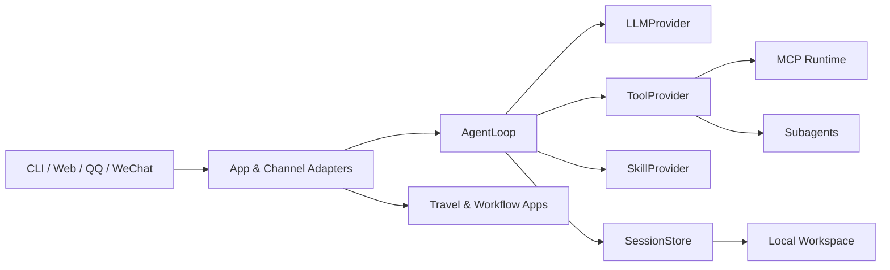

<p align="center">
  
</p>

<h1 align="center">ZhiCe-Agent</h1>

<p align="center">
  一个核心轻量、可私有部署、可扩展的 AI Agent Runtime。
</p>

<p align="center">
  Python 3.11+ · FastAPI · Vue 3 · MCP · Skills · Self-hosted
</p>

ZhiCe-Agent 将 Agent 循环、模型接入、工具调用、Skill、MCP、会话与权限收敛在一个可本地运行的工程中，并提供 CLI、Web、QQ 和微信等交互入口。它适合个人助理、私有部署和 Agent 工程实践，也内置了智能旅行规划与可视化工作流两个完整应用。

> 当前版本为 `0.1.0`。项目优先服务本地和可信私有网络，不应在缺少 TLS、访问控制与可信代理配置的情况下直接暴露到公网。

## 为什么是 ZhiCe-Agent

- **可私有部署**：Runtime、Web UI 与数据默认由用户在自己的电脑或服务器中管理。
- **协议解耦**：AgentLoop 只依赖 `LLMProvider`、`ToolProvider`、`SkillProvider` 和 `SessionStore` 等协议。
- **按需能力发现**：模型先发现并激活本轮需要的 Tool，减少无关 schema 对上下文的占用。
- **可控扩展**：支持 Markdown Skill、可执行 Skill、MCP Server、生命周期 Hook 和有界 Subagent。
- **安全边界明确**：Tool 权限、用户 RBAC、危险操作确认、workspace guard、超时、输出截断和审计共同生效。
- **不止聊天**：同一 Runtime 支撑 Web 产品、外部渠道、旅行规划和可视化定时工作流。

## 功能概览

| 领域 | 当前能力 |
| --- | --- |
| Agent Runtime | 多轮 Tool Calling、流式 RuntimeEvent、模型切换、endpoint 重试与优先级故障转移 |
| 上下文工程 | 完整 Session 历史、结构化压缩、SQLite FTS5 与可选 Embedding 混合检索 |
| Tool 与 Skill | 受限文件/命令工具、按需 Tool 发现、Skill source 同步、独立 SkillExecutor |
| MCP | stdio、Streamable HTTP、SSE、自动 Tool 发现、OAuth 刷新与逐 Server 隔离 |
| 多 Agent | 有界并行委派、独立 child Session、能力 Profile 与 workspace 隔离 |
| 用户与安全 | SQLite 本地用户、唯一 Owner、RBAC、登录态、操作确认、Activity 与 Security Audit |
| 交互入口 | CLI、FastAPI Gateway、Vue Web UI、QQ 和微信渠道 |
| 内置应用 | 智能旅行规划、Vue Flow 可视化工作流与 APScheduler 定时执行 |

外部渠道、第三方数据源和部分领域能力均为可选集成；未配置时不会影响基础 CLI 或 Web 聊天。

## 界面与应用

Web UI 由 Vue 3、Vite 和 TypeScript 构建，生产产物随 Python 包发布，包含：

- 多会话聊天、模型切换、安全 Markdown 与 KaTeX；
- 个人设置、渠道连接、Memory、运行诊断和 Owner 管理后台；
- `/travel` 智能旅行规划页面；
- `/workflows` 可视化工作流编辑与运行页面。

仓库暂未提供公开演示服务。克隆后可按下方步骤在本机启动完整 Web UI。

## 架构



核心依赖方向保持单向：

```text
cli/app -> agent core -> protocols
tools   -> protocols/message/base types
skills  -> no agent imports
```

详细设计和演进记录见 [`docs_design/README.md`](docs_design/README.md)。

## 快速开始

### 1. 环境要求

- Python `3.11` 或更高版本；
- 一个 OpenAI-compatible 或 LiteLLM 支持的模型服务；
- Node.js 仅在修改前端或启用微信 sidecar 时需要；
- Docker 仅在使用容器部署时需要。

### 2. 安装

```bash
git clone https://github.com/zcjMoxx/zhice_agent.git
cd zhice_agent

python -m venv .venv
```

激活虚拟环境：

```bash
# Linux / macOS
source .venv/bin/activate

# Windows PowerShell
.venv\Scripts\Activate.ps1
```

安装 CLI 和 Web Gateway：

```bash
python -m pip install --upgrade pip
python -m pip install -e ".[gateway]"
```

### 3. 初始化 workspace

```bash
zcagent init
```

默认 workspace 为：

```text
Windows: C:\Users\<user>\.zhice
Linux/macOS: ~/.zhice
```

也可以通过 `--workspace` 或环境变量 `ZHICE_AGENT_WORKSPACE` 指定其他目录。解析优先级为：

```text
--workspace > ZHICE_AGENT_WORKSPACE > ~/.zhice
```

### 4. 配置模型

初始化后，编辑 workspace 中的两个文件：

1. `config/models.json`：填写 endpoint、模型名、上下文窗口等非敏感模型配置；
2. `config/.env`：填写 API Key 等 Secret。

仓库模板分别位于：

- [`config/models.example.json`](config/models.example.json)
- [`config/.env.example`](config/.env.example)

最少需要一个 `enabled: true` 的 Chat endpoint。`protocol` 支持：

- `openai`：直接连接 OpenAI-compatible API；
- `litellm`：通过进程内 LiteLLM 连接相应模型提供方。

Embedding 是可选能力；未配置时基础聊天、完整历史、压缩和 FTS 检索仍可使用。

### 5. 运行

启动 CLI：

```bash
zcagent
```

启动 Web 前可先检查配置：

```bash
zcagent gateway --check
```

然后启动 Gateway：

```bash
zcagent gateway
```

浏览器访问 [http://127.0.0.1:10086](http://127.0.0.1:10086)。

首次使用 Web 时，需要先在 `config/.env` 中设置随机的 `ZHICE_AGENT_SETUP_TOKEN`，再运行：

```bash
zcagent auth init-owner
```

命令会安全地读取 setup token 和 Owner 密码，不接受明文密码参数。Owner 创建后即可登录 Web；普通用户自助注册默认关闭，可由 Owner 在管理后台开启。

## Workspace 与配置

`zcagent init` 会创建完整运行目录。源码仓库只保存模板，真实运行数据不会写回仓库。

```text
~/.zhice/
├── config/
│   ├── .env            # Secret 与环境变量
│   ├── config.yml      # Runtime、MCP、渠道与应用配置
│   └── models.json     # 模型 endpoint 与路由
├── contexts/           # Session、Memory、用户上下文与索引
├── extends/            # 已同步的 Skill source
├── logs/               # 运行日志与 trace
├── prompts/            # 运行时 Prompt
└── state/              # MCP、渠道和其他运行状态
```

主要公共模板：

| 文件 | 用途 |
| --- | --- |
| [`config/models.example.json`](config/models.example.json) | Chat、Compaction 与 Embedding endpoint |
| [`config/config.example.yml`](config/config.example.yml) | Context、Skills、Subagents、MCP、渠道和应用配置 |
| [`config/.env.example`](config/.env.example) | Secret 与运行环境变量清单 |

`zcagent init` 可重复执行：默认只补齐缺失文件；`zcagent init --force` 会覆盖现有模板，请在使用前备份自己的运行配置。

## 可选能力

### QQ

```bash
python -m pip install -e ".[gateway,qq]"
```

在 workspace 的 `config/config.yml` 启用 `channels.qq`，并在 `config/.env` 配置 `QQBOT_APP_ID` 和 `QQBOT_APP_SECRET`。支持私聊、群聊 `@`、一次性身份绑定和跨端 Session。

### 微信

微信集成使用 Node.js sidecar，并复用经过审计的腾讯微信插件 Transport。账号由每个 Web 用户自行扫码绑定，Agent、权限、Session 和 Memory 仍由 ZhiCe-Agent 管理。启用方式与边界见 [`docs_design/zhice-agent-part14-external-channel-design.md`](docs_design/zhice-agent-part14-external-channel-design.md)。

### 智能旅行规划

旅行应用支持 quick/deep 两种规划流程，可组合天气、地图、铁路、网页和只读攻略来源。Open-Meteo 无需 Secret；高德、Tavily、12306、小红书和携程等来源需要分别安装或配置。完整说明见 [`docs_design/zhice-agent-part19-intelligent-travel-planner-design.md`](docs_design/zhice-agent-part19-intelligent-travel-planner-design.md)。

### 可视化工作流

工作流运行时使用 SQLite、APScheduler 和固定 DAG 节点，支持草稿试运行、定时调度、用户连接以及本人邮件/QQ/微信投递。完整说明见 [`docs_design/zhice-agent-part20-visual-workflow-scheduler-design.md`](docs_design/zhice-agent-part20-visual-workflow-scheduler-design.md)。

### MCP、Skills 与 Subagents

- MCP Server 配置位于 `config/config.yml` 的 `mcp.servers`；
- Skill source 与同步策略位于 `skills`；
- Subagent 开关、并发限制和能力 Profile 位于 `subagents`；
- Tool Hook 位于 `hooks`，显式配置错误时会 fail closed。

这些能力都有可运行模板，建议从 [`config/config.example.yml`](config/config.example.yml) 复制所需部分，而不是一次性启用所有集成。

## 常用命令

```bash
# 查看 CLI 参数
zcagent --help

# 初始化或补齐 workspace
zcagent init

# 检查并启动 Web Gateway
zcagent gateway --check
zcagent gateway

# 创建唯一 Owner
zcagent auth init-owner

# 查看渠道状态
zcagent channels status
```

CLI 会话内还支持 `/model`、`/memory`、`/skills`、`/mcp`、`/subagent` 和 `/clear` 等命令；输入 `/exit` 退出。

## 开发

安装开发依赖：

```bash
python -m pip install -e ".[gateway,dev]"
```

运行 Python 检查：

```bash
python -m ruff check .
python -m pytest
```

默认测试不访问真实外部服务。标记为 `integration` 的用例需要显式配置依赖，并单独运行：

```bash
python -m pytest -o addopts="" -m integration
```

前端源码位于 `web/frontend`：

```bash
cd web/frontend
npm ci
npm run lint
npm run typecheck
npm run test
npm run build
```

`npm run build` 会更新 `agent/web/static`。前端改动应同时提交源码、`package-lock.json` 和最新生产构建产物。

微信 sidecar 测试：

```bash
cd integrations/weixin_sidecar
npm ci
npm test
```

## 部署

仓库提供 Docker 和单机私有部署工具，入口见 [`deploy/README.md`](deploy/README.md)。部署前请注意：

> ZhiCe-Agent 核心 Runtime 保持轻量。完整部署镜像为提供开箱即用的旅行规划能力，额外预装了携程只读集成及其浏览器运行时，因此镜像体积明显大于基础 Runtime。

- 真实 Secret 只放在 workspace、平台 Secret 或 Git 忽略的私有配置中；
- 不要把 Session、Memory、数据库、渠道登录态或日志打包进镜像；
- Gateway 本身不是公网安全边界；公网入口必须额外配置 TLS、访问控制和可信代理；
- 工作流调度当前按单实例 Runtime 设计，不要直接横向启动多个调度实例；
- 外部服务 smoke 默认关闭，只有显式提供凭据和开关时才会访问真实网络。

## 当前边界

ZhiCe-Agent 面向本地运行与私有部署，不是完整的企业级托管平台。当前不包含：

- 面向公网的 OAuth/SSO、组织/租户与多 workspace 隔离；
- `depth > 1` 的递归 Subagent、跨 Turn 后台 Agent Job 和自动 worktree merge；
- Skill 市场、审批流、多节点容器编排或完整发布平台；
- keyring/Secret Manager 和多服务器统一管理。

如果你的场景依赖上述能力，请先完成相应的安全与架构扩展，不要把当前本地边界直接等同于生产 SaaS 边界。

## 文档

- [设计文档索引](docs_design/README.md)
- [总体设计](docs_design/zhice-agent-overall-design.md)
- [Skill Runtime 与 Ops](docs_design/zhice-agent-part18-skill-runtime-and-server-ops-design.md)
- [智能旅行规划](docs_design/zhice-agent-part19-intelligent-travel-planner-design.md)
- [可视化工作流](docs_design/zhice-agent-part20-visual-workflow-scheduler-design.md)
- [部署指南](deploy/README.md)

无日期的设计文档表示当前实现口径；`docs_design/YYYY-MM-DD-*.md` 是历史设计记录。判断当前能力时，请优先阅读无日期文档和代码。

## 参与贡献

Issue 和 Pull Request 均欢迎。提交前请：

1. 保持 `cli/app -> agent core -> protocols` 的单向依赖；
2. 不在 AgentLoop 中加入业务判断，业务能力优先实现为 Tool 或 Skill；
3. 为新模块补充正常、异常和边界测试；
4. 不提交 API Key、Cookie、Token、密码、运行数据库或用户数据；
5. 至少通过 `python -m ruff check .` 与 `python -m pytest`。

更完整的工程约束见 [`AGENTS.md`](AGENTS.md)。

## License

本项目采用 [Apache License 2.0](LICENSE)。仓库内第三方组件继续遵循各自目录中声明的许可证。
