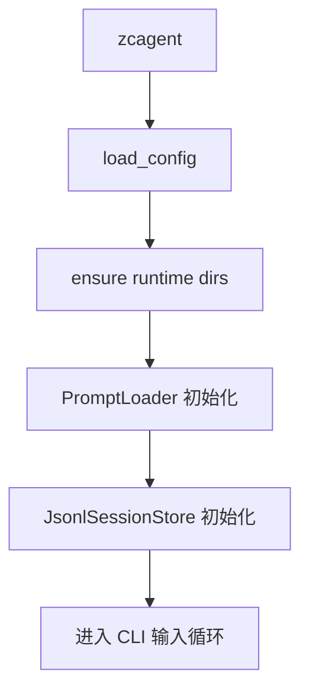
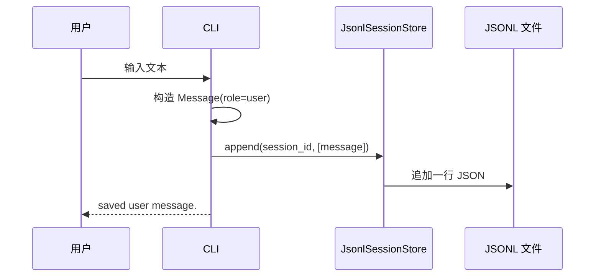

# 智策 Agent 第一部分详细设计文档：可运行底座

> 关联总设：`docs_design/zhice-agent-overall-design.md`
>
> 开发范围：Milestone 0 项目骨架 + Message/Session 基础模型

---

## 1. 第一部分要开发什么

第一部分建议开发“可运行底座”，目标是让 ZhiCe-Agent 从空仓库变成一个能启动、能读取配置、能加载 Prompt、能保存会话消息的最小 Python 项目。

这一部分不接真实 LLM，也不实现工具调用。它主要为后续 AgentLoop、LLMProvider、ToolRegistry、SkillLoader 打地基。

### 1.1 交付内容

```text
pyproject.toml
README.md
.env.example
config/
  llm_endpoints.example.json
prompts/
  identity.md
  tool_use_policy.md
  skills_intro.md
agent/
  __init__.py
  cli.py
  config.py
  context.py
  message.py
  prompt_loader.py
  protocols/
    __init__.py
    session.py
  session/
    __init__.py
    jsonl_store.py
contexts/
  sessions/
tests/
  unit_test/
    config/
      test_case.md
      test_config.py
    prompt_loader/
      test_case.md
      test_prompt_loader.py
    session_store/
      test_case.md
      test_session_store.py
```

### 1.2 验收目标

第一部分完成后，应满足：

1. 安装本地项目后，可以执行 `zcagent` 启动 CLI。
2. CLI 能打印项目名、workspace、session_id。
3. CLI 能接收一行用户输入，并将用户消息保存到 JSONL session。
4. 配置能从环境变量和默认路径加载。
5. PromptLoader 能读取 `prompts/*.md`。
6. JsonlSessionStore 能创建、读取、追加 session 消息。
7. 单元测试覆盖配置、Prompt 加载、Session 存取。

---

## 2. 为什么第一部分先做底座

总设里指出，智策 Agent 的核心是 AgentLoop，但 AgentLoop 依赖四个基础能力：

- Message：统一表达 user、assistant、tool、system 消息。
- SessionStore：保存和恢复历史上下文。
- Config：定义 workspace、prompts、contexts、skills 等路径。
- PromptLoader：把文件化 Prompt 交给后续 ContextBuilder。

如果没有这些底座，后续直接写 AgentLoop 很容易把路径、消息格式、上下文拼接和存储细节混在循环里。第一部分先把边界立住，后面每个模块都会更清楚。

---

## 3. 范围边界

### 3.1 本部分包含

- Python 项目初始化。
- CLI 最小入口。
- 应用配置加载。
- Message 数据结构。
- SessionState 数据结构。
- JSONL Session 存储。
- Prompt 文件加载。
- 基础单元测试。

### 3.2 本部分不包含

- OpenAI 或其他真实 LLM 调用。
- AgentLoop 推理循环。
- ToolRegistry 和具体工具。
- Skill 扫描与加载。
- exec 安全策略。
- Web UI。
- Memory、MCP、Hooks、Subagent。

---

## 4. 模块设计

### 4.1 `agent/message.py`

负责定义 Agent 内部通用消息结构。

```python
from dataclasses import dataclass, field
from typing import Any, Literal

Role = Literal["system", "user", "assistant", "tool"]

@dataclass
class Message:
    role: Role
    content: str
    name: str | None = None
    tool_call_id: str | None = None
    tool_calls: list[dict[str, Any]] = field(default_factory=list)
    metadata: dict[str, Any] = field(default_factory=dict)
```

设计要求：

- `content` 必须是字符串，避免存储层处理复杂对象。
- `metadata` 用于扩展 timestamp、source、token_usage 等信息。
- `tool_calls` 先保留字段，第一部分不使用，但为后续 AgentLoop 留接口。

### 4.2 `agent/session/jsonl_store.py`

负责将 session 保存为 JSONL 文件。

目录规则：

```text
contexts/sessions/{session_id}.jsonl
```

核心类：

```python
@dataclass
class SessionState:
    session_id: str
    messages: list[Message]
    metadata: dict[str, Any] = field(default_factory=dict)

class JsonlSessionStore:
    def __init__(self, sessions_dir: Path):
        ...

    def load(self, session_id: str) -> SessionState:
        ...

    def append(self, session_id: str, messages: list[Message]) -> None:
        ...
```

存储格式：

```json
{"role":"user","content":"hello","timestamp":1781000000.0,"metadata":{}}
```

设计要求：

- session 文件不存在时，`load` 返回空消息列表。
- `append` 自动创建 `contexts/sessions` 目录。
- 每条消息单独一行，便于追加和人工排查。
- 反序列化时忽略未知字段，保证后续兼容。
- `session_id` 只允许字母、数字、下划线、短横线，避免路径穿越。

### 4.3 `agent/config.py`

负责集中管理运行路径。

核心结构：

```python
@dataclass
class AppConfig:
    workspace: Path
    config_dir: Path
    prompts_dir: Path
    contexts_dir: Path
    sessions_dir: Path
    skills_dir: Path
    logs_dir: Path
```

加载顺序：

1. 如果存在环境变量，优先使用环境变量。
2. 如果没有环境变量，以当前项目根目录为 workspace。
3. 派生默认目录。

环境变量：

```text
ZHICE_AGENT_WORKSPACE
ZHICE_AGENT_CONFIG_DIR
ZHICE_AGENT_PROMPTS_DIR
ZHICE_AGENT_CONTEXTS_DIR
ZHICE_AGENT_SKILLS_DIR
ZHICE_AGENT_LOGS_DIR
```

设计要求：

- 所有路径转换为绝对路径。
- 启动时可创建必要目录：`contexts/sessions`、`logs`。
- 不读取真实 API Key；第一部分只提供 `.env.example`。

### 4.4 `agent/prompt_loader.py`

负责读取 Markdown Prompt。

核心类：

```python
class PromptLoader:
    def __init__(self, prompts_dir: Path):
        ...

    def load(self, name: str) -> str:
        ...

    def load_many(self, names: list[str]) -> dict[str, str]:
        ...
```

设计要求：

- `name` 不需要带 `.md` 后缀。
- 文件不存在时抛出明确异常。
- 禁止通过 `../` 读取 prompts 目录外的文件。
- 统一使用 UTF-8。

### 4.5 `agent/cli.py`

第一部分的 CLI 是调试入口，不承担 AgentLoop。

启动行为：

```text
$ python -m pip install -e .
$ zcagent --session default
ZhiCe-Agent
workspace: ...
session: default
> hello
saved user message.
> /exit
bye
```

参数：

```text
--session     session id，默认 default
--workspace   可选，覆盖 ZHICE_AGENT_WORKSPACE
```

命令：

```text
/exit         退出
/history      打印当前 session 最近消息
/prompts      打印已加载 prompt 名称
```

设计要求：

- 普通文本先保存为 `user` 消息。
- 第一部分不调用 LLM，因此保存后提示 `saved user message.`。
- CLI 应该能作为后续 AgentLoop 的入口复用。

---

## 5. Prompt 文件内容

### 5.1 `prompts/identity.md`

```markdown
你是智策 Agent，一个帮助用户思考、开发、研究和自动化的本地智能助手。

你会认真理解用户目标，必要时使用工具获取事实和执行操作。

你回答要清晰、具体、可执行。
```

### 5.2 `prompts/tool_use_policy.md`

```markdown
当工具能显著提高准确性，或能让你完成实际操作时，使用工具。

执行可能破坏文件或仓库状态的命令前，必须确认用户确实要求这样做。

工具失败后，不要用完全相同的参数反复重试。
```

### 5.3 `prompts/skills_intro.md`

```markdown
Skill 是外部能力包，每个 Skill 有一个 SKILL.md 文件和可选 scripts 脚本。

当某个 Skill 可能有用但你还没有看到完整正文时，先加载 Skill 说明。

加载 Skill 后，严格按 SKILL.md 的说明执行。
```

---

## 6. 数据流

### 6.1 启动流程



### 6.2 保存用户消息流程



---

## 7. 测试设计

### 7.1 `tests/unit_test/config/test_config.py`

覆盖：

- 默认 workspace 派生目录正确。
- 环境变量覆盖路径。
- `ensure_dirs` 能创建 sessions 和 logs。

### 7.2 `tests/unit_test/prompt_loader/test_prompt_loader.py`

覆盖：

- 能读取存在的 Markdown prompt。
- 缺失文件抛出明确异常。
- 路径穿越被拒绝。

### 7.3 `tests/unit_test/session_store/test_session_store.py`

覆盖：

- 新 session load 返回空列表。
- append 后能再次 load。
- 多条消息保持顺序。
- 非法 session_id 被拒绝。
- 未知 JSON 字段不影响读取。

---

## 8. 实现顺序

推荐按下面顺序开发：

1. 创建项目结构、`pyproject.toml`、`.env.example`。
2. 实现 `Message` 和 `SessionState`。
3. 实现 `JsonlSessionStore` 及测试。
4. 实现 `AppConfig` 及测试。
5. 编写三份基础 Prompt。
6. 实现 `PromptLoader` 及测试。
7. 实现 `agent.cli`。
8. 手动运行 `zcagent` 验收。

---

## 9. 后续衔接

第一部分完成后，第二部分可以自然进入“无工具聊天”：

- 新增 `agent/protocols/llm.py`。
- 新增 `agent/llm/openai_provider.py`。
- 新增最小 `AgentLoop.run_turn`。
- CLI 从“保存用户消息”改成“调用 AgentLoop 并保存 user/assistant 消息”。

第一部分留下的 `Message`、`SessionStore`、`Config`、`PromptLoader` 都会被第二部分直接复用。

---

## 10. 完成定义

当以下命令都能成功时，第一部分可以认为完成：

```bash
python -m pytest tests/unit_test
zcagent --session default
```

并且输入一条消息后，能看到：

```text
contexts/sessions/default.jsonl
```

其中追加了对应的 `user` 消息。
