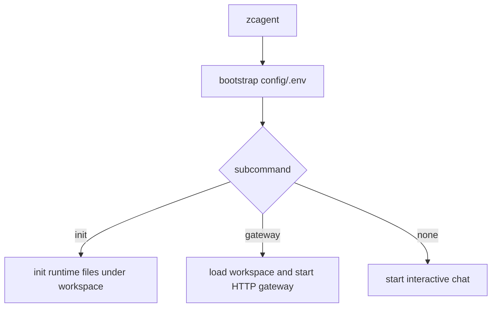

# ZhiCe-Agent CLI 与 Gateway 入口设计

> 说明：这是早期 gateway scaffold 设计记录。当前代码已经删除顶层 `agent/gateway.py` 兼容导出层，`zcagent gateway` 入口仍保留，但 CLI 直接调用 `agent.app.gateway` 的 FastAPI 实现。当前口径以 `docs_design/zhice-agent-part6-web-minimum-design.md` 和 `docs_design/2026-07-02-gateway-import-convergence-design.md` 为准。

## 归属

本设计归属于“入口与打包基础设施改进”，不归入第二部分“无工具聊天”的功能范围，也不归入后续完整 Web/Gateway 部分。

原因是本次只确定命令形态和运行时配置约定：

- `zcagent` 默认进入本地 CLI 对话。
- `zcagent gateway` 作为后续网关能力的稳定入口。
- gateway 与 chat 共享 `config/.env` 和 `ZHICE_AGENT_WORKSPACE` 校验。

第二部分仍然只负责 `ContextBuilder`、`LLMProvider`、`AgentLoop.run_turn` 和 CLI 对话链路。完整 Web UI、WebSocket、多渠道接入、鉴权、后台任务、会话 API 等都不在本次实现范围内。

## 背景

参考项目只注册一个顶层命令 `xagent`，`gateway` 是同一个命令下的子命令。ZhiCe-Agent 也采用同样的入口形态，但把无参数行为改成更适合当前阶段的默认聊天。

## 目标

- 第一次使用：创建 `config/.env`，设置 `ZHICE_AGENT_WORKSPACE`，执行 `zcagent init`。
- 日常对话：直接执行 `zcagent`。
- 启动网关：执行 `zcagent gateway`。
- 网关和聊天共享同一套 `config/.env`、workspace 校验和运行目录约定。

## 范围边界

本次只实现轻量本地 gateway scaffold，提供 `/` 和 `/health` 状态接口用于确认命令、端口和 workspace 约定可用。

明确不包含：

- Web UI。
- WebSocket / SSE。
- 聊天 REST API。
- 多渠道接入。
- 鉴权和用户体系。
- 后台任务调度。
- 生产部署与进程守护。
- 与 AgentLoop 的 HTTP 调用编排。

## 模块设计

- `agent.cli`
  - 顶层分发 `init`、`gateway` 和默认 chat。
  - 无参数默认进入 chat，减少日常对话入口的心智负担。
  - `gateway` 子命令支持 `--host`、`--port`、`--workspace`、`--check`。
- `agent.gateway`
  - 只作为 gateway scaffold，不承载业务 API。
  - 使用标准库 `ThreadingHTTPServer`，避免在入口基础设施阶段引入 FastAPI/Uvicorn 依赖。
  - `run_gateway()` 阻塞运行，直到用户按 Ctrl+C。
  - `gateway_status()` 返回健康检查 JSON。

## 数据流

## 测试方案

- `zcagent gateway --check` 能读取 workspace 并输出网关地址。
- 缺少 `ZHICE_AGENT_WORKSPACE` 时，gateway 与 chat 使用同样的报错提示。
- 继续保留 `zcagent init` 的运行时文件生成测试。

## 验收标准

- `zcagent` 默认进入对话。
- `zcagent gateway --check` 非阻塞通过配置检查。
- `zcagent gateway` 能启动本地 scaffold health 服务。
- `python -m ruff check .` 和 `python -m pytest` 通过。
