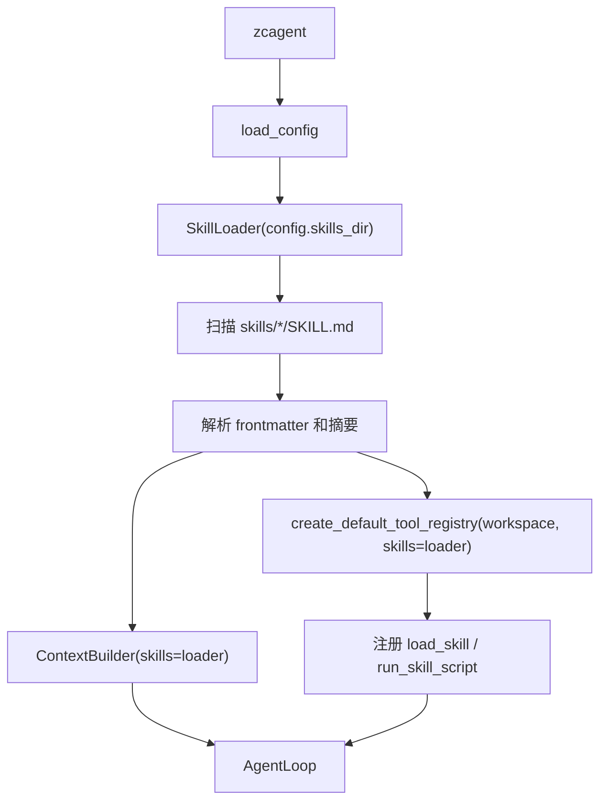
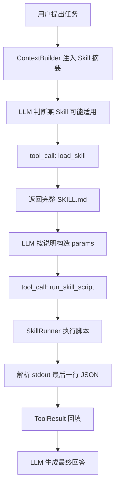
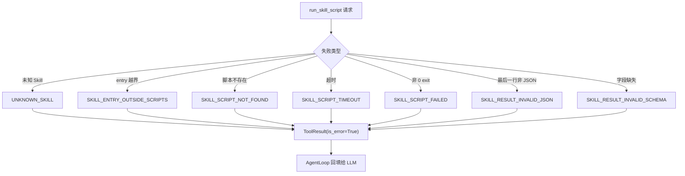

# 智策 Agent 第五部分详细设计文档：SkillLoader 与技能执行

> 关联总设：`docs_design/zhice-agent-overall-design.md`
>
> 承接文档：`docs_design/2026-06-12-zhice-agent-part4-exec-tool-design.md`
>
> 参考规范：`AGENTS.md`
>
> 开发范围：Milestone 5 SkillLoader，在现有 ToolRegistry 与安全 `exec` 之上接入本地 Skill 发现、说明加载和脚本执行

---

## 1. 第五部分要开发什么

第五部分建议开发“SkillLoader 与技能执行”。目标是让 ZhiCe-Agent 不只拥有固定内置工具，还能发现 workspace 下的 `skills/*/SKILL.md`，把技能摘要注入上下文，并在需要时读取完整说明、按规范执行对应脚本。

这一部分的核心不是把每个业务能力写进 AgentLoop，而是建立一个轻量、可审计、可逐步扩展的 Skill 层：

```text
启动时扫描 skills 目录
  -> 解析每个 SKILL.md 的 frontmatter 和摘要
  -> ContextBuilder 把可用 Skill 摘要放进 system prompt
  -> LLM 判断某个 Skill 适用
  -> 调用 load_skill 读取完整说明
  -> 按 SKILL.md 参数规范构造脚本输入
  -> 调用 run_skill_script 执行脚本
  -> 校验 stdout 最后一行 JSON
  -> AgentLoop 回填 tool 消息
  -> LLM 基于真实结果回答用户
```

第五部分仍然保持 AgentLoop 的通用循环不变。Skill 发现、说明读取、脚本执行和结果校验都应通过协议、Provider 或 Tool 完成，不能在 AgentLoop 中硬编码某个 Skill 的业务判断。

### 1.1 交付内容

```text
agent/
  protocols/
    skill.py                      # SkillInfo / SkillProvider 协议
  skills/
    __init__.py
    loader.py                     # 扫描、解析、缓存 Skill 元信息
    markdown.py                   # frontmatter 与 Markdown 摘要解析 helper
    runner.py                     # Skill 脚本参数、命令与结果校验 helper
  tools/
    skill.py                      # load_skill / run_skill_script 工具
    __init__.py                   # 默认 ToolRegistry 注册 skill 工具
  context.py                      # system prompt 中注入 Skill 摘要
  cli.py                          # 可选 /skills 调试命令
  prompts/
    skills_intro.md               # 更新 Skill 使用边界
tests/
  unit_test/
    skills/
      test_skill_loader.py
      test_skill_markdown.py
      test_skill_runner.py
    tools/
      test_skill_tools.py
    context_builder/
      test_context_builder_skills.py
    agent_loop/
      test_agent_loop_skill_tools.py
```

如果实现时发现 `agent/tools/base.py` 的路径 helper 足够通用，应直接复用；Skill 自身只负责限制 `skills_dir` 内路径和脚本执行策略，不重新实现 workspace guard。

### 1.2 验收目标

第五部分完成后，应满足：

1. `agent/protocols/skill.py` 只包含接口和数据结构，不 import 具体实现。
2. `SkillLoader` 只能扫描 `ZHICE_AGENT_WORKSPACE` 派生的 `skills_dir`，不能读取 workspace 外的 Skill。
3. 合法 Skill 必须包含 `SKILL.md`，且 frontmatter 至少包含 `name`、`description`、`category`、`readonly`。
4. 启动上下文只注入 Skill 摘要，不一次性塞入完整 `SKILL.md`。
5. LLM 需要完整说明时，通过 `load_skill` 工具读取单个 Skill 正文。
6. 脚本执行通过 `run_skill_script` 工具封装，并复用第四部分的安全命令执行边界。
7. Skill 脚本只能位于对应 Skill 目录的 `scripts/` 下，禁止路径逃逸。
8. 脚本统一通过 `--params '{JSON}'` 接收参数。
9. 脚本 stdout 最后一行必须是 JSON，并校验固定返回字段：`status`、`code`、`data`、`message`、`error_stack`。
10. `readonly: true` 的 Skill 不应执行明显写入或破坏性脚本；第一版可只通过元信息和工具文案约束，后续再补强确认流。
11. Skill 加载失败、frontmatter 非法、脚本返回非法 JSON 都返回结构化 `ToolResult`，不让异常炸出 AgentLoop。
12. 默认测试不依赖真实 LLM、真实网络或 workspace 外路径。
13. `python -m ruff check .` 和 `python -m pytest` 成功。

---

## 2. 为什么第五部分做 SkillLoader

前四部分已经形成了本地 Agent 的基础闭环：

- 第一部分：配置、Prompt、Message、Session 底座。
- 第二部分：无工具 LLM 对话链路。
- 第三部分：ToolProvider、ToolRegistry、工具调用与 session 回填。
- 第四部分：受限 `exec`，让 Agent 能真实运行本地命令。

Skill 是下一层扩展点。它让业务能力以文件目录存在，而不是继续膨胀 `agent/tools/`：

```text
skills/{skill_name}/
  SKILL.md
  scripts/{entry}.py
```

这样做的价值是：

- 业务说明、参数规范和边界条件可以写在 `SKILL.md`，不进入 Python 长字符串。
- 脚本通过固定 CLI 协议通信，避免 Skill import `agent.*` 后污染依赖方向。
- AgentLoop 仍然只认识工具调用，不认识具体业务。
- 新 Skill 可以渐进加入，不需要每次都修改核心循环。
- 第四部分的 `exec` 能力可以作为脚本执行底座复用。

第五部分的重点不是做 Skill 市场、远程安装或复杂编排，而是先把本地 Skill 发现、说明加载、脚本调用这条最小链路打通。

---

## 3. 范围边界

### 3.1 本部分包含

- `SkillInfo`、`SkillProvider` 协议。
- `SkillLoader` 扫描 `skills/*/SKILL.md`。
- frontmatter 解析与必填字段校验。
- Skill 摘要生成与上下文注入。
- `load_skill` 工具读取完整 `SKILL.md`。
- `run_skill_script` 工具执行 `scripts/{entry}.py`。
- 脚本参数 JSON 序列化。
- 脚本 stdout 最后一行 JSON 解析。
- 脚本返回字段校验。
- Skill 路径逃逸防护。
- Skill 输出截断。
- Skill 相关错误码。
- CLI 可选 `/skills` 调试命令。
- 单元测试和 Fake LLM 工具调用测试。

### 3.2 本部分不包含

- 从远程仓库安装 Skill。
- Skill 市场、版本管理和签名校验。
- 多层 Skill 覆盖优先级。
- Skill 热重载。
- Skill 之间互相依赖。
- Skill 脚本 import 检测的静态分析器。
- 对破坏性 Skill 的用户确认 UI。
- 长时间后台 Skill 任务。
- 流式脚本输出。
- Web UI Skill 管理。
- MCP、Hooks、Subagent。
- 多用户权限隔离。

---

## 4. 核心设计决策

### 4.1 Skill 是能力包，不是 AgentLoop 分支

AgentLoop 继续只处理通用工具循环：

```text
LLM tool call
  -> ToolRegistry.execute(name, args)
  -> ToolResult
  -> AgentLoop 回填 tool 消息
```

它不判断“用户是否需要某个 Skill”，也不直接读取 `SKILL.md` 或调用脚本。Skill 相关能力通过 `SkillProvider` 和两个工具暴露：

- `load_skill`：读取指定 Skill 的完整说明。
- `run_skill_script`：按 Skill 名和脚本名执行脚本。

这样后续新增业务 Skill 时，不需要改 AgentLoop。

### 4.2 上下文只注入摘要，完整说明按需读取

Skill 说明可能很长，且数量会逐步增加。第五部分不应把所有 `SKILL.md` 全文塞进 system prompt，而是注入短摘要：

```text
- name: file_summary
  category: document
  readonly: true
  description: Summarize a text file inside the workspace.
```

当 LLM 判断某个 Skill 可能适用时，先调用 `load_skill({"name": "file_summary"})` 读取完整说明，再按说明决定是否运行脚本。

这能控制上下文长度，也能让 Skill 的详细边界在需要时才进入模型视野。

### 4.3 SkillLoader 只做发现和校验，不执行脚本

`SkillLoader` 负责：

- 扫描目录。
- 解析 `SKILL.md`。
- 校验 frontmatter。
- 缓存或返回 `SkillInfo`。
- 提供摘要和正文读取。

它不执行 `scripts/`。脚本执行放到 `SkillRunner` 或 `run_skill_script` 工具中，这样“发现能力”和“执行能力”分开，测试更容易，安全边界也更清楚。

### 4.4 脚本执行复用 exec 边界，但不暴露任意命令

`run_skill_script` 不接收任意 `command`。它接收结构化参数：

```json
{
  "skill": "file_summary",
  "entry": "summarize.py",
  "params": {"path": "README.md"}
}
```

工具内部构造命令：

```bash
python skills/file_summary/scripts/summarize.py --params "{...}"
```

这样 LLM 不能借 Skill 工具执行任意 shell。`run_skill_script` 仍然需要复用第四部分的超时、输出截断和 workspace guard 思路，但入口比 `exec` 更窄。

第一版可以直接在 `SkillRunner` 中使用 `subprocess.run`，复用 `shell_policy.redact_secrets`、`truncate_text` 和路径 helper；如果希望强制经过 `ExecTool`，也必须避免把模型输入拼成任意命令。

### 4.5 不在第一版做 Skill 业务参数校验

`SKILL.md` 中会有参数表，但第一版不实现完整 Markdown 参数表解析器，也不把参数表自动转成 JSON Schema。

第一版策略：

- `load_skill` 把完整说明交给 LLM。
- LLM 按说明构造 `params`。
- 脚本自己做业务参数校验，并用固定 JSON 格式返回错误。
- `run_skill_script` 只校验通用结构：skill、entry、params 类型、路径安全、返回 JSON 格式。

后续如果需要更强约束，可以新增 `skill.schema.json` 或在 frontmatter 中声明参数 schema。

---

## 5. 模块设计

### 5.1 `agent/protocols/skill.py`

负责定义 Skill 协议和元信息结构。该文件只放接口和数据结构，禁止 import 具体实现。

```python
from dataclasses import dataclass, field
from pathlib import Path
from typing import Any, Protocol

@dataclass(frozen=True)
class SkillInfo:
    name: str
    description: str
    category: str
    readonly: bool
    root: Path
    skill_file: Path
    scripts_dir: Path
    summary: str
    metadata: dict[str, Any] = field(default_factory=dict)

class SkillProvider(Protocol):
    def list_skills(self) -> list[SkillInfo]:
        ...

    def get_skill(self, name: str) -> SkillInfo:
        ...

    def read_skill(self, name: str) -> str:
        ...
```

设计要求：

- `SkillInfo.root` 必须是 resolve 后的绝对路径。
- `summary` 是用于上下文注入的短文本，不是完整正文。
- 具体扫描逻辑属于 `agent/skills/loader.py`。

### 5.2 `agent/skills/markdown.py`

负责解析 `SKILL.md` 的 frontmatter 和摘要。

支持的最小 frontmatter：

```markdown
---
name: file_summary
description: Summarize a text file.
category: document
readonly: true
---
```

建议提供：

```python
@dataclass
class ParsedSkillMarkdown:
    frontmatter: dict[str, object]
    body: str
    summary: str

def parse_skill_markdown(text: str, *, max_summary_chars: int = 800) -> ParsedSkillMarkdown:
    ...
```

解析规则：

1. 必须以 `---` frontmatter 开始。
2. frontmatter 只支持简单 `key: value`，第一版不引入 YAML 依赖。
3. `readonly` 支持 `true` / `false`。
4. `summary` 优先取 `description`，再追加正文开头的短段落。
5. 摘要超过上限时截断并追加 `[truncated]`。

不支持复杂 YAML 的原因是第一阶段保持轻量，避免为了 Skill 元信息引入新的运行时依赖。

### 5.3 `agent/skills/loader.py`

负责扫描并提供 Skill 元信息。

核心类：

```python
class SkillLoader:
    def __init__(self, skills_dir: Path):
        self.skills_dir = Path(skills_dir).expanduser().resolve()

    def list_skills(self) -> list[SkillInfo]:
        ...

    def get_skill(self, name: str) -> SkillInfo:
        ...

    def read_skill(self, name: str) -> str:
        ...
```

扫描规则：

- 只扫描 `skills_dir` 的直接子目录。
- 每个 Skill 目录必须包含 `SKILL.md`。
- 忽略以 `.` 开头的目录、`__pycache__` 和普通文件。
- Skill 名称以 frontmatter `name` 为准，但必须与目录名一致或在 metadata 中记录差异。
- Skill 名称只允许字母、数字、下划线、短横线。
- 重名 Skill 返回 `DUPLICATE_SKILL`。
- 非法 Skill 不应导致整个 Agent 启动失败；默认跳过并在 metadata 中记录 `load_errors`。测试可直接断言 loader 的错误结果。

读取规则：

- `read_skill(name)` 只能读取对应 `SKILL.md`。
- 正文按 UTF-8 读取。
- 过长正文按上限截断，metadata 中记录截断状态。

### 5.4 `agent/skills/runner.py`

负责 Skill 脚本执行前后的通用处理。

建议提供：

```python
@dataclass
class SkillScriptResult:
    status: str
    code: str
    data: dict[str, Any] | list[Any] | str | int | float | bool | None
    message: str
    error_stack: str
    raw_output: str

class SkillRunner:
    def __init__(self, skills: SkillProvider, workspace: Path):
        ...

    def run(
        self,
        skill_name: str,
        entry: str,
        params: dict[str, Any],
        timeout_seconds: int = 30,
        max_output_chars: int = 12000,
    ) -> SkillScriptResult:
        ...
```

执行规则：

1. 通过 `SkillProvider.get_skill()` 获取 Skill。
2. 校验 `entry` 是相对文件名，不能包含绝对路径或 `..`。
3. `entry` 必须位于该 Skill 的 `scripts/` 目录下。
4. 第一版只允许 `.py` 脚本。
5. 使用当前 Python 解释器执行脚本。
6. 通过 `--params` 传入 JSON 字符串。
7. `cwd` 使用 workspace 根目录，避免脚本依赖当前 shell 目录。
8. 捕获 stdout/stderr、超时和 exit code。
9. 取 stdout 最后一行非空文本解析 JSON。
10. 校验返回字段固定为 `status`、`code`、`data`、`message`、`error_stack`。

脚本返回示例：

```json
{
  "status": "success",
  "code": "OK",
  "data": {"summary": "..."},
  "message": "done",
  "error_stack": ""
}
```

如果脚本非 0 退出但最后一行 JSON 合法，仍返回结构化结果，并在 metadata 记录 `exit_code`。如果最后一行不是合法 JSON，返回 `SKILL_RESULT_INVALID_JSON`。

### 5.5 `agent/tools/skill.py`

新增两个工具。

#### 5.5.1 `load_skill`

用途：读取某个 Skill 的完整 `SKILL.md`。

参数：

```json
{
  "type": "object",
  "properties": {
    "name": {
      "type": "string",
      "description": "Skill name to load."
    },
    "max_chars": {
      "type": "integer",
      "minimum": 1000,
      "maximum": 50000,
      "description": "Maximum characters to return."
    }
  },
  "required": ["name"],
  "additionalProperties": false
}
```

返回内容建议：

```text
skill: file_summary
category: document
readonly: true
path: skills/file_summary/SKILL.md

---
完整 SKILL.md 正文...
```

错误码：

- `MISSING_PARAM`
- `INVALID_PARAM`
- `UNKNOWN_SKILL`
- `SKILL_READ_ERROR`

#### 5.5.2 `run_skill_script`

用途：执行某个 Skill 的指定脚本。

参数：

```json
{
  "type": "object",
  "properties": {
    "skill": {
      "type": "string",
      "description": "Skill name."
    },
    "entry": {
      "type": "string",
      "description": "Script filename under the skill scripts directory."
    },
    "params": {
      "type": "object",
      "description": "JSON parameters passed to the script."
    },
    "timeout_seconds": {
      "type": "integer",
      "minimum": 1,
      "maximum": 120
    },
    "max_output_chars": {
      "type": "integer",
      "minimum": 1000,
      "maximum": 50000
    }
  },
  "required": ["skill", "entry", "params"],
  "additionalProperties": false
}
```

返回内容建议：

```json
{
  "status": "success",
  "code": "OK",
  "data": {...},
  "message": "done",
  "error_stack": ""
}
```

metadata 应包含：

```python
{
    "tool_name": "run_skill_script",
    "skill": "file_summary",
    "entry": "summarize.py",
    "exit_code": 0,
    "duration_seconds": 0.42,
    "timed_out": False,
    "truncated": False,
}
```

如果脚本返回 `status != "success"` 或非 0 exit code，`ToolResult.is_error=True`。

### 5.6 `agent/context.py`

`ContextBuilder` 新增可选 `skills` 依赖：

```python
class ContextBuilder:
    def __init__(
        self,
        prompt_loader: PromptLoader,
        skills: SkillProvider | None = None,
        max_history_messages: int = 30,
        max_message_chars: int = 8000,
        max_skill_summaries: int = 50,
    ):
        ...
```

system prompt 增加一段：

```markdown
# Available Skills

- `file_summary` [document, readonly=true]: Summarize a text file.
- `repo_report` [code, readonly=true]: Generate a local repository report.
```

当没有 Skill 时，保留现有 `skills_intro.md` 的限制说明，不注入空噪声。

设计要求：

- Skill 摘要截断，不能让 system prompt 无限增长。
- ContextBuilder 只依赖 `SkillProvider` 协议。
- 如果 SkillProvider 扫描出错，应降级为无 Skill 摘要，并在测试中覆盖；不要让普通聊天启动失败。

### 5.7 `agent/tools/__init__.py`

默认工具注册表从第四部分：

```python
ToolRegistry([
    ListDirTool(workspace),
    ReadFileTool(workspace),
    GrepTool(workspace),
    ExecTool(workspace),
])
```

扩展为：

```python
ToolRegistry([
    ListDirTool(workspace),
    ReadFileTool(workspace),
    GrepTool(workspace),
    ExecTool(workspace),
    LoadSkillTool(skills),
    RunSkillScriptTool(skills, workspace),
])
```

建议新增工厂参数：

```python
def create_default_tool_registry(
    workspace: Path | str,
    skills: SkillProvider | None = None,
) -> ToolRegistry:
    ...
```

如果 `skills is None`，可以只注册基础工具，便于测试和无 Skill 模式。

### 5.8 `agent/cli.py`

CLI 初始化时：

```python
skill_loader = SkillLoader(config.skills_dir)
context_builder = ContextBuilder(prompt_loader, skills=skill_loader)
tool_registry = create_default_tool_registry(config.workspace, skills=skill_loader)
```

可选新增调试命令：

```text
/skills       打印已发现 Skill 名称、分类、readonly 和短描述
```

设计要求：

- `/skills` 只展示摘要，不执行脚本。
- CLI 不直接解析 `SKILL.md`，只调用 `SkillProvider`。
- Skill 目录为空时输出友好提示。

### 5.9 `prompts/skills_intro.md`

更新为更明确的使用规则：

```markdown
Skill 是本地能力包。只有当 Available Skills 中的摘要明显匹配用户目标时，才考虑使用 Skill。

使用 Skill 前，先调用 load_skill 读取完整 SKILL.md，并严格遵守其中的参数、返回格式和边界说明。

不要假设未列出的 Skill 存在。不要直接编造脚本路径。运行脚本只能通过 run_skill_script。

如果 Skill 返回错误，先根据 code 和 message 向用户解释，不要盲目重复执行。
```

---

## 6. 数据流

### 6.1 启动发现流程



### 6.2 一次 Skill 使用流程



### 6.3 脚本执行失败路径



---

## 7. 安全与边界策略

### 7.1 Skill 目录 guard

所有 Skill 路径必须从 `config.skills_dir` 派生：

1. `skills_dir` 初始化时 resolve 为绝对路径。
2. 只扫描直接子目录，不递归任意深度。
3. `SKILL.md` resolve 后必须位于对应 Skill 根目录内。
4. `scripts_dir` resolve 后必须位于 Skill 根目录内。
5. `entry` resolve 后必须位于 `scripts_dir` 内。
6. 任意不满足时返回结构化错误，不执行脚本。

不能因为用户传入绝对路径就读取 workspace 外的 Skill。

### 7.2 脚本执行限制

第一版 `run_skill_script` 限制：

- 只执行 `.py` 文件。
- 不支持 shell 脚本、bat、ps1。
- 不支持 entry 中包含目录穿越。
- 不支持脚本交互输入。
- 不支持后台任务。
- 默认超时 30 秒，最大 120 秒。
- 默认输出上限 12000 字符。
- `cwd` 固定为 workspace。

### 7.3 返回 JSON 校验

脚本 stdout 最后一行非空文本必须是 JSON object。字段固定：

```text
status
code
data
message
error_stack
```

校验规则：

- 缺字段返回 `SKILL_RESULT_INVALID_SCHEMA`。
- `status` 只允许 `success` 或 `error`。
- `code` 和 `message` 必须是字符串。
- `error_stack` 必须是字符串，且进入 ToolResult 前最多保留 1500 字符。
- `data` 可为 JSON 兼容值。

### 7.4 readonly 策略

`readonly` 是 Skill 对自身能力的声明。第一版策略：

- `readonly: true` 的 Skill 摘要中明确标记只读。
- `run_skill_script` metadata 记录 `readonly`。
- LLM prompt 要求只把 readonly Skill 用于读操作。
- 如果用户要求写入或破坏性操作，模型不能仅凭 readonly Skill 自行执行。

第一版不做脚本静态审计，不保证 `readonly` 绝对可信。后续可以新增 Skill 签名、静态检查、确认流或沙箱执行。

### 7.5 错误码

第五部分新增错误码：

```text
UNKNOWN_SKILL
DUPLICATE_SKILL
INVALID_SKILL_NAME
INVALID_SKILL_FRONTMATTER
MISSING_SKILL_FIELD
SKILL_READ_ERROR
SKILL_ENTRY_OUTSIDE_SCRIPTS
SKILL_SCRIPT_NOT_FOUND
SKILL_SCRIPT_TIMEOUT
SKILL_SCRIPT_FAILED
SKILL_RESULT_MISSING
SKILL_RESULT_INVALID_JSON
SKILL_RESULT_INVALID_SCHEMA
```

继续复用已有错误码：

```text
INVALID_PARAM
MISSING_PARAM
PATH_OUTSIDE_WORKSPACE
INTERNAL_ERROR
```

### 7.6 禁止事项

第五部分禁止：

- Skill import `agent.*`。
- Skill 之间互相 import。
- `load_skill` 读取任意 Markdown 文件。
- `run_skill_script` 接收任意 shell 命令。
- 脚本路径逃逸 `scripts/`。
- 自动安装依赖。
- 联网下载 Skill。
- 把完整 traceback 或 secret 无限写入 session。

---

## 8. 测试设计

### 8.1 `tests/unit_test/skills/test_skill_markdown.py`

覆盖：

- 能解析合法 frontmatter。
- `readonly: true` 和 `readonly: false` 正确转换为 bool。
- 缺少 frontmatter 返回 `INVALID_SKILL_FRONTMATTER`。
- 缺少 `name`、`description`、`category`、`readonly` 返回 `MISSING_SKILL_FIELD`。
- 非法 `readonly` 返回 `INVALID_SKILL_FRONTMATTER`。
- 摘要能截断并记录状态。

### 8.2 `tests/unit_test/skills/test_skill_loader.py`

覆盖：

- 空 `skills/` 返回空列表。
- 合法 Skill 能被发现。
- 隐藏目录和无 `SKILL.md` 目录被忽略或记录错误。
- Skill 名称非法返回结构化错误。
- 重名 Skill 返回 `DUPLICATE_SKILL`。
- `get_skill` 对未知名称返回 `UNKNOWN_SKILL`。
- `read_skill` 只能读取对应 `SKILL.md`。
- 路径穿越不能逃逸 `skills_dir`。

### 8.3 `tests/unit_test/skills/test_skill_runner.py`

覆盖：

- 成功运行 Python 脚本并解析最后一行 JSON。
- `params` 通过 `--params` 正确传入。
- 脚本不存在返回 `SKILL_SCRIPT_NOT_FOUND`。
- entry 包含 `..` 返回 `SKILL_ENTRY_OUTSIDE_SCRIPTS`。
- 非 `.py` 脚本被拒绝。
- 超时返回 `SKILL_SCRIPT_TIMEOUT`。
- 非 0 exit code 返回错误且保留结构化结果。
- stdout 最后一行不是 JSON 返回 `SKILL_RESULT_INVALID_JSON`。
- JSON 缺固定字段返回 `SKILL_RESULT_INVALID_SCHEMA`。
- `error_stack` 被截断。

### 8.4 `tests/unit_test/tools/test_skill_tools.py`

覆盖：

- `load_skill` 返回完整说明。
- `load_skill` 对未知 Skill 返回 `UNKNOWN_SKILL`。
- `run_skill_script` 返回 `ToolResult` success。
- `run_skill_script` 对脚本错误返回 `ToolResult(is_error=True)`。
- 工具参数不是 dict 时沿用 registry 的 `INVALID_PARAM`。
- 工具输出过长会截断。

### 8.5 `tests/unit_test/context_builder/test_context_builder_skills.py`

覆盖：

- 有 SkillProvider 时 system prompt 包含 Skill 摘要。
- 无 Skill 时 system prompt 保持兼容。
- Skill 摘要过多时按 `max_skill_summaries` 截断。
- SkillProvider 抛错时不影响普通上下文构建。
- ContextBuilder 不 import 具体 `SkillLoader`。

### 8.6 `tests/unit_test/agent_loop/test_agent_loop_skill_tools.py`

使用 Fake LLM 和临时 Skill：

```text
第一次 LLM 返回 load_skill({"name":"demo"})
第二次 LLM 返回 run_skill_script({"skill":"demo","entry":"main.py","params":{...}})
第三次 LLM 返回最终总结
session 保存 user -> assistant(tool_calls) -> tool -> assistant(tool_calls) -> tool -> assistant(final)
```

这里不需要真实 LLM，也不需要真实网络。

### 8.7 `tests/unit_test/cli/test_cli_init.py`

如果新增 `/skills`，覆盖：

- `/skills` 在空目录时输出友好提示。
- `/skills` 能显示合法 Skill 摘要。
- CLI 初始化 SkillLoader 失败时不影响 `/help` 和普通启动错误提示。

---

## 9. 实现顺序

推荐按下面顺序开发：

1. 新增 `agent/protocols/skill.py`。
2. 新增 `agent/skills/markdown.py` 与测试。
3. 新增 `agent/skills/loader.py` 与测试。
4. 调整 `ContextBuilder` 支持可选 `SkillProvider` 摘要注入。
5. 新增 `agent/skills/runner.py` 与测试。
6. 新增 `agent/tools/skill.py`，实现 `load_skill` 和 `run_skill_script`。
7. 修改 `agent/tools/__init__.py`，在有 SkillProvider 时注册 Skill 工具。
8. 修改 `agent/cli.py`，初始化 `SkillLoader`，可选新增 `/skills`。
9. 更新 `prompts/skills_intro.md`。
10. 补充 AgentLoop Fake LLM 的 Skill 工具链路测试。
11. 运行 `python -m ruff check .`。
12. 运行 `python -m pytest`。
13. 手动创建一个最小 demo Skill，用 `zcagent --session default` 验证说明加载和脚本执行。

---

## 10. 后续衔接

第五部分完成后，ZhiCe-Agent 会拥有第一阶段最关键的扩展机制：

- 固定内置工具用于通用本地操作。
- Skill 用于承载可复用业务能力。
- AgentLoop 保持通用调度，不绑定业务。
- Session 保存完整工具证据链。

第六部分可以考虑进入以下方向之一：

- 文件写入与补丁工具。
- 用户确认流，支持破坏性操作的显式授权。
- Hook runner，把固定生命周期事件接入本地脚本。
- Web gateway 的交互入口。
- 更强的 Skill 参数 schema 和校验。

暂不建议立刻进入 Skill 市场、远程安装、多用户权限或复杂容器隔离。这些能力会显著提高系统复杂度，应该在本地 Skill 闭环稳定后再单独设计。

---

## 11. 完成定义

当以下命令都能成功时，第五部分可以认为完成：

```bash
python -m ruff check .
python -m pytest
zcagent --session default
```

并且 Skill 场景满足：

```text
用户：用 demo skill 处理一下 README
assistant(tool_calls): load_skill({"name":"demo"})
tool: {"status":"success","output":"完整 SKILL.md ..."}
assistant(tool_calls): run_skill_script({"skill":"demo","entry":"main.py","params":{"path":"README.md"}})
tool: {"status":"success","output":"{\"status\":\"success\",\"code\":\"OK\",...}"}
assistant(final): 已根据 demo skill 处理完成 ...
```

安全场景满足：

```text
assistant(tool_calls): run_skill_script({"skill":"demo","entry":"../escape.py","params":{}})
tool: {"status":"error","metadata":{"code":"SKILL_ENTRY_OUTSIDE_SCRIPTS"}}
assistant(final): 该脚本路径不在 Skill 的 scripts 目录内，已被拒绝执行 ...
```

同时满足：

- `agent/loop.py` 不 import `SkillLoader` 或具体 Skill。
- `agent/protocols/skill.py` 不 import 具体实现。
- `skills/*/scripts/` 不 import `agent.*`。
- Skill 摘要不会无限注入 system prompt。
- 完整 `SKILL.md` 只在 `load_skill` 后进入上下文。
- Skill 脚本只能从对应 `scripts/` 下执行。
- 脚本输出不会无限进入 session。
- 默认测试不访问真实 LLM 或网络。
