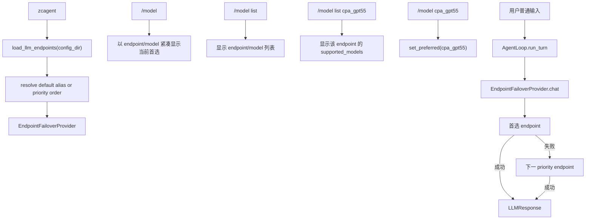

# ZhiCe-Agent 模型查看切换与 Endpoint Failover 设计

> 说明：这是一份历史设计记录。当前代码不再把 CLI `--endpoint` 默认值当作字面 `default` endpoint，而是默认使用 `auto`：优先解析配置中的 `default` 别名，其次使用名为 `default` 的 endpoint，最后按 enabled endpoint 的 priority 选择。`/model` 仍只影响当前进程，不做 session 级持久化。

- 日期：2026-06-15
- 状态：第一版已实现；session 级模型持久化待做
- 范围：第一阶段轻量实现

## 1. 背景

当前 ZhiCe-Agent 通过 `zcagent --endpoint <name>` 选择一个 LLM endpoint。CLI 默认值是 `default`，因此不传参数时会读取 `${ZHICE_AGENT_WORKSPACE}/config/llm_endpoints.json` 中名为 `default` 的 endpoint。

参考项目 `sthg_nanobot_agent` 已有更完整的 endpoint chain：

- endpoint 支持 `priority`。
- 同一 priority 内按策略选择 key。
- priority 低数字优先，当前层全部失败后进入下一层。
- `/model` 是前置斜杠命令，不进入 LLM，也不注册为 tool。
- `/model` 切换当前 session 的 active profile；首选模型失败后仍可自动 failover。
- 参考项目还包含 circuit breaker、热重载、模型 profile、session meta 持久化、least-in-flight 等重型能力。

ZhiCe-Agent 第一阶段要保持轻量，因此本次只实现最小可用闭环：

1. `/model` 查看当前 endpoint/model，并用一行 Tip 提醒常用切换命令；`/model list` 查看可用 endpoint；`/model list <endpoint>` 查看端点支持模型。
2. `/model <endpoint>` 或 `/model <endpoint>/<model>` 在当前 CLI 进程内切换首选 endpoint。
3. LLM 调用失败时按 priority 自动尝试其它 enabled endpoint。

注意：参考项目的 `/model` 是 session 级 active profile，并通过 session meta 持久化。ZhiCe-Agent 当前第一版只做当前 CLI 进程内首选 endpoint 切换；退出进程后再次启动会回到 `--endpoint` 或默认 `default`。

## 2. 目标

- 保留现有 `LLMProvider` 协议，AgentLoop 仍只依赖 `LLMProvider`。
- 不传 `--endpoint` 时先读取 `default` 别名；没有别名时按 priority 自动选择首选 endpoint。
- 支持从配置中读取多个 endpoint，并按 `priority` 排序 failover。
- 支持参考项目常见字段：
  - `priority`
  - `enabled`
  - `role`
  - 顶层 `"endpoints": [...]` 列表格式
  - 现有顶层 keyed object 格式
  - 顶层 `"default": "endpoint_name"` 或 `"default": {"ref": "endpoint_name"}` 别名
- CLI 增加 `/model` 命令：
  - 无参数：以 `endpoint/model` 紧凑显示当前首选 endpoint 和模型，并用一行 Tip 提醒 `/model <endpoint>`、`/model <endpoint>/<model>`、`/model list (<endpoint>)`、`/model reset`。
  - `list`：显示可用 endpoint 列表，每行包含 endpoint 和默认 model。
  - `list <endpoint-name>`：显示单个 endpoint 的默认 `model` 和 `supported_models`。
  - `<endpoint-name>`：按 endpoint name 切换首选，并使用该 endpoint 的默认 `model`。
  - `<endpoint-name>/<model>`：按 endpoint name 切换首选，并临时覆盖本次首选 endpoint 的 `model`；覆盖模型必须等于默认 `model` 或命中该 endpoint 的 `supported_models`。
  - `reset`：清除当前进程内手动切换，恢复 default alias 或 priority 顺序。
  - 不支持裸 `<model>` 自动猜测 endpoint；需要明确写 endpoint 或 endpoint/model。
- Provider 错误需要记录已尝试 endpoint，全部失败后返回合并后的错误提示。

## 3. 非目标

本次不实现参考项目的完整 endpoint chain：

- 不做 circuit breaker / cooldown。
- 不做 weighted random / least-in-flight。
- 不做 JSON 热重载。
- 不做 `model_profiles` 和任意模型图。
- 不做跨重启 session meta 持久化。
- 不做同一 session 重启后的 `/model` 选择恢复。
- 不做 ad-hoc model probe。
- 不改变工具调用链路。

这些能力以后需要时再按独立设计引入。

### 3.1 后续必须补充

后续如果要对齐参考项目的用户体验，需要补：

1. SessionStore 增加 session-level metadata 写入接口。
2. `/model` 切换时把 `active_model_endpoint` / `active_model` 写入当前 session metadata。
3. CLI 启动并加载同一 session 时，优先用 session metadata 恢复首选 endpoint。
4. `/new` 新会话默认回到启动首选 endpoint；已有会话保留自己的模型选择。
5. 如果 endpoint 被删除或 disabled，恢复时给出提示并回退到 `--endpoint` / `default`。

## 4. 模块设计

### 4.1 `agent.protocols.llm.LLMEndpoint`

扩展轻量字段：

```python
priority: int = 1
enabled: bool = True
role: str = "default"
supported_models: tuple[str, ...] = ()
```

字段只表达 endpoint 选择元信息和端点内模型白名单，不把 failover 状态放进协议结构。

### 4.2 `agent.config`

新增：

```python
load_llm_endpoints(config_dir: Path) -> list[LLMEndpoint]
```

支持两种 JSON 形态：

```json
{
  "default": {...},
  "cpa_gpt55": {...}
}
```

以及参考项目风格：

```json
{
  "endpoints": [
    {"name": "default", "...": "..."},
    {"name": "cpa_gpt55", "...": "..."}
  ]
}
```

`load_llm_endpoint(config_dir, name)` 继续保留，用于兼容已有调用和测试；内部可复用列表加载逻辑。

### 4.3 `agent.llm.failover_provider.EndpointFailoverProvider`

新增一个 provider wrapper，仍实现 `LLMProvider`：

- 输入多个 `LLMEndpoint`。
- 过滤 `enabled=False` 的 endpoint。
- 默认按 `(priority, config_index)` 排序。
- 如果设置了 `preferred_endpoint`，该 endpoint 放在尝试列表首位，剩余 endpoint 继续按 priority 排序。
- `match_endpoint("endpoint/model")` 只允许默认 `model` 或命中 `supported_models` 的模型；`supported_models` 支持精确模型名和简单 glob，例如 `gpt-*`。
- 每次 `chat()` 依次创建具体 provider 并调用：
  - 成功：返回响应，并在 metadata 写入 `endpoint_name`、`model`、`attempted_endpoints`。
  - 失败：记录错误并尝试下一个 endpoint。
  - 全部失败：抛出 `LLMProviderError`，消息包含 endpoint 名和错误摘要，但不包含 secret。

### 4.4 `agent.llm.__init__`

新增：

```python
create_llm_provider_chain(
    endpoints: list[LLMEndpoint],
    preferred_endpoint: str | None = None,
) -> LLMProvider
```

当前实现始终返回 `EndpointFailoverProvider`，即使只有一个 enabled endpoint。这样 CLI 可以统一通过 provider 查询 `/model` 状态。

### 4.5 `agent.cli`

启动时：

- `--endpoint` 仍默认 `default`。
- `_build_llm_provider(config.config_dir, args.endpoint)` 改为加载所有 endpoint，并把 `args.endpoint` 作为首选。

新增 slash command：

```text
/model
/model list
/model list <endpoint>
/model <endpoint>
/model <endpoint>/<model>
/model reset
```

命令只在 CLI 层处理，不进入 LLM，也不写 session 消息。

当前命令也不写 session metadata，因此只影响本次 CLI 进程内的首选 endpoint。后续 session 持久化版本需要在这里接入 SessionStore metadata。

## 5. 数据流



## 6. 变更文件

- `agent/protocols/llm.py`
- `agent/config.py`
- `agent/llm/failover_provider.py`
- `agent/llm/__init__.py`
- `agent/cli.py`
- `config/llm_endpoints.example.json`
- `README.md`
- `tests/unit_test/config/test_config.py`
- `tests/unit_test/llm_provider/test_failover_provider.py`
- `tests/unit_test/cli/test_cli_init.py`
- `tests/unit_test/llm_provider/test_case.md`

## 7. 测试方案

- 配置加载：
  - keyed object 能读取多个 endpoint。
  - `default` 字符串或 `ref` 对象能解析为真实 endpoint。
  - `endpoints` list 能读取多个 endpoint。
  - `priority`、`enabled`、`role` 正常解析。
  - `load_llm_endpoint` 仍能按 name 读取单 endpoint。
- Provider：
  - 首选 endpoint 优先尝试。
  - 首选失败后按 priority failover。
  - disabled endpoint 不参与尝试。
  - 全部失败时抛出可读错误。
- CLI：
  - `/model` 能以 `endpoint/model` 紧凑显示当前选择。
  - `/model list` 能显示可用 endpoint 和默认 model。
  - `/model list <endpoint>` 能显示单个 endpoint 的默认 model 和 supported_models。
  - `/model <endpoint>` 能切换首选 endpoint。
  - `/model <endpoint>/<model>` 能在首选 endpoint 上临时覆盖已声明支持的 model。
  - `/model reset` 能恢复默认首选。
  - 裸 model 名不会被猜测选择。
  - `/help` 包含 `/model`。
- 回归：
  - `python -m ruff check .`
  - `python -m pytest`

## 8. 验收标准

- 默认启动优先使用 `default` 别名；没有 `default` 时按 priority 选择。
- 当前运行配置中 `default` 失败时，可以继续尝试 `cpa_gpt55` 等其它 enabled endpoint。
- 用户能通过 `/model` 看见当前 `endpoint/model`。
- 用户能通过 `/model list` 看见可用 endpoint 和默认 model。
- 用户能通过 `/model list cpa_gpt55` 看见该 endpoint 支持的模型列表。
- 用户能通过 `/model cpa_gpt55` 切到 CPA endpoint。
- 用户能通过 `/model cpa_gpt55/gpt-5.1` 切到 CPA endpoint 并临时使用已在 `supported_models` 声明的 `gpt-5.1`。
- 用户能通过 `/model reset` 恢复 default alias 或 priority 顺序。
- 裸 `/model <model>` 不会自动匹配 endpoint。
- AgentLoop 不直接依赖 OpenAI、LiteLLM 或 failover 细节。

## 9. 后续细化：重试、错误分类与冷却

当前第一版 failover 逻辑比较粗糙：只要某个 endpoint 调用抛异常，就直接尝试下一个 enabled endpoint。这个行为能完成最小闭环，但还不能区分“瞬时不可用”和“请求本身错误”，也没有同 endpoint 重试。

后续修改时，优先把这块拆成四层：

- 结构化错误：Provider 不只抛普通 `LLMProviderError` 文本，而是带上 `category`、`status_code`、`retryable`、`failover_allowed` 等元信息。
- 同端点重试：对瞬时错误先在当前 endpoint 重试 1 到 2 次，再考虑切换。
- 分类切换：根据错误类型决定重试、切换或直接停止。
- endpoint 冷却：连续失败的 endpoint 暂时跳过，避免每次请求都先撞坏节点。

建议的默认错误策略：

- `timeout` / `network` / `429` / `5xx`：先重试当前 endpoint，再 failover。
- `400 bad request` / `model_not_found`：不重试，不 failover，直接返回错误。
- `401` / `403`：默认不重试当前 endpoint，尝试下一个 endpoint；后续可做成配置项。
- 连续多次失败：后续进入短暂 cooldown，例如 30 秒。

设计边界：

- 错误分类必须封装在 `LLMProvider` 边界内，`AgentLoop` 不感知 OpenAI、LiteLLM、HTTP 或 SDK 的具体异常。
- `EndpointFailoverProvider` 只消费统一错误元信息，不直接解析底层异常字符串。
- `/model <endpoint>/<model>` 的 `supported_models` 校验发生在真实 LLM 调用前，不属于可重试错误。

阶段二测试需要覆盖：

- 同 endpoint 重试次数和退避行为。
- `timeout` / `network` / `429` / `5xx` 会重试后再 failover。
- `400` / `model_not_found` 会直接停止，不误切下一个 endpoint。
- `401` / `403` 的默认 failover 行为。
- cooldown 期间跳过已进入冷却的 endpoint。
