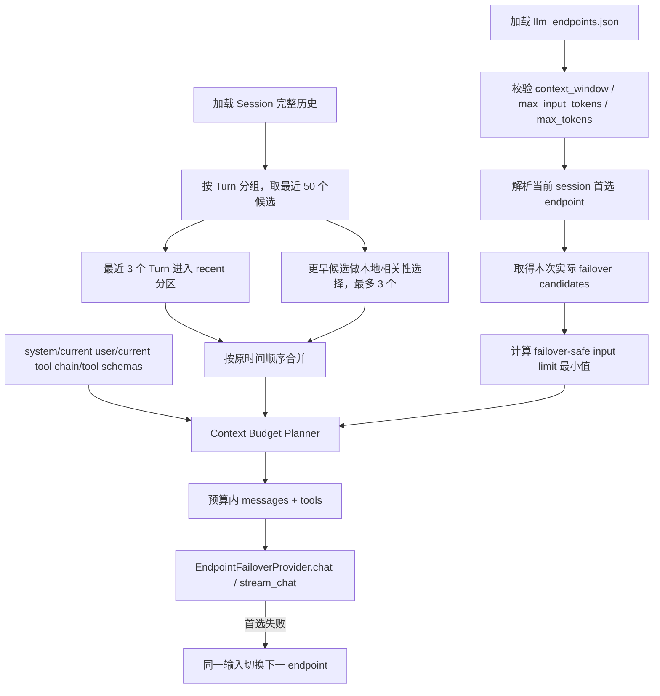

# ZhiCe-Agent Endpoint 上下文预算与混合 Turn 选择设计

> 说明：当前代码已进一步简化为 `context_window`（默认 `131072`）与 `max_tokens` 两个配置字段，并删除独立输入上限配置。本文三字段讨论保留为当时方案；当前实现见 `2026-07-22-endpoint-budget-config-simplification-design.md`。

> 日期：2026-07-22
>
> 状态：已实现并进入当前代码基线
>
> 承接：`docs_design/2026-06-15-model-command-and-endpoint-failover-design.md`、`docs_design/2026-07-06-context-relevance-selection-design.md`、`docs_design/2026-07-16-context-candidate-window-expansion-design.md`、`docs_design/2026-07-22-immediate-turn-reference-retention-design.md`

## 1. 背景

当前上下文治理已经具备以下基础：

- Session JSONL 是完整会话真值，历史按 `turn_id` 分组。
- `ContextBuilder` 默认查看最近 50 个含 user message 的 Turn，再通过本地相关性算法最多保留 5 个 Turn。
- 单条 message 有字符裁剪，最终历史还有 `max_history_messages=60` 的 message 数量硬上限。
- 紧邻上一轮的“刚刚 / 上一轮 / what did I just ask”等明确回指通过额外相关性信号保留最新 Turn。
- LLM endpoint 已支持 priority failover，但所有候选 endpoint 共用同一份 LLM input。

这套实现解决了“无关历史不要自动进入上下文”，但仍有两个结构性问题。

第一，纯相关性选择不能稳定保证短期对话连续性。用户问完“苏格拉底是谁”，紧接着问“我刚刚问了什么”时，不应该依赖某组词法 marker 才保留上一轮；最近几轮本来就应作为短期工作记忆优先存在。

第二，当前限制主要是 Turn 数、message 数和字符数，没有基于 endpoint 上下文窗口做统一 token 预算。`max_tokens` 已被 OpenAI-compatible 与 LiteLLM provider 作为请求的单次最大输出 token 使用，不能再把它误解释为输入窗口或总上下文窗口。Failover 链上不同 endpoint 的输入容量也可能不同；如果只按首选 endpoint 组装上下文，首选失败后，同一请求可能无法安全切换到容量更小的 fallback endpoint。

因此，本次设计把两个问题一起收敛：

1. Endpoint 明确声明输出上限和上下文容量，由 Failover 链计算本次请求可共同承载的最小输入预算。
2. Session 历史改为“最近 3 个完整 Turn 优先保留 + 较早历史最多 3 个相关 Turn”的混合选择，而不是让所有历史都经过同一套相关性淘汰。

## 2. 目标

1. 明确 `max_tokens` 只表示一次 LLM 响应允许生成的最大输出 token。
2. 每个 endpoint 必须声明正整数 `context_window`，并可选声明 `max_input_tokens`。
3. 对一次可能发生 failover 的 LLM 调用，使用所有实际候选 endpoint 的有效输入上限最小值作为 failover-safe 预算。
4. 上下文预算覆盖 system prompt、历史消息、当前 user message、当前 Turn 已产生的 assistant/tool 消息和 tool schemas，而不只统计历史文本。
5. 默认优先保留最近 3 个完整 Turn，再从最近 50 个 Turn 窗口的更早部分选择最多 3 个相关 Turn。
6. Turn 仍是历史裁剪原子；assistant tool call 与对应 tool result 不能被拆开。
7. Session JSONL 继续保存完整事实，LLM 输入裁剪不反向删除 Session 历史。
8. 保留当前 endpoint 配置文件的 keyed object、`endpoints` list、default alias、priority、enabled、role 和 supported_models 结构。

## 3. 非目标

- 本次不引入向量数据库、embedding 服务或 LLM relevance judge。
- 本次不实现长期会话的滚动摘要或 OpenAI Responses compaction item；后续若需要，应作为独立的 Session compaction 设计。
- 本次不修改 Session JSONL 格式，也不迁移既有 Session。
- 本次不实现按模型自动联网查询 context window。
- 本次不为缺失容量配置的旧 endpoint 猜测一个“看似安全”的默认 token 值。
- 本次不改变 endpoint priority、session model preference 或 failover 调用顺序。
- 本次不把 `max_tokens` 重命名成 provider-specific 字段；只澄清并固化现有语义。

## 4. Endpoint 配置语义

### 4.1 字段定义

`LLMEndpoint` 增加：

```python
context_window: int
max_input_tokens: int | None = None
```

三个容量字段语义如下：

| 字段 | 是否必填 | 语义 |
| --- | --- | --- |
| `context_window` | 是 | endpoint/model 一次请求可承载的总上下文 token 上限，包含输入与本次输出空间 |
| `max_input_tokens` | 否 | endpoint 明确允许的最大输入 token；用于服务商限制比理论窗口更小时进一步收窄 |
| `max_tokens` | 否，缺失时沿用现有默认值 | 一次响应允许生成的最大输出 token；继续直接传给 OpenAI-compatible / LiteLLM 请求 |

配置示例：

```json
{
  "openai_gpt55": {
    "protocol": "openai",
    "provider": "",
    "base_url": "https://api.openai.com/v1",
    "api_key": "${ZHICE_LLM_OPENAI_API_KEY}",
    "model": "gpt-5.5",
    "context_window": 128000,
    "max_input_tokens": 100000,
    "max_tokens": 16384,
    "priority": 1,
    "enabled": true,
    "role": "default"
  }
}
```

`max_input_tokens` 可以省略。省略时不代表无限输入，而是从 `context_window` 和 `max_tokens` 推导。

### 4.2 配置校验

单 endpoint 必须满足：

```text
context_window > 0
max_tokens > 0
max_tokens < context_window
max_input_tokens is None or max_input_tokens > 0
max_input_tokens is None or max_input_tokens <= context_window
```

缺少 `context_window`、字段不是整数或不满足上述关系时，配置加载失败并给出 endpoint 名、字段名和修复提示。这里不能静默填入 8K、32K 或其它经验值，因为那既不能保证 fallback 安全，也可能无端裁掉大窗口模型的有效上下文。

### 4.3 单 Endpoint 有效输入上限

计算公式：

```text
derived_input_limit = context_window - max_tokens

effective_input_limit = min(
  derived_input_limit,
  max_input_tokens if configured else derived_input_limit
)
```

显式 `max_input_tokens` 可以描述 provider 对输入侧的独立限制；最终仍会和 `context_window - max_tokens` 取最小值，因此输出空间始终得到保留。

### 4.4 Failover-safe 输入预算

`EndpointFailoverProvider` 已知本次实际尝试顺序：首选 endpoint 在前，其余 enabled endpoint 按 priority 与配置顺序排列。一次调用的共同输入上限为：

```text
failover_safe_input_limit = min(
    endpoint.effective_input_limit
    for endpoint in actual_failover_candidates
)
```

“实际候选 endpoint”指本次调用确实可能尝试的 endpoint：

- 包含当前 session preference / `/model` 解析后的首选 endpoint。
- 包含首选失败后会继续尝试的 enabled fallback endpoint。
- 不包含 `enabled=false` 的 endpoint。
- model override 只改变首选 endpoint 的 model，不把该 override 复制到其它 endpoint；容量仍从每个实际 endpoint 自身配置读取。

这样组装出的同一份 `messages + tools` 可以发送给 failover 链中的任何候选 endpoint。不能先按大窗口首选 endpoint 塞满输入，再期待失败后无损切换到小窗口 fallback。

## 5. 输入 Token 预算边界

### 5.1 统计范围

每次调用 LLM 前都必须执行输入预算，而不是只在 Turn 开始时执行一次。统计对象至少包括：

- system prompt，包括基础 Prompt、Runtime 信息、Memory policy、Skill 摘要与 Turn addendum。
- 选中的历史 Turn。
- 当前 user message。
- 当前 Turn 后续工具迭代中追加的 assistant tool call、tool result 与 assistant message。
- 本次实际暴露的 tool schemas，包括按需发现后新增的 schema。
- OpenAI-compatible 序列化所需的角色、tool call id、name 等结构开销。

原因是工具执行后第二次、第三次 LLM 调用会比首轮拥有更多消息；只预算初始 `ContextBuilder.build()` 的结果，无法约束长 tool output 或新增 tool schema。

### 5.2 固定区与可裁剪区

输入分为：

```text
固定区：system + current user + 当前仍必需的最新调用链 + tool schemas
可裁剪区：旧相关 Turn + 最近 Turn 历史
```

预算器先计算 tool schema 成本，再用剩余空间约束 messages。若删除历史、截断 tool result、删除当前 Turn 中较早的已完成 Tool 块后，system、current user 与最新必要调用链仍超过 `failover_safe_input_limit`，返回 `LLMContextBudgetError`，不向 provider 发送必然超窗的请求。

### 5.3 估算与安全余量

第一阶段保持本地、确定性预算，不增加 tokenizer 网络依赖。`estimate_llm_tokens()` 对 CJK 字符按一字符一 token 估算，对其它字符按四字符一 token 向上取整，并计入 message 固定开销、角色、name、tool call id、tool calls JSON 与 tool schemas JSON。

预算值表达的是“允许发送给所有 failover 候选 endpoint 的最大输入”，不是总上下文窗口。AgentLoop 在 trace 的 `llm.call` 中记录 `estimated_input_tokens`、`max_input_tokens`、message 数和 tool schema 数。

## 6. 混合 Turn 选择

### 6.1 默认参数

默认上下文历史策略调整为：

```text
max_history_turns = 50
max_recent_turns = 3
max_relevant_turns = 3
```

语义：

- `max_history_turns=50`：最近最多 50 个含 user message 的 Turn 构成短期候选窗口。
- `always_include_recent_turns=3`：候选窗口中最近 3 个完整 Turn 进入高优先级 recent 分区，不要求词法相关。
- `max_relevant_turns=3`：从 recent 分区之前的较早候选中，本地选择最多 3 个相关 Turn。

因此默认最多选择 6 个历史 Turn，但最终数量仍受 failover-safe token 预算约束。

### 6.2 选择流程

```text
SessionStore full history
  -> group_messages_by_turn(history)
  -> keep complete groups containing a real user message
  -> take latest max_history_turns as candidate window
  -> split:
       recent = latest up to 3 turns
       older_candidates = candidates before recent
  -> local relevance scoring only on older_candidates
  -> take up to 3 older relevant turns
  -> union + deduplicate
  -> restore original chronological order
  -> fit into failover-safe token budget
  -> convert to OpenAI-compatible messages
```

最近 Turn 与旧相关 Turn 不能按“相关性分数高低”混排后直接注入。选择完成后必须恢复 Session 原始时间顺序，避免把旧问题插到新问题之后造成错误因果关系。

### 6.3 “最近 3”与明确回指

最近 3 个 Turn 默认直接进入 recent 分区，因此“刚刚问了什么”“上一轮你说了什么”和需要理解连续代词的追问不再依赖 `_CONTEXTUAL_FOLLOWUP_MARKERS` 才能获得基础上下文。

现有 immediate-reference 识别仍可保留为排序、诊断或极端预算降级时的保护信号，但它不再承担“最新 Turn 是否进入候选”的唯一职责。

### 6.4 旧历史相关性

较早 Turn 继续复用当前本地确定性特征：

- ASCII / 代码 token。
- 中文 CJK bigram。
- 文件、路径、错误、命令和标识符 anchor。
- recency bonus。
- 邻接确认或明确回指信号。

本次只把检索对象从“全部 50 个候选”改成“排除 recent 分区后的旧候选”，并把最终上限从当前 5 个收敛为最多 3 个。无关旧 Turn 不因窗口扩大而进入 LLM。

### 6.5 Token 超限时的降级顺序

Turn 数量是连续性偏好，token limit 是硬边界。选择结果超过预算时按以下顺序收窄：

1. 从已选择上下文的最旧历史 Turn 开始整体移除；由于旧相关 Turn 位于 recent 分区之前，因此正常情况下先移除旧相关 Turn，再降级 recent 分区。
2. 历史只剩当前 Turn 后，优先反复截断最长 tool result，最低保留 128 字符并追加预算截断标记。
3. 仍超限时，删除当前 Turn 中较早的完整已完成 Tool 块，至少保留最新已完成 Tool 块。
4. 任何 Tool 块删除都同时移除 assistant tool call 与对应 tool result，不产生孤立消息。
5. system、current user 与最新必要调用链仍超限时，返回上下文预算错误。

因此，“最近 3”表示正常预算下的强优先级，不表示可以突破 endpoint 的真实 context window。

## 7. Tool 调用块完整性

混合选择与 token 裁剪都必须在 Turn 分组和 tool block 校验之上工作：

- assistant message 含 `tool_calls` 时，对应 tool result 必须一起保留或一起移除。
- 不向模型发送孤立 tool result。
- 不保留已经删除其结果的 tool call。
- 当前 Turn 需要裁剪时先压缩 tool output；仍超限才整体删除较早的已完成 Tool 块，保留最新调用链且不破坏调用关系。
- 历史 Turn 的 tool output 可以继续使用已有单 message 字符截断；后续若新增专用 tool-output token limit，应另行设计并统一替换字符近似。

## 8. 兼容性

### 8.1 Endpoint 配置

继续兼容：

- keyed object endpoint 格式。
- 顶层 `endpoints` list 格式。
- `default` 字符串或 `{ "ref": "..." }` 别名。
- `priority`、`enabled`、`role`、`supported_models`。
- `max_tokens` 字段名和 provider 请求行为。

有意不兼容：

- 旧配置若缺少 `context_window`，启动时明确报配置错误并引导更新 `${ZHICE_AGENT_WORKSPACE}/config/llm_endpoints.json`。
- 不通过隐式默认值让旧配置“看起来还能跑”，因为无法证明该值对所有 failover endpoint 安全。

`zcagent init`、仓库 example 和 README 示例必须同步生成 `context_window`；`max_input_tokens` 仍为可选字段。

### 8.2 ContextBuilder 调用

- `max_history_turns=None` 继续保留 message-based fallback，主要服务测试或特殊调用；即使走 fallback，发送前仍必须经过统一 token budget。
- `max_history_turns=0` 继续表示不注入 Session 历史。
- 显式传入小于 3 的 `max_history_turns` 时，recent 分区最多只能取得该窗口内实际存在的 Turn。
- `max_relevant_turns=0` 表示只使用 recent 分区，不检索旧 Turn。
- Session JSONL 和既有 `turn_id` / `turn_index` 不需要迁移。

## 9. 模块设计

### 9.1 `agent.protocols.llm`

- `LLMEndpoint` 增加 `context_window`、`max_input_tokens`。
- 增加统一的 endpoint effective input limit 计算接口或只读属性，避免各层重复公式。
- `LLMProvider` 仍只负责模型调用；AgentLoop 不依赖 OpenAI 或 LiteLLM SDK。

### 9.2 `agent.config`

- 加载并校验新字段。
- `context_window` 缺失或非法时返回精确配置错误。
- `zcagent init` 写入新的必填示例字段。

### 9.3 `agent.llm.failover_provider`

- 暴露本次实际 failover candidates 或直接暴露 `failover_safe_input_limit()`。
- 计算候选 endpoint 的 effective input 最小值。
- 不改变既有请求尝试顺序和错误合并行为。

### 9.4 `agent.core.context`

- 将历史选择拆成 recent 分区与 older relevant 分区。
- 默认最近 3、旧相关最多 3。
- 返回选择元信息，供预算器和 trace 解释裁剪原因。
- 保持 Turn chronological order 和 tool block 合法化。

### 9.5 `agent.core.context`

当前预算实现集中在 `ContextBuilder.fit_messages()` 与 `estimate_llm_tokens()`：

- 接收 endpoint/failover `ContextBudget`。
- 估算 messages 与 tool schemas。
- 按完整 Turn 删除旧历史。
- 截断 tool result，并在必要时删除较早的完整已完成 Tool 块。
- 固定内容仍超限时抛出 `LLMContextBudgetError`。

### 9.6 `agent.core.loop`

- 每次 LLM 调用前取得本 Turn 的 tool definitions 和 failover-safe 输入 limit。
- 初次调用及每次 tool result 追加后的后续调用都执行预算。
- Session 仍保存未被输入裁剪删除的完整消息事实。
- trace 记录预算与选择结果。

## 10. 数据流



## 11. 变更文件

代码落地预计涉及：

- `agent/protocols/llm.py`
- `agent/config.py`
- `agent/llm/failover_provider.py`
- `agent/core/context.py`
- `agent/core/context_relevance.py`
- `agent/core/loop.py`
- `agent/llm/selection.py`
- `agent/cli.py`
- `agent/app/runtime.py`
- `agent/memory/extraction.py`
- `agent/subagents/factory.py`
- `config/llm_endpoints.example.json`
- 对应 config、LLM provider、ContextBuilder、AgentLoop 单元测试与 `test_case.md`

代码落地后同步当前文档：

- `README.md`
- `docs_design/README.md`
- `docs_design/zhice-agent-overall-design.md`
- `docs_design/zhice-agent-part2-no-tool-chat-design.md`
- `docs_design/zhice-agent-part7-turn-context-design.md`
- 确认真实调用链后，若 Part 3 的 tool-loop 预算说明不足，再同步 `docs_design/zhice-agent-part3-tool-calling-design.md`

当前实现已经落地，本次同步把上述活文档收敛到相同口径。

## 12. 测试方案

### 12.1 Endpoint 配置

| 用例 | 输入 | 期望 |
| --- | --- | --- |
| required context window | 缺 `context_window` | 配置错误包含 endpoint 与字段名 |
| invalid context window | `context_window <= 0` | 配置错误 |
| invalid output limit | `max_tokens >= context_window` | 配置错误 |
| derived input | 只配置 context window 与 max tokens | effective input = 两者之差 |
| explicit input | 配置合法 max input | 使用显式值 |
| invalid explicit input | max input 大于 context window | 配置错误 |
| init template | 运行 `zcagent init` | 新模板包含 context window |

### 12.2 Failover 预算

| 用例 | 场景 | 期望 |
| --- | --- | --- |
| single endpoint | 一个 enabled endpoint | 使用该 endpoint effective input limit |
| mixed windows | 首选 128K，fallback 32K | 使用较小的 fallback effective input limit |
| disabled endpoint | 最小窗口 endpoint disabled | 不参与 min |
| session preference | session 切换首选 endpoint | 实际候选集合和 min 正确 |
| model override | 首选 endpoint/model override | fallback 容量配置不被首选 override 污染 |

### 12.3 混合 Turn 选择

| 用例 | 场景 | 期望 |
| --- | --- | --- |
| recent continuity | 最近 3 Turn 与当前问题无词法重叠 | 正常预算下仍保留最近 3 Turn |
| immediate recall | “我刚刚问了什么” | 最新 Turn 必然在 recent 分区 |
| older relevance | 第 8 Turn 与当前代码错误相关 | 除最近 3 外选中该旧 Turn |
| unrelated older | 旧 Turn 无关 | 不进入 old relevant 分区 |
| old top cap | 5 个旧 Turn 都相关 | 最多 3 个旧相关 Turn |
| chronological merge | 旧相关 Turn 和最近 Turn 混合 | 注入顺序与 Session 原时间一致 |
| no duplicate | recent Turn 也被 relevance 命中 | 合并后只出现一次 |

### 12.4 Token 预算与 Tool 块

| 用例 | 场景 | 期望 |
| --- | --- | --- |
| schemas counted | tool schemas 很大 | 纳入输入估算并减少历史预算 |
| tool iteration | 追加 tool result 后再次调用 | 重新预算，不沿用首轮结果 |
| oldest history dropped first | 总输入略超限 | 从已选上下文的最旧历史 Turn 开始删除 |
| recent degraded | 清空旧相关仍超限 | 从 recent 最旧 Turn 整体删除 |
| pair integrity | 被删 Turn 含 tool call/result | 两者一起删除 |
| current tool compaction | 只剩当前 Turn 仍超限 | 截断 tool result，再删除较早完整 Tool 块 |
| fixed region overflow | system + current user + 最新必要调用链已超限 | 返回明确预算错误，不发送请求 |
| session truth | 输入裁掉历史 Turn | Session JSONL 原消息不删除 |

## 13. 验收标准

1. `max_tokens` 在代码、模板和 README 中统一解释为单次最大输出 token。
2. 所有 enabled endpoint 都有合法 `context_window`；可选 `max_input_tokens` 的校验和推导一致。
3. 缺少 `context_window` 的旧配置明确失败并提示更新，不存在隐式 legacy safe default。
4. 每次调用使用实际 failover candidates 的 effective input 最小值组装输入。
5. 默认历史选择为最近 3 个完整 Turn，加上较早相关 Turn 最多 3 个；候选窗口仍为最近 50 个 Turn。
6. 选择结果恢复原始时间顺序，不重复注入 Turn。
7. Tool call/result 在选择和 token 降级中保持完整。
8. 初次 LLM 调用与每次工具迭代后的 LLM 调用都执行输入预算。
9. 预算裁剪只影响发送给 LLM 的 context，不删除 Session JSONL 真值。
10. 新增和修改的测试主题同步维护 `test_case.md`；Ruff、全量 pytest 和前端既有检查通过，或明确记录无关历史失败。

## 14. 实现结果与文档同步

当前代码已经完成：

- `LLMEndpoint` 的必填 `context_window`、可选 `max_input_tokens` 与输出侧 `max_tokens`。
- `ConfiguredLLMProviderResolver` / `EndpointFailoverProvider` 的 enabled endpoint 最小输入预算。
- CLI 与 Web 的 call-scoped provider 和 `ContextBudget` 传递。
- 50 候选、最近 3 个直接保留、旧相关最多 3 个的混合选择，以及 60 message 兜底。
- AgentLoop 每次初始/工具结果 LLM 调用前重新读取 schemas 并执行预算。
- 后台 Memory extraction 使用相同预算；child Agent 使用新鲜 Session 上下文，但继承父 Turn 的预算。

已同步范围：

1. `docs_design/README.md`：本记录已进入索引，Part 7 当前口径已更新为混合 Turn 选择与 token budget。
2. `docs_design/zhice-agent-overall-design.md`：已更新 endpoint 能力模型、Failover 预算和 AgentLoop 每次调用前的预算阶段。
3. `docs_design/zhice-agent-part2-no-tool-chat-design.md`：已澄清无工具聊天同样受 endpoint input/output budget 约束。
4. `docs_design/zhice-agent-part3-tool-calling-design.md`：已补充 Tool schema 计入预算和每次工具迭代重新 fit。
5. `docs_design/zhice-agent-part7-turn-context-design.md`：已更新为 50 候选、最近 3、旧相关最多 3，并写入真实 token 降级顺序。
6. `docs_design/zhice-agent-part10-memory-design.md`：已补充后台 extraction 继承 session 模型预算。
7. `README.md`：已更新 endpoint JSON 示例和字段解释，明确旧配置必须补 `context_window`。
