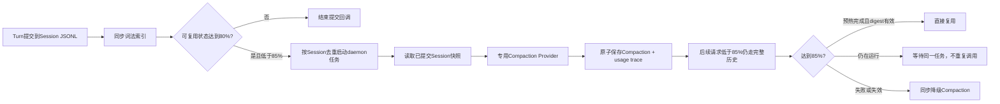

# Compaction 专用 Provider 与后台预热设计记录

> 日期：2026-07-26
>
> 状态：已实现；当前口径已同步 Part 15 活文档。
>
> 承接：`docs_design/2026-07-26-session-compaction-watermark-strategy-design.md`

## 背景

`85 / 15 / 35` 分离水位和摘要预算预留已经把同一Turn的低水位重复压缩从两次降为一次。真实Provider合成冒烟中，首次调用链由两次compaction加answer收敛为一次compaction加answer；但首次单次compaction仍是同步LLM调用，复杂真实历史可能持续数十秒。Compaction还会额外消耗输入/输出Token，当前trace没有单独暴露Provider usage，无法判断费用是否被后续上下文节省摊回。

## 目标

1. 回答模型与Compaction模型解耦，由App层注入独立`LLMProvider`。
2. trace记录每次Compaction的真实Provider、模型、输入/输出/总Token；配置价格后计算估算费用，未配置时明确不可用。
3. Session可复用状态达到80%且仍低于85%时，后台预生成有效Compaction；达到85%时优先使用，避免同步首压等待。
4. 保持JSONL真值、用户隔离、source digest失效、CLI/Web/QQ/微信一致性。

## 范围边界

- 不在AgentLoop中选择服务商、模型或计算业务水位。
- 不新增后台常驻服务、任务数据库或跨进程队列；当前实现是进程内、daemon线程、每Session最多一个任务。
- 后台只读取已提交完整Turn，不压缩当前运行Turn。
- 80%预热可能在用户停止聊天时产生一次未使用费用；必须写trace，不允许每轮重复。
- 85%以下主请求仍使用完整历史；后台Compaction只是派生状态，不能提前替换当前上下文。
- 后台失败、进程退出或摘要过期均回退同步主链，不影响Session保存。

## 配置

```json
{
  "default": "cpa_one",
  "compaction": "cpa_one",
  "cpa_one": {
    "base_url": "...",
    "api_key": "${ENV_VAR}",
    "model": "gpt-5.4"
  }
}
```

```yaml
context:
  compaction:
    background_enabled: true
    background_trigger_budget_ratio: 0.80
    input_price_per_million: 0
    output_price_per_million: 0
```

- `llm_endpoints.json`的顶层`compaction`与`default`使用同一别名协议，指向一个包含地址、Key、模型、窗口和输出预算的完整端点；别名缺失或不可用时回退当前Turn Provider。
- `context.yml`只表达水位、后台策略与可选价格，不重复端点路由或Secret。
- 价格为可选非负数，币种由部署配置约定；默认0表示只记录Token，不声称费用。
- 后台trigger必须低于前台85% trigger，高于35%压缩后目标。

## 模块与数据流



## 并发与失效

- ContextBuilder维护`session_id -> Future`，受锁保护；重复提交只观察同一任务。
- Build低于85%不等待后台任务；达到85%且任务仍在运行时等待该Future，避免同一Session并发重复压缩。
- 后台Planner使用独立实例，关闭history query与retrieval，只生成Compaction派生状态。
- CompactionStore继续通过临时文件加`os.replace`原子保存；前台加载时继续校验source digest。
- clear/delete使旧摘要失效；后台晚到写入即使成功，下一次加载也因JSONL为空或digest不匹配被删除。实现同时尽力取消尚未开始的Future。

## Usage与费用trace

`context.compaction.usage`只记录：

```text
session_id
phase = foreground | background
endpoint / model
prompt_count / completion_count / total_count / usage_unit=tokens
estimated_cost
cost_available
```

不记录Prompt、Session正文、Embedding或Secret。Provider未返回usage时Token字段为0并标记`usage_available=false`；不能用本地估算冒充账单真值。

## 变更文件

- `agent/context/config.py`
- `agent/context/compaction.py`
- `agent/context/planner.py`
- `agent/core/context.py`
- `agent/cli.py`
- `agent/app/runtime.py`
- `config/context.example.yml`
- `tests/unit_test/context_engineering/`及相关装配测试
- Part 15活文档与本文

## 测试方案

- 专用Provider只用于Compaction，answer仍使用当前Turn Provider。
- endpoint为空时兼容复用当前Provider；非法端点安全失败或明确降级。
- usage存在、缺失、不同字段命名、价格配置和不泄露正文。
- 79.9%不启动；80%启动一次；重复Turn提交不重复任务。
- 80%后台任务完成后，85%请求复用相同Compaction。
- 85%到达时后台仍运行则只等待，不并发发起第二次Compaction。
- 后台失败、digest失效、clear/delete、进程退出安全降级。
- Ruff、Part 15专项、相关回归、全量pytest与完全合成真实Provider冒烟。

## 验收标准

- AgentLoop不import具体Provider、后台线程或Compaction实现。
- CLI/Web/QQ/微信通过共享ContextBuilder得到相同行为。
- 同一Session同一source范围最多一个后台Compaction任务。
- 80%预热不改变85%以下当前回答的完整历史语义。
- usage/费用trace真实、可解释且不泄露内容。
- 任一可选优化失败时，Session JSONL和普通回答主链保持可用。

## 真实合成冒烟结果

使用81%已提交上下文、完全合成的19个Turn、真实聊天Provider与百炼1024维Embedding验证：Turn提交回调在0.0285秒返回，后台Compaction在10.83秒完成，真实usage为输入22,382、输出431 Token；后续越过85%时直接复用同一Compaction，answer调用4.09秒、总响应7.18秒，Turn 1以`semantic`召回且`degraded=[]`。临时目录正常清理，证明SQLite短连接修复有效。

冒烟也证明工作区原`cpa_model/claude-sonnet-4-6`端点由上游返回`unknown provider`并回退到`cpa_one/gpt-5.4`；`cpa_two`同样不可用，`deepseek`缺少当前环境凭据。因此真实工作区暂将`llm_endpoints.json`中的`compaction`别名指向可用的`cpa_one`，保证独立Provider边界与后台预热真实生效，但不声称已经获得专用廉价模型的价格优势。以后配置可用快速端点后只需修改该别名，无需改`context.yml`、AgentLoop或ContextPlanner。
