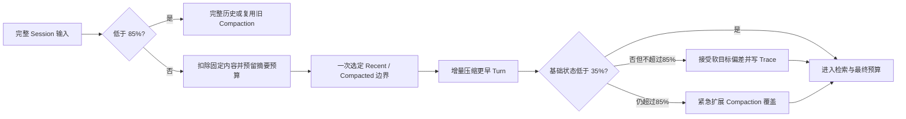

# Session Compaction 分离水位策略设计记录

> 日期：2026-07-26
>
> 状态：已实现；当前施工口径维护在 `docs_design/zhice-agent-part15-context-engineering-design.md`。
>
> 承接：`docs_design/2026-07-26-full-session-context-engineering-design.md`

## 背景

Part 15 初版采用 `80%` 触发、压缩到约 `70%`。真实长 Session 冒烟证明复用水位已经消除“每轮都调用 compactor”的 37 秒级延迟，但 70% 低水位只留下约 10% 的再次增长空间，且一个 `target_budget_ratio` 同时表达近期原文保留量与压缩后总体目标，语义不清。

对照 Codex、LangChain/Deep Agents 和 Aider 的公开实现后，可以确认成熟方案普遍把触发条件与压缩后保留量分离，并保留连续近期原文；具体比例会随产品目标变化，不存在对所有模型都唯一最优的常数。ZhiCe 当前更重视低频压缩、Provider-neutral、完整 JSONL 真值和多渠道一致性，因此采用保守的三水位默认值。

## 目标与范围边界

- 完整历史尽可能长期保持逐字可见。
- 接近窗口时才支付 LLM compaction 的延迟与费用。
- 压缩后留下足够增长空间，避免很快再次压缩。
- 保留连续 recent raw Turn，减少摘要信息损失。
- compaction 覆盖边界必须连续，不能为了命中低水位制造上下文空洞。
- 不引入后台常驻 worker，不把渠道判断或 Provider SDK 放入 AgentLoop。
- 本次不实现 60% Tool 清理、75% 后台预生成；它们需要独立生命周期与并发安全设计。

## 决策

```text
trigger_budget_ratio         = 0.85
recent_keep_ratio            = 0.15
post_compaction_max_ratio    = 0.35
```

- `trigger_budget_ratio`：完整输入或“旧 compaction + 新增 raw 尾部”达到 85% 才触发/刷新。
- `recent_keep_ratio`：刚触发时，最近原始 Turn 目标占输入预算约 15%。
- `post_compaction_max_ratio`：刚完成 compaction 后，固定内容、结构化摘要和 recent raw 的可复用基础状态目标不高于约 35%。检索 evidence 属于当前问题的动态补充，仍由最终输入预算约束。
- `min_recent_turns=8` 降为连续性偏好。Token 边界优先；超大 Turn 保持块完整，必要时只能保留最新完整 Turn或由最终预算器删除。

## 数据流与安全边界



Session JSONL 不修改。Planner 在首次调用前为摘要预留空间，尽量一次选准边界；35%轻微偏差不再触发同步二次压缩。只有新基础状态仍超过85%时才允许紧急移动边界，且必须先让新compaction覆盖被移出的完整Turn，再删除其raw注入；失败时保留原raw尾部并标记degraded。SQLite index和compaction继续是用户隔离、可失效、可重建的派生状态。

## 配置迁移

新模板只写三个新字段。旧 `target_budget_ratio` 不再兼容或懒映射；旧工作区必须显式迁移，继续使用旧字段时配置加载会明确报 unknown field，避免静默保留旧行为。`recent_keep_ratio` 不得大于 `post_compaction_max_ratio`，两个低水位都必须低于 trigger。

## 变更文件

- `agent/context/config.py`
- `agent/context/planner.py`
- `config/context.example.yml`
- `tests/unit_test/context_engineering/`
- Part 15 活文档与本设计记录

## 测试方案

- 默认值和旧字段迁移。
- 三水位非法顺序与新旧字段冲突。
- 85% 以下不触发，达到 85% 才触发。
- recent raw 受 15% 目标约束且不拆 Turn/Tool block。
- 首次选择边界前预留摘要预算；35%轻微超出只写trace，不得立即追加一次LLM调用。
- 只有压缩后基础状态仍超过85%时允许紧急扩展覆盖；超过32个新增Turn仍按输入大小做有界增量批次。
- compaction 输出推高基础状态时，边界扩展后仍连续覆盖。
- 旧 compaction + 增量尾部低于 85% 时不新增 LLM 调用。
- compactor 失败时不因低水位丢弃未覆盖 raw Turn。
- compactor 前置条件不可用时绕过 15% 目标，在最终硬预算内尽量保留连续近期 raw Turn。
- Ruff、Part 15 专项、相关回归和全量 pytest。

## 验收标准

- 默认配置真实为 `85 / 15 / 35`，不只是文档改数值。
- 压缩不会按每轮或固定 Turn 数执行。
- 35%为软目标；同一Turn不得仅为命中低水位重复调用compactor。
- `context.selection` trace 记录三个比例，但不记录正文。
- compaction 覆盖终点与 recent raw 起点连续；失败时宁可超过 35% 目标，也不能丢 Session 真值。
- CLI/Web/QQ/微信仍共用同一个 ContextPlanner/AgentLoop 调用链。

## 真实延迟优化验证

同日使用20,000 Token受控预算、19个完全合成Turn、真实聊天Provider和百炼`text-embedding-v4` 1024维Embedding复测。优化前同规模真实Session首次调用链为两次compaction加一次answer，总耗时98.15秒；加入摘要预留和35%软目标后，调用链收敛为一次compaction加一次answer，总耗时15.89秒，其中compaction 10.38秒、answer 3.19秒。第二轮复用同一compaction，只调用一次answer，总耗时5.19秒；早期Turn 1以`semantic`原因召回，回答正确且`degraded=[]`。

该合成冒烟退出时暴露SQLite连接上下文只提交但未显式关闭，在Windows临时目录清理阶段触发文件占用。索引实现同步改为每次操作显式commit/rollback/close；这不改变JSONL真值或索引协议，只收紧派生状态资源生命周期。
