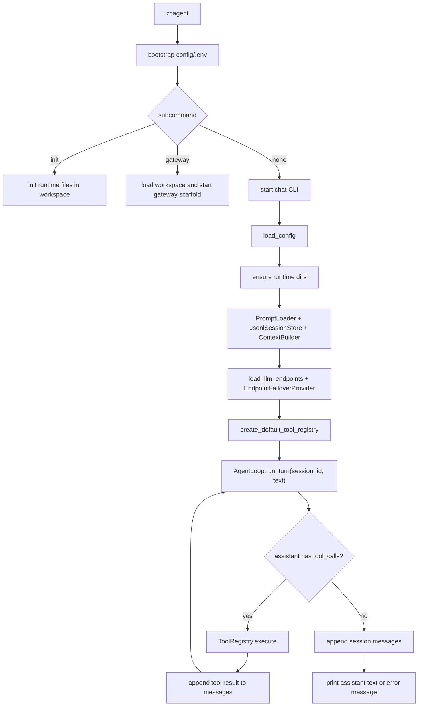

# 智策 Agent（ZhiCe-Agent）总体设计文档

> 目标：设计一个适合学习、开发、逐步实现的轻量 Agent 项目。
>
> 文档类型：当前活文档。本文档始终以最新代码和当前阶段口径为准。

---

## 1. 这份文档要解决什么问题

很多 Agent 系统会同时包含多端接入、用户体系、工具调用、技能扩展、会话管理、长期记忆、前端交互和部署治理。完整平台能力很强，但如果一开始全部纳入，会带来两个问题：

1. **太重**：大量能力在第一阶段用不上，却会增加理解和开发成本。
2. **太耦合**：核心 AgentLoop 容易混入渠道、界面、部署和业务细节，后续演进会变慢。

所以 ZhiCe-Agent 的设计方式是：

> 先搭一个小而清楚的 Agent 内核，再围绕内核逐步扩展。

这份文档是 ZhiCe-Agent 的总体设计蓝图。它既给后续实现用，也适合作为学习路线。后面可以一章一章实现，每一步都知道自己在做什么、为什么这么做。

---

## 2. 核心设计思想

### 2.1 最重要的核心：Agent Loop

Agent 项目最核心的不是 Web，也不是数据库，也不是部署，而是 Agent Loop。

它的基本流程是：

```text
用户输入
  -> 构建上下文
  -> 调用 LLM
  -> LLM 决定是否调用工具
  -> 执行工具
  -> 把工具结果放回上下文
  -> 再调用 LLM
  -> 直到得到最终回答
  -> 保存会话
```

换句话说，Agent Loop 负责让 LLM “边想边做事”。

这个循环是所有能力的根：

- 想读文件？LLM 调 `read_file` 工具。
- 想搜索项目？LLM 调 `grep` 工具。
- 想运行脚本？LLM 调 `exec` 工具。
- 想使用业务能力？LLM 先加载 Skill，再按 Skill 说明执行脚本。
- 想拆任务？未来可以让 LLM 调 `spawn_agent`。

所以智策 Agent 项目第一阶段必须先把 Agent Loop 做出来。

### 2.2 第二个核心：工具系统

工具系统的作用是把 Python 能力暴露给 LLM。

成熟 Agent 系统中的工具通常包括：

- 文件读取、写入、编辑。
- 目录列表。
- grep/glob 搜索。
- shell 执行。
- Skill 加载。
- MCP 工具。
- 记忆工具。
- 子代理工具。
- 消息发送工具。
- 前端 UI 渲染工具。

智策 Agent 当前第一阶段已经落地的最小工具集是：

```text
read_file     读取文件
list_dir      查看目录
grep          搜索文本
exec          执行安全命令
load_skills   读取完整 Skill 说明
sync_skills   同步已配置 Skill source
```

`write_file`、外部 API、MCP、Memory 和 Subagent 都属于后续扩展，不放进当前默认工具集；Skill 正文加载与同步已作为当前轻量工具进入主线。

工具系统最值得学习的设计是：

```text
Tool 类
  -> 定义 name / description / parameters
  -> 实现 execute(args)

ToolRegistry
  -> 注册工具
  -> 给 LLM 返回工具 schema
  -> 根据 LLM 的 tool_call 执行对应工具
```

这样 Agent Loop 不需要知道每个工具怎么实现，它只需要把 LLM 的工具调用交给 `ToolRegistry`。

### 2.3 第三个核心：Skill 体系

这是 Agent 项目里很有价值的思想之一。

很多 Agent 项目会把业务逻辑直接写进 Agent Loop，比如：

```python
if user_asks_weather:
    call_weather_api()
elif user_asks_report:
    generate_report()
```

这样做短期很快，长期会让 Agent Loop 变成一锅粥。

更好的做法是：

> Agent Loop 不写业务功能。业务功能做成 Skill。

一个 Skill 的结构是：

```text
extends/{source_name}/skills/{skill_name}/
+-- SKILL.md
+-- scripts/
    +-- run.py
```

当前落地代码中，`${ZHICE_AGENT_SKILL_REPO}` 表示本地技能仓库根目录；运行时会按 `${ZHICE_AGENT_WORKSPACE}/config/skill_sources.yml` 同步到 `${ZHICE_AGENT_WORKSPACE}/extends/{source_name}/`，`SkillLoader` 固定从各 source 的 `skills/` 目录扫描。Skill 的运行时身份是 `source/name`，其中 `name` 来自 Skill 外层目录名。

`SKILL.md` 是给 LLM 看的说明书，里面写：

- 这个 Skill 什么时候用。
- 参数有哪些。
- 怎么执行脚本。
- 输入 JSON 示例。
- 输出 JSON 格式。
- 错误码含义。
- 失败后该不该重试。

脚本负责真正执行能力。

LLM 的使用流程是：

```text
1. 看到 skill 摘要
2. 判断 skill 可能有用
3. 调 load_skills 读取完整 SKILL.md
4. 按 SKILL.md 里的命令调用 exec
5. exec 执行 scripts/*.py --params '{JSON}'
6. 脚本返回 JSON
7. LLM 根据结果回答用户
```

智策 Agent 项目应该完整保留这个思想。

但是第一阶段不要引入复杂的多层扩展目录，比如用户私有层、开发暂存层、团队扩展层、公共扩展层等覆盖关系。

智策 Agent 项目当前阶段只保留一层 source 仓库，不做多层覆盖链：

```text
skill_repo/skills/{skill_name}/SKILL.md
skill_repo/skills/{skill_name}/scripts/*.py

同步后：
${ZHICE_AGENT_WORKSPACE}/extends/{source_name}/skills/{skill_name}/SKILL.md
${ZHICE_AGENT_WORKSPACE}/extends/{source_name}/skills/{skill_name}/scripts/*.py
```

### 2.4 第四个核心：协议边界

成熟系统通常会设置协议层，它的思想是：

> 各模块之间尽量通过接口沟通，而不是直接依赖具体实现。

智策 Agent 项目不需要那么多协议，但应该保留最小的几个：

```text
LLMProvider      调 LLM 的接口
ToolProvider     工具注册与执行接口
SkillProvider    技能发现与加载接口
SessionStore     会话存储接口
```

这样做的好处是：

- 一开始可以用 OpenAI，后面换 LiteLLM。
- 一开始可以用 JSONL 存会话，后面换 SQLite。
- 一开始 Skill 只读本地目录，后面可以读远程仓库。
- Agent Loop 不需要跟所有具体实现纠缠。

### 2.5 第五个核心：Prompt 文件化

这里采用一个重要规范：

> 所有 LLM 会看到的 prompt，都放在 Markdown 文件里。

智策 Agent 项目也应该坚持这个原则。

推荐：

```text
prompts/
+-- identity.md
+-- tool_use_policy.md
+-- skills_intro.md
+-- summarize_session.md
```

不要在 Python 里到处写长 prompt。

原因：

- Prompt 是 Agent 的“操作系统说明书”。
- Prompt 应该能被人直接阅读。
- Prompt 的演进应该走版本管理。
- 后续调 Agent 行为时，改 Markdown 比翻 Python 字符串舒服。

### 2.6 第六个核心：Session 是上下文的一部分

Session 不只是日志。

Session 会影响下一轮对话，因为历史消息会被重新放回 LLM 上下文。

智策 Agent 项目第一版可以用 JSONL。当前普通 CLI 未指定 `--session` 时默认使用当天会话，例如：

```text
contexts/sessions/chat-YYYYMMDD.jsonl
```

显式传入 `--session default` 或其它名称时，仍然可以恢复指定会话。

早期示例中的固定 `default.jsonl` 仍可作为手动命名会话存在，但不再作为普通聊天默认值：

```text
contexts/sessions/default.jsonl
```

每一行是一条消息：

```json
{"role":"user","content":"hello","timestamp":1781000000.0}
```

优点：

- 简单。
- 可读。
- 容易调试。
- 不需要数据库。

等后面需要会话搜索、会话标题、工具步骤表，再升级 SQLite。

后续上下文治理要继续完善：当前 `ContextBuilder` 先按最近消息数裁剪历史，已经能避免无限带入旧上下文；下一步应改成更接近参考项目的“按最近 N 轮 user turn”裁剪，并处理历史 tool 调用块，避免简单问候时被很久以前的任务牵引。

---

## 3. 智策 Agent（ZhiCe-Agent）项目的总体设计

### 3.1 当前实现目标

当前代码库已经落地的是一个轻量、可运行、可逐步演进的本地 Agent 内核，核心能力是：

```text
一个 CLI 智策 Agent：
能启动，
能加载 workspace 配置，
能读取 Markdown Prompt，
能保存和恢复会话，
能完成无工具聊天和工具调用循环，
能把只读工具与安全 exec 暴露给 LLM，
能通过 OpenAI-compatible 或 LiteLLM Provider 调用模型，
能按 endpoint priority 做轻量 failover，
能用 /model 查看和切换本进程内首选模型，
能提供本地 gateway scaffold，
能通过 `zcagent init` 生成运行时文件。
```

这就是当前代码真正实现出来的第一阶段闭环。它已经不是“只聊天”的版本，而是包含本地工具、命令验证、endpoint 管理和模型切换的轻量 Agent 内核。

### 3.2 未来扩展方向

当前代码还没有实现的能力，后续再按模块增加：

- Web 前端。
- 登录系统。
- 多用户。
- 外部 IM / 协作平台接入。
- Skill Market。
- 审批。
- 通知。
- 复杂部署编排。
- 复杂 Memory。
- Subagent。
- MCP。
- session 级 `/model` 选择持久化。
- Provider 错误分类、同 endpoint 重试和 cooldown。

这些能力不是不要，而是现在还没有进入代码主线。已经落地的只读工具、`exec`、LiteLLM、endpoint failover 和 `/model` 命令，应视为当前架构边界的一部分。

### 3.3 推荐目录结构

```text
zhice_agent/
+-- pyproject.toml
+-- README.md
+-- .env.example
+-- config/
|   +-- llm_endpoints.example.json
|   +-- skill_sources.example.yml
+-- prompts/
|   +-- identity.md
|   +-- tool_use_policy.md
|   +-- skills_intro.md
|   +-- summarize_session.md
+-- agent/
|   +-- __init__.py
|   +-- cli.py
|   +-- loop.py
|   +-- context.py
|   +-- message.py
|   +-- config.py
|   +-- prompt_loader.py
|   +-- protocols/
|   |   +-- llm.py
|   |   +-- tool.py
|   |   +-- skill.py
|   |   +-- session.py
|   +-- llm/
|   |   +-- openai_provider.py
|   |   +-- litellm_provider.py
|   |   +-- failover_provider.py
|   +-- tools/
|   |   +-- base.py
|   |   +-- registry.py
|   |   +-- readonly.py
|   |   +-- exec.py
|   |   +-- shell_policy.py
|   +-- skills/
|   |   +-- loader.py
|   |   +-- markdown.py
|   |   +-- sync.py
|   +-- session/
|       +-- jsonl_store.py
+-- skill_repo/
|   +-- skills/
|       +-- README.md
|       +-- {skill_name}/
|           +-- SKILL.md
|           +-- scripts/
+-- tests/
    +-- test_agent_loop_fake_llm.py
    +-- test_tool_registry.py
    +-- test_skill_loader.py
    +-- test_session_store.py
```

这份目录结构是第一阶段的轻量形态，核心目标是先让 CLI、AgentLoop、工具、Session 和 Prompt 闭环跑起来。当前阶段不急着照搬大型平台里的 `app/api`、`agent_core` 等完整分层，否则会在能力还没展开前引入过多空目录和 import 迁移成本。

参考大型 Agent 项目时，更应该吸收它的边界思想，而不是直接复制目录重量：

```text
app shell       -> CLI / HTTP API / Web / 渠道 / 鉴权 / 产品服务
agent core      -> AgentLoop / ContextBuilder / ToolRegistry / Provider / Session
protocols       -> LLMProvider / ToolProvider / SkillProvider / SessionStore 等稳定协议
```

当前代码里：

- `agent/loop.py`、`agent/context.py`、`agent/tools/`、`agent/llm/`、`agent/session/` 属于核心层。
- `agent/cli.py` 和 `agent/gateway.py` 属于入口层或未来 app shell。
- `agent/protocols/` 已经承担协议层职责，应该保持只放接口和数据结构。

因此，短期先保持现有结构；当 HTTP API、Web UI、鉴权、渠道或更多产品服务真正出现时，再演进为更明确的分层：

```text
agent/
+-- app/
|   +-- cli.py
|   +-- gateway.py
|   +-- api/
|       +-- routes.py
+-- core/
|   +-- loop.py
|   +-- context.py
+-- protocols/
+-- tools/
+-- llm/
+-- session/
+-- config.py
```

迁移原则：

- 不为了“看起来像平台”提前拆目录。
- 一旦拆分，依赖方向固定为 `app -> core -> protocols`，`protocols` 禁止 import 具体实现。
- `core` 不 import `app`，AgentLoop 不知道 CLI、HTTP、Web、鉴权或渠道。
- 先在设计文档里写清迁移范围，再做文件移动，避免纯路径重构打断当前里程碑学习。

---

## 4. 核心运行流程

### 4.1 一轮对话发生了什么

用户输入：

```text
hello
```

当前 Agent 内部流程是：

```text
1. CLI 收到用户输入
2. AgentLoop 加载 session 历史
3. ContextBuilder 构造 system prompt + history + 当前用户消息
4. LLMProvider 调用模型一次
5. 如果 LLM 返回 tool_calls，AgentLoop 串行执行工具并把 tool 消息回填
6. 重复调用 LLM，直到得到无工具调用的最终 assistant 回复，或达到工具轮数上限
7. 保存 user / assistant(tool_calls) / tool / assistant(final) 等本轮消息
8. 如果 LLM 或保存失败，也把错误作为 assistant 消息保留
9. CLI 打印最终文本
```

### 4.2 Mermaid 流程图



当前实现已经包含工具调用、多轮 tool loop、Skill source 同步、SkillLoader、`load_skills` 与 `sync_skills`；MCP、Hook 和 Subagent 仍是后续能力。

---

## 5. 数据结构设计

下面第 5 节开始同时包含当前代码结构和长期路线图。当前已实现 CLI、配置、Prompt、Session、无工具聊天、工具调用、安全 exec、LiteLLM、endpoint failover、`/model`、gateway scaffold、Skill source 同步、SkillLoader、`load_skills` 和 `sync_skills`；Memory、MCP、Hooks、Subagent 仍是后续设计。

### 5.1 Message

消息是 Agent 的最基本数据。

```python
from dataclasses import dataclass, field
from typing import Any, Literal

Role = Literal["system", "user", "assistant", "tool"]

@dataclass
class Message:
    role: Role
    content: str
    name: str | None = None
    tool_call_id: str | None = None
    tool_calls: list[dict[str, Any]] = field(default_factory=list)
    metadata: dict[str, Any] = field(default_factory=dict)
```

角色含义：

```text
system      给 LLM 的系统指令
user        用户输入
assistant   LLM 输出
tool        工具执行结果
```

### 5.2 ToolResult

```python
@dataclass
class ToolResult:
    output: str
    is_error: bool = False
    metadata: dict[str, Any] = field(default_factory=dict)
```

工具永远返回统一结构。

这样 AgentLoop 不需要关心每个工具内部细节。

### 5.3 ToolDefinition

当前代码没有单独的 `ToolDefinition` dataclass，而是让每个 `Tool` 直接声明 `name`、`description`、`parameters`，由 `ToolRegistry.definitions()` 生成 OpenAI-compatible `tools` schema。

```python
class Tool(Protocol):
    name: str
    description: str
    parameters: dict[str, Any]

    def execute(self, args: dict[str, Any]) -> ToolResult:
        ...
```

当前第一阶段刻意保持工具协议轻量：

- `name`、`description`、`parameters` 是 function calling 风格模型需要理解的核心信息。
- `ToolRegistry.definitions()` 返回 `list[dict[str, Any]]`，也就是 OpenAI-compatible schema。
- 如果后续要支持更多模型供应商差异，再把中性 `ToolDefinition` 抽出来，让 provider adapter 负责格式转换。
- `exclusive`、`category`、`read_only` 等元信息用于后续并发、确认流或 Skill 分类，当前代码暂不引入。

当前阶段使用 OpenAI-compatible dict 作为共同格式，因为 `OpenAIProvider` 和 `LiteLLMProvider` 都能消费这类 `tools` schema。等接入不兼容该 schema 的模型时，应把转换逻辑收口到 LLM provider 或小型 adapter 中。

### 5.4 SkillInfo

```python
@dataclass
class SkillInfo:
    source: str
    name: str
    qualified_name: str
    description: str
    root: Path
    skill_file: Path
    scripts_dir: Path
    summary: str
    metadata: dict[str, Any] = field(default_factory=dict)
```

这个结构用于向 LLM 展示 Skill 摘要，并保留 `source/name` 限定名，避免跨 source 同名 Skill 调用歧义。

### 5.5 SessionState

```python
@dataclass
class SessionState:
    session_id: str
    messages: list[Message]
    metadata: dict[str, Any] = field(default_factory=dict)
```

---

## 6. 协议接口设计

### 6.1 LLMProvider

```python
class LLMProvider(Protocol):
    def chat(
        self,
        messages: list[dict[str, Any]],
        tools: list[dict[str, Any]] | None = None,
    ) -> LLMResponse:
        ...
```

返回统一格式：

```python
@dataclass
class LLMResponse:
    content: str
    tool_calls: list[dict[str, Any]] = field(default_factory=list)
    metadata: dict[str, Any] = field(default_factory=dict)
```

这样 OpenAI、LiteLLM、OpenRouter、本地模型都可以被包装成同一种接口。

当前接口是同步的。后续如果 Web API、并发工具或 MCP 需要异步能力，应先新增设计文档，再统一评估是否把 `LLMProvider`、`ToolProvider` 和 `AgentLoop` 改为 async。

LLMProvider 内部负责把工具 schema 传给目标模型需要的请求格式：

```text
ToolRegistry.definitions()
  -> OpenAI-compatible tools
  -> LiteLLM tools
  -> 其他供应商的工具调用格式
```

这样 `AgentLoop` 和 `ToolRegistry` 不需要知道当前模型到底使用 OpenAI、Anthropic、Gemini 还是本地兼容服务。

### 6.2 LLM 错误结构

LLM 错误也属于 provider 边界的一部分。`AgentLoop` 不应该靠解析 HTTP body 或字符串片段判断错误原因；当前只接收 provider 抛出的安全错误文本，保存会话并展示用户可读提示。

#### 当前已实现

```python
class LLMProviderError(RuntimeError):
    """Base error raised by LLM providers."""


class LLMConfigurationError(LLMProviderError):
    """Raised when LLM configuration is missing or invalid."""
```

`LLMConfigurationError` 用于本地配置错误，例如缺少 `api_key`、`${ENV_VAR}` 未定义、endpoint 配置字段非法等。`LLMProviderError` 用于运行时 LLM 调用失败。两者都只携带安全文本，不包含结构化错误元信息。

错误文本必须脱敏。Provider 可以保留短错误摘要，但不能把真实 API key、Authorization header、完整请求体或长 traceback 直接交给 `AgentLoop`。

#### 后续目标：结构化错误分类

后续错误分类阶段应把 `LLMProviderError` 扩展为携带结构化元信息：

```python
LLMErrorCode = Literal[
    "CONFIG_INVALID",
    "AUTH_FAILED",
    "MODEL_NOT_FOUND",
    "RATE_LIMITED",
    "NETWORK_ERROR",
    "INVALID_RESPONSE",
    "PROVIDER_HTTP_ERROR",
    "PROVIDER_ERROR",
]


class LLMProviderError(RuntimeError):
    def __init__(
        self,
        message: str,
        *,
        code: LLMErrorCode = "PROVIDER_ERROR",
        status_code: int | None = None,
        retryable: bool = False,
        user_hint: str = "",
    ):
        ...
```

Provider 层负责把具体供应商错误转换为稳定错误码：

```text
401 / invalid_api_key       -> AUTH_FAILED
403 / permission denied     -> AUTH_FAILED
404 / model not found       -> MODEL_NOT_FOUND
429 / rate limit            -> RATE_LIMITED
DNS / timeout / connect     -> NETWORK_ERROR
JSON decode failed          -> INVALID_RESPONSE
其他 HTTP 4xx/5xx           -> PROVIDER_HTTP_ERROR
未知异常                    -> PROVIDER_ERROR
```

配置错误通常不是 retryable；限流、网络抖动、部分 5xx 可以标记为 `retryable=True`，供后续自动重试或提示用户稍后再试。

### 6.3 Tool

```python
class Tool(Protocol):
    name: str
    description: str
    parameters: dict[str, Any]

    def execute(self, args: dict[str, Any]) -> ToolResult:
        ...
```

### 6.4 ToolProvider

```python
class ToolProvider(Protocol):
    def definitions(self) -> list[dict[str, Any]]:
        ...

    def execute(self, name: str, args: dict[str, Any]) -> ToolResult:
        ...
```

`ToolProvider` 当前提供 OpenAI-compatible 工具定义和执行入口，这是第一阶段的务实选择。长期如果接入不兼容 OpenAI tools schema 的 provider，再把 schema 转换下沉到 provider adapter。

### 6.5 SkillProvider

```python
class SkillProvider(Protocol):
    def list_skills(self) -> list[SkillInfo]:
        ...

    def get_skill_body(self, name: str) -> str:
        ...
```

### 6.6 SessionStore

```python
@dataclass
class SessionSummary:
    session_id: str
    preview: str
    updated_at: float
    message_count: int


class SessionStore(Protocol):
    def load(self, session_id: str) -> SessionState:
        ...

    def append(self, session_id: str, messages: list[Message]) -> None:
        ...

    def clear(self, session_id: str) -> None:
        ...

    def list_sessions(self) -> list[SessionSummary]:
        ...
```

`clear` 被 `/reset` 使用，`list_sessions` 被 `/sessions` 使用。`SessionSummary` 用于渲染 CLI 会话列表。

---

## 7. AgentLoop 设计

### 7.1 AgentLoop 负责什么

AgentLoop 只负责通用循环：

1. 接收用户消息。
2. 加载历史。
3. 构造上下文。
4. 调用 LLM。
5. 执行工具。
6. 回填工具结果。
7. 重复直到最终回答。
8. 保存消息。

### 7.2 AgentLoop 不负责什么

AgentLoop 不应该负责：

- 天气业务怎么查。
- 报告业务怎么写。
- 外部协作消息怎么发。
- 审批怎么走。
- 前端怎么显示。
- 某个 Skill 的参数怎么解释。
- HTTP 状态码、供应商错误体、限流和模型不存在等 LLM provider 细节怎么分类。

这些应该放到工具、Skill、渠道层或者前端层。

### 7.3 简化伪代码

```python
class AgentLoop:
    def __init__(self, llm, sessions, context_builder, workspace, tools=None, max_tool_iterations=4):
        self.llm = llm
        self.sessions = sessions
        self.context_builder = context_builder
        self.workspace = workspace
        self.tools = tools
        self.max_tool_iterations = max_tool_iterations
        # Skill 摘要由 ContextBuilder 注入，AgentLoop 仍只处理通用 tool loop

    def run_turn(self, session_id: str, user_text: str) -> str:
        session = self.sessions.load(session_id)
        user_msg = Message(role="user", content=user_text)

        messages = self.context_builder.build(
            history=session.messages,
            user_message=user_msg,
        )

        new_messages = [user_msg]
        final_text = ""

        tool_definitions = self.tools.definitions() if self.tools else None

        for _ in range(self.max_tool_iterations):
            try:
                response = self.llm.chat(messages=messages, tools=tool_definitions)
            except LLMConfigurationError as exc:
                error_text = format_configuration_error(exc)
                new_messages.append(Message(role="assistant", content=error_text, metadata={"is_error": True}))
                final_text = error_text
                break
            except LLMProviderError as exc:
                error_text = format_provider_error(exc)
                new_messages.append(Message(role="assistant", content=error_text, metadata={
                    "is_error": True,
                    "error_type": type(exc).__name__,
                }))
                final_text = error_text
                break
            except Exception as exc:
                error_text = format_unknown_llm_error(type(exc).__name__)
                new_messages.append(Message(role="assistant", content=error_text, metadata={"is_error": True}))
                final_text = error_text
                break

            assistant_msg = Message(
                role="assistant",
                content=response.content or "",
                tool_calls=response.tool_calls or [],
            )
            messages.append(assistant_msg)
            new_messages.append(assistant_msg)

            tool_calls = assistant_msg.tool_calls
            if not tool_calls:
                final_text = assistant_msg.content
                break

            for call in tool_calls:
                result = self.tools.execute(
                    call["name"],
                    call["arguments"],
                )
                tool_msg = Message(
                    role="tool",
                    name=call["name"],
                    tool_call_id=call["id"],
                    content=result.output,
                    metadata=result.metadata,
                )
                messages.append(tool_msg)
                new_messages.append(tool_msg)

        self.sessions.append(session_id, new_messages)
        return final_text or "工具调用轮数已达到上限，未生成最终回答。"
```

这里的重点不是让 `AgentLoop` 变成错误分类中心，而是让它稳定收尾：

- 保存本轮已经产生的 `user`、`assistant(tool_calls)`、`tool`、`assistant(error)` 消息。
- 对 `LLMConfigurationError` 给出可操作配置提示。
- 对 `LLMProviderError` 使用 provider 给出的安全错误文本格式化提示。
- 对未知异常只展示错误类型，不展示原始异常正文，避免泄露 secret。
- 不在 `AgentLoop` 里解析 HTTP body、供应商错误 JSON 或模型私有字段。
- `code`、`status_code`、`retryable`、`user_hint` 等结构化错误字段是后续 Provider 错误分类阶段要补的能力。

---

## 8. ContextBuilder 设计

ContextBuilder 负责把各种上下文拼成 LLM 能理解的 messages。

输入：

- 身份 prompt。
- 工具使用策略。
- Skill 摘要。
- 历史消息。
- 当前用户消息。

输出：

```python
[
    {"role": "system", "content": "..."},
    {"role": "user", "content": "...历史用户消息..."},
    {"role": "assistant", "content": "...历史回答..."},
    {"role": "user", "content": "...当前用户输入..."}
]
```

### 8.1 system prompt 结构

推荐：

```text
# 你的身份
{identity.md}

# 工具使用规则
{tool_use_policy.md}

# Skill 使用规则
{skills_intro.md}

# 当前可用 Skill 摘要
{skill_summaries}

# 运行环境
workspace={workspace}
session_id={session_id}
```

### 8.2 历史裁剪

第一版不要做复杂压缩。

简单策略：

- 保留最近 30 条消息。
- 如果工具结果太长，截断到固定长度。

后续再做：

- token 估算。
- 会话摘要。
- memory recall。

---

## 9. Prompt 文件设计

### 9.1 `prompts/identity.md`

说明 Agent 是谁。

示例：

```markdown
你是一个智策 Agent，帮助用户思考、开发、研究和自动化。

你会认真理解用户目标，必要时使用工具，而不是凭空猜测。

你不把业务流程硬编码在自己身上。当某个能力以 Skill 形式存在时，你应该先加载并阅读 Skill 说明。

你回答要清晰、具体、可执行。
```

### 9.2 `prompts/tool_use_policy.md`

说明工具使用规则。

示例：

```markdown
当工具能显著提高准确性或能让你完成实际操作时，使用工具。

工具失败后，不要用完全相同的参数反复重试。

执行可能破坏文件或仓库状态的命令前，必须确认用户确实要求这样做。

当已有工具结果足够回答时，停止继续调用工具，直接回答用户。
```

### 9.3 `prompts/skills_intro.md`

说明 Skill 是什么。

示例：

```markdown
Skill 是外部能力包，每个 Skill 有一个 SKILL.md 文件和可选 scripts 脚本。

Skill 摘要只告诉你它大概能做什么。完整 SKILL.md 会告诉你参数、示例、执行命令和返回格式。

当某个 Skill 可能有用但你还没有看到完整正文时，先调用 load_skills。

加载 Skill 后，严格按 SKILL.md 的说明执行。
```

---

## 10. 工具体系设计

### 10.1 BaseTool

```python
class BaseTool:
    name: str
    description: str
    parameters: dict[str, Any]

    def execute(self, args: dict[str, Any]) -> ToolResult:
        try:
            return self._execute(args)
        except ToolExecutionError as exc:
            return ToolResult(output=exc.message, is_error=True, metadata=exc.metadata)

    def _execute(self, args: dict[str, Any]) -> ToolResult:
        raise NotImplementedError
```

`BaseTool` 负责所有具体工具共享的参数校验、workspace 路径 guard、错误包装和输出截断。当前第一阶段不抽象 `read_only`、`exclusive` 等工具元信息，等并发工具、确认流或更复杂策略出现时再补。

### 10.2 ToolRegistry

```python
class ToolRegistry:
    def __init__(self, tools: list[Tool]):
        self._tools = {}
        for tool in tools:
            self._register(tool)

    def definitions(self) -> list[dict[str, Any]]:
        return [
            {
                "type": "function",
                "function": {
                    "name": tool.name,
                    "description": tool.description,
                    "parameters": copy.deepcopy(tool.parameters),
                },
            }
            for tool in self._tools.values()
        ]

    def execute(self, name: str, args: dict[str, Any]) -> ToolResult:
        tool = self._tools.get(name)
        if not tool:
            return ToolResult(
                output=f"Tool not found: {name}",
                is_error=True,
            )
        return tool.execute(args)
```

`ToolRegistry` 的职责边界：

- 管理工具注册、重名检查和按名称分发执行。
- 返回 OpenAI-compatible tool schema；这是当前 Provider 实现已支持的最小公共格式。
- 把未知工具、参数错误和工具异常转换为 `ToolResult`，避免异常穿透到 AgentLoop。
- 后续可以逐步增加 alias、hidden、category filter、pre/post hook 或中性 `ToolDefinition`，但这些不放入第一阶段已实现闭环。

参考项目里的 hook、UI metadata、分类动态加载、并发批处理都很完整，但对智策 Agent 当前阶段偏重。当前只吸收最小稳定边界：工具协议、注册表、workspace guard、结构化错误和输出截断。

### 10.3 MVP 工具清单

当前已实现：

```text
list_dir      列出目录
read_file     读取文件
grep          搜索文本
exec          执行安全命令
load_skills   读取完整 Skill 说明
sync_skills   同步已配置 Skill source
```

当前未实现 `write_file`。Skill 正文加载通过 `load_skills` 提供，Skill 脚本执行复用受控 `exec`。

### 10.4 exec 工具的安全规则

`exec` 最容易出问题，必须早加护栏。

第一版至少要有：

- 默认工作目录限制在 workspace。
- 禁止访问 workspace 外的路径。
- 命令超时。
- 输出截断。
- 拦截明显危险命令。

危险命令示例：

```text
rm -rf
git reset --hard
del /s
rmdir /s
format
```

---

## 11. Skill 体系设计

### 11.1 Skill 目录

```text
skill_repo/skills/example_calculator/
+-- SKILL.md
+-- scripts/
    +-- calculate.py
```

同步后运行时路径为：

```text
${ZHICE_AGENT_WORKSPACE}/extends/zhice-official/skills/example_calculator/
+-- SKILL.md
+-- scripts/
    +-- calculate.py
```

### 11.2 SKILL.md 示例

````markdown
---
name: example_calculator
description: 用 Python 脚本执行基础四则运算。
category: default
---

# Example Calculator

当用户需要精确计算时使用这个 Skill。

## 参数

| 字段 | 类型 | 必填 | 说明 |
|---|---|---|---|
| operation | string | 是 | add、subtract、multiply、divide 之一 |
| a | number | 是 | 第一个数字 |
| b | number | 是 | 第二个数字 |

## 执行方式

```bash
python extends/zhice-official/skills/example_calculator/scripts/calculate.py --params '{"operation":"add","a":3,"b":5}'
```

## 返回格式

```json
{
  "status": "success",
  "code": "OK",
  "data": {"result": 8},
  "message": "3 + 5 = 8",
  "error_stack": ""
}
```

## 错误码

| code | 含义 | 重试策略 |
|---|---|---|
| OK | 成功 | 继续 |
| INVALID_PARAM | 参数错误 | 修改参数后重试 |
| DIVIDE_BY_ZERO | 除数为 0 | 不要用相同参数重试 |
````

### 11.3 Skill 脚本规范

所有 Skill 脚本都应该：

- 接收 `--params` JSON 字符串。
- 最后一行输出 JSON。
- 不 import `agent.*`。
- 需要上下文时通过环境变量读取。

标准成功返回：

```json
{
  "status": "success",
  "code": "OK",
  "data": {},
  "message": "",
  "error_stack": ""
}
```

标准失败返回：

```json
{
  "status": "error",
  "code": "INVALID_PARAM",
  "data": null,
  "message": "operation is required",
  "error_stack": ""
}
```

### 11.4 SkillLoader

SkillLoader 负责：

- 扫描每个启用 source 的 `extends/{source}/skills/*/SKILL.md`。
- 解析 frontmatter。
- 返回包含 `source`、`name`、`qualified_name` 的 Skill 摘要。
- 按 `source/name` 或无歧义裸名返回完整 `SKILL.md`。

伪代码：

```python
class SkillLoader:
    def __init__(self, skill_roots: list[SkillRoot]):
        self.skill_roots = skill_roots

    def list_skills(self) -> list[SkillInfo]:
        ...

    def get_skill_body(self, name: str, source: str | None = None) -> str:
        ...
```

当前 source-aware root 只作为 `SkillSourceSync` 和 `SkillLoader` 之间的内部输入，不放入 `agent/protocols/skill.py`。对外稳定协议仍然是 `SkillInfo`、`SkillProvider` 和 `SkillError`。

后续如果多个模块都稳定依赖 source root 信息，例如 `/skills status`、Skill 索引缓存、Skill 健康检查、source 权限过滤、同步来源审计等，再把 `SkillRoot` 提升为协议层数据结构。提升前应先确认它不再只是“扫描目录”的内部细节，而是多个模块共同消费的稳定契约。

---

## 12. Session 设计

### 12.1 JSONL 存储

目录：

```text
contexts/sessions/
+-- chat-YYYYMMDD.jsonl
+-- default.jsonl
+-- project-a.jsonl
```

每行：

```json
{
  "role": "user",
  "content": "hello",
  "timestamp": 1781000000.0,
  "metadata": {}
}
```

### 12.2 为什么先用 JSONL

因为它：

- 容易实现。
- 容易阅读。
- 容易调试。
- 不需要数据库。
- 很适合单人本地项目。

### 12.3 什么时候升级 SQLite

需要这些能力时再升级：

- 会话列表分页。
- 会话搜索。
- 消息索引。
- 工具步骤单独展示。
- 文件引用。
- 多用户。

---

## 13. LLM Provider 设计

### 13.1 配置文件

`${ZHICE_AGENT_WORKSPACE}/config/llm_endpoints.json`：

```json
{
  "default": "openai_gpt5",
  "openai_gpt5": {
    "protocol": "openai",
    "provider": "",
    "base_url": "https://api.openai.com/v1",
    "api_key": "${ZHICE_LLM_OPENAI_API_KEY}",
    "model": "gpt-5.5",
    "supported_models": ["gpt-5.5", "gpt-5.4", "gpt-5.4-mini"],
    "max_tokens": 16384,
    "temperature": 0.7,
    "priority": 1,
    "enabled": true,
    "role": "default"
  },
  "litellm_claude": {
    "protocol": "litellm",
    "provider": "anthropic",
    "api_key": "${ANTHROPIC_API_KEY}",
    "model": "claude-opus-4.8",
    "supported_models": ["claude-opus-4.8", "claude-opus-4.6"],
    "max_tokens": 16384,
    "temperature": 0.7,
    "priority": 1,
    "enabled": true,
    "role": "default"
  }
}
```

`protocol="openai"` 表示 `base_url` 直接指向 OpenAI-compatible 模型网关。`protocol="litellm"` 表示在 ZhiCe-Agent 进程内调用 LiteLLM SDK；`base_url` 对 litellm 是可选字段，只在需要自定义 `api_base` 时填写。

### 13.2 为什么要包一层 Provider

不要让 AgentLoop 直接依赖某个 SDK。

好处：

- 当前可以通过 `OpenAIProvider` 直连 OpenAI-compatible endpoint。
- 当前可以通过 `LiteLLMProvider` 调用进程内 LiteLLM SDK，再接 Anthropic、Gemini、DeepSeek 等模型商。
- 后面可以换 OpenRouter。
- 后面可以接本地模型。
- 当前可以做轻量 endpoint failover：启动首选 endpoint 失败后，按 `priority` 尝试其它 enabled endpoint。
- 当前 `/model` 可以查看和切换本进程内的首选 endpoint。
- 后面需要把 `/model` 选择写入 session metadata，让同一会话重启后继续使用上次选择的模型。

AgentLoop 只认：

```python
llm.chat(messages, tools)
```

---

## 14. 配置设计

### 14.1 `.env.example`

```env
ZHICE_AGENT_WORKSPACE=C:\Users\you\ZhiCe-Agent-Workspace
ZHICE_LLM_OPENAI_API_KEY=your-api-key
```

当前 CLI 会优先加载项目目录下的 `config/.env`，也支持通过进程级 `--env-file` 指定其它 dotenv 文件。`ZHICE_AGENT_WORKSPACE` 必须显式提供；没有 workspace 时，`zcagent` 会直接提示用户初始化配置，而不是把源码目录误当作运行工作区。

运行态文件由 `zcagent init` 生成到 workspace 下：

```text
${ZHICE_AGENT_WORKSPACE}/
+-- config/
|   +-- llm_endpoints.json
|   +-- skill_sources.yml
+-- prompts/
+-- contexts/
|   +-- sessions/
+-- extends/
+-- logs/
```

### 14.2 第一版配置原则

保持简单：

- 不做多环境 overlay。
- 不做复杂部署编排配置。
- 不做复杂 Pydantic schema。
- 不把模型 key 写进代码。
- 仓库只提交 `config/llm_endpoints.example.json`，不提交真实 `llm_endpoints.json`。
- 本地运行态 `${ZHICE_AGENT_WORKSPACE}/config/llm_endpoints.json` 统一使用 `api_key` 字段，可写直接本地值，也可写 `${ENV_VAR}` 占位。
- endpoint 支持 `priority`、`enabled`、`role`、`supported_models`，并支持 keyed object 与 `"endpoints": [...]` 两种配置形态。
- 顶层 `"default": "endpoint_name"` 或 `"default": {"ref": "endpoint_name"}` 只作为别名，不是必须存在的真实 endpoint。

---

## 15. 后续能力设计

### 15.1 Web UI

等 CLI 稳定后再加。

Web/API 属于 app shell，不属于 Agent core。它的职责是接收 HTTP 请求、做会话绑定、鉴权、参数校验、流式输出和前端状态组织；真正的推理循环、工具调度、Session 读写仍然通过 core 层的 AgentLoop 和协议接口完成。

最小后端：

```text
POST /api/chat
GET /api/sessions
GET /api/sessions/{id}
```

后面再加：

```text
GET /api/chat/sse
WebSocket /ws
```

最小前端：

- 左侧会话列表。
- 中间聊天窗口。
- 底部输入框。
- 右侧可选工具调用日志。

不要一开始做完整前端。

当最小 Web 版开始落地时，建议先做一次轻量目录演进：

```text
agent/app/api/      # HTTP routes 和请求/响应适配
agent/app/cli.py    # CLI 入口
agent/core/         # AgentLoop 与 ContextBuilder
```

但这个迁移应放在 Web/API 真实进入开发时做，而不是在 CLI-only 阶段提前搬文件。判断标准很简单：如果还没有真正的 `POST /api/chat`、会话 API、SSE/WebSocket 或鉴权逻辑，就继续保持当前结构。

### 15.2 Memory

第一版不要 memory，只用 session。

第二版可以加：

```text
contexts/memory/MEMORY.md
```

工具：

```text
memory_read
memory_write
```

第三版再考虑：

- 会话摘要。
- fact index。
- vector search。

不要一开始上 graph/holographic memory。

### 15.3 MCP

MCP 很有价值，但放在工具系统稳定之后。

设计：

- 读取 `${ZHICE_AGENT_WORKSPACE}/config/mcp.json`。
- 启动或连接 MCP server。
- 把 MCP tool 包装成 `BaseTool`。
- 注册到 `ToolRegistry`。

### 15.4 Hooks

Hooks 可以用于安全和结果整理。

第一版可选：

```text
hooks/safety/pre_tooluse/exec.py
```

输入 JSON：

```json
{
  "phase": "pre_tooluse",
  "tool_name": "exec",
  "arguments": {"command": "ls"},
  "context": {"session_id": "default"}
}
```

输出 JSON：

```json
{
  "action": "continue",
  "arguments": {"command": "ls"},
  "message": ""
}
```

或阻止：

```json
{
  "action": "block",
  "message": "危险命令，已拦截"
}
```

### 15.5 Skill Source 运维增强

Skill source 的第一阶段目标是“能同步、能发现、能加载、能按说明执行”。后续可以围绕运维可见性、性能、治理和审计继续增强，但不应提前把这些能力塞进 AgentLoop。

建议后续优化方向：

- `/skills status`：查看每个 source 的实际来源、本地路径、远端地址、分支、当前 commit、上次同步时间、同步结果和可用 Skill 数量。
- Skill 索引缓存：缓存 source 扫描结果、mtime、commit 和 frontmatter 摘要，减少每次启动的全量扫描成本。
- Skill 健康检查：检查 `skills/`、`SKILL.md`、`hooks/`、`config/`、`shared/` 等仓库结构是否符合规范，并输出提供者可修复的 warning。
- source 权限过滤：为官方、团队、个人等 source 预留启用策略，后续支持按 workspace、会话或用户上下文过滤可用 Skill。
- 同步来源审计：记录本次实际使用的是 `local_dir` 还是 `git_url`，包含分支、commit、变更列表和错误信息，方便排查“为什么加载的是这个版本”。

如果这些能力开始稳定共享 source root、来源、commit、同步状态等结构化信息，再把当前内部的 `SkillRoot` 提升为 `agent/protocols/skill.py` 中的协议层数据结构。

### 15.6 Subagent

子代理晚点做。

关键原则：

> 子代理也复用同一个 AgentLoop，不要另写一套 Loop。

子代理本质是：

- 新开一个 session。
- 给它一个任务 prompt。
- 限制工具。
- 让它跑同一个 AgentLoop。
- 把结果摘要交回父 Agent。

### 15.7 入口、打包与部署

为了让项目既能本地开发，也能容器化运行，入口和部署边界建议固定下来：

- `zcagent` 作为默认聊天入口。
- `zcagent init` 作为运行时文件初始化入口。
- `zcagent gateway` 作为本地网关 scaffold 入口。
- `pyproject.toml` 保持单一 console script 暴露方式，便于 `pip install -e .` 后直接运行。
- 打包层优先保持轻量，不把 `.venv` 作为用户必须步骤。

如果后续补入 `Dockerfile`，建议只承载“应用打包与运行”这件事，不把业务逻辑塞进镜像：

- 构建阶段只安装 Python 依赖和项目包。
- 运行阶段只保留应用源码、`prompts/`、`config/` 约定和最小运行时依赖。
- `ZHICE_AGENT_WORKSPACE` 通过环境变量或挂载卷注入，不写死在镜像里。
- 项目 `config/.env`、`${ZHICE_AGENT_WORKSPACE}/config/llm_endpoints.json` 与 `${ZHICE_AGENT_WORKSPACE}/config/skill_sources.yml` 保持宿主机侧挂载，不打进镜像。
- 网关容器应显式暴露端口，并默认监听 `0.0.0.0`。

推荐的容器运行边界是：

```text
container image
  -> 只负责启动 zcagent 或 zcagent gateway
workspace volume
  -> 放会话、运行时配置、临时输出
env/config mount
  -> 放 workspace 路径和本地密钥引用
```

这意味着：

- 不把真实 LLM secret 烤进镜像。
- 不把运行时 workspace 烤进镜像。
- 不把完整 Web 平台、编排系统、Secret Manager 作为第一阶段依赖。
- 如果后续需要 `docker compose`、Kubernetes、进程守护或云部署清单，再单独拆出部署设计文档。

### 15.8 CLI 入口与会话命令

当前 CLI 已经形成稳定的本地工作流，建议在总设中明确保留：

- `zcagent` 默认进入对话模式。
- `zcagent init` 初始化运行时文件。
- `zcagent gateway` 启动本地 HTTP gateway scaffold。
- `--env-file` 作为进程级环境文件覆盖入口，优先于默认 `config/.env`。
- 未显式传 `--session` 时默认进入当天本地会话 `chat-YYYYMMDD`。
- `--session default` 或其它名称用于显式恢复指定会话。

对话模式内置命令：

- `/help`：打印可用命令。
- `/new`：生成新的 session id 并切换。
- `/reset`：清空当前 session。
- `/sessions`：列出已保存 session 及预览。
- `/history`：打印当前 session 最近消息。
- `/prompts`：打印已加载 prompt。
- `/tools`：打印已注册工具列表。
- `/exit`：退出 CLI。

这些命令是当前可运行体验的一部分，不是未来设想。

### 15.9 运行时初始化

`zcagent init` 的职责是补齐本地运行时模板，而不是搭建生产环境。

推荐行为：

- 初始化时创建或补齐 `${ZHICE_AGENT_WORKSPACE}/config/llm_endpoints.json`、`${ZHICE_AGENT_WORKSPACE}/config/skill_sources.yml` 和 `${ZHICE_AGENT_WORKSPACE}/prompts/*.md`；项目 `config/.env` 仍是启动入口配置。
- 默认保留已有文件，只补齐缺失的 endpoint、Skill source 和 prompt 模板。
- 启动聊天时，workspace、prompts、LLM endpoint 这类必需配置缺失或非法必须直接报错并引导配置；Skill source 缺失只影响可选 Skill 同步，应打印 warning 后继续运行基础聊天。
- 支持 `--force`，用于显式覆盖已有文件。
- 支持 `--write-env`，用于额外生成工作目录 `.env` 模板。
- 支持通过 `--endpoint`、`--protocol`、`--base-url`、`--api-key`、`--model`、`--max-tokens`、`--temperature` 生成默认 LLM 端点模板。
- 运行时模板属于用户 workspace，不应提交到仓库。

`config/.env` 的最小作用是提供 `ZHICE_AGENT_WORKSPACE`，让 CLI 能定位运行态目录。

### 15.10 本地密钥配置

当前实现里，LLM endpoint 的密钥字段采用 `api_key`，并支持两种写法：

- 直接写入本地密钥字面量。
- 使用 `${ENV_VAR}` 占位，启动时从环境变量展开。

建议优先级如下：

1. 当前进程环境变量。
2. `config/.env`。
3. `${ZHICE_AGENT_WORKSPACE}/config/llm_endpoints.json` 内的占位引用。

典型示例：

```json
{
  "default": {
    "name": "default",
    "protocol": "openai",
    "base_url": "https://api.openai.com/v1",
    "api_key": "${ZHICE_LLM_OPENAI_API_KEY}",
    "model": "gpt-5"
  }
}
```

边界上要坚持两点：

- 仓库里的示例配置不能包含真实密钥。
- 容器镜像里也不应该烤进真实密钥。

### 15.11 打包与 Docker

项目打包已经从 `setuptools` 切到 `hatchling`，这让 `pip install -e .` 和 wheel 构建更轻。

建议在总设中保留以下约定：

- `pyproject.toml` 继续通过 `project.scripts` 暴露 `zcagent`。
- `build-system` 使用 `hatchling.build`。
- wheel 仅打包 `agent` 包，避免把工作区运行态内容打进去。
- 打包目标是“安装后可直接运行”，不是把 workspace 一并发布。

如果后续补 `Dockerfile`，建议只做应用运行镜像，不做业务镜像：

```dockerfile
FROM python:3.11-slim
WORKDIR /app
COPY pyproject.toml README.md ./
COPY agent ./agent
COPY prompts ./prompts
COPY config/llm_endpoints.example.json ./config/
RUN pip install --no-cache-dir .
CMD ["zcagent"]
```

实际部署时，workspace 更适合通过卷挂载注入：

```text
container image
  -> 只负责启动 zcagent 或 zcagent gateway
workspace volume
  -> 放会话、运行时配置、临时输出
env/config mount
  -> 放 workspace 路径和本地密钥引用
```

因此：

- 不把真实 LLM secret 烤进镜像。
- 不把运行时 workspace 烤进镜像。
- 如果后续需要 `docker compose`、Kubernetes、进程守护或云部署清单，再单独拆出部署设计文档。

### 15.12 网关运行边界

`zcagent gateway` 只是本地 HTTP scaffold，不是完整 Web 平台。

建议在总设里明确：

- `gateway` 默认监听 `127.0.0.1:18791`。
- `--check` 只做配置检查，不启动服务。
- 健康检查接口用于确认命令、端口和 workspace 约定可用。
- gateway 和 chat 共享同一套 `config/.env` 与 workspace 校验逻辑。
- 不把 Web UI、WebSocket、鉴权、后台任务、聊天 REST API 提前塞进入口层。

如果后续 gateway 开始承载真实聊天 API，应同步做结构调整，而不是继续把所有入口逻辑塞在 `agent/gateway.py`：

```text
agent/app/gateway.py      # 服务启动和本地检查
agent/app/api/routes.py   # HTTP route
agent/app/api/schemas.py  # 请求/响应结构
agent/core/loop.py        # AgentLoop，仍不 import app
```

迁移触发条件：

- 新增 `POST /api/chat` 或会话查询 API。
- 需要 SSE/WebSocket 流式输出。
- 需要 Web 鉴权、用户会话绑定或多渠道接入。
- gateway 文件开始出现与 AgentLoop 无关的 HTTP 路由、鉴权、UI 状态编排。

迁移后仍要保持：`app` 可以依赖 `core` 和 `protocols`，但 `core` 不能依赖 `app`。

---

## 16. 测试策略

### 16.1 单元测试

第一批测试：

```text
tests/unit_test/tools/test_tool_registry.py
tests/unit_test/tools/test_readonly_tools.py
tests/unit_test/tools/test_exec_tool.py
tests/unit_test/tools/test_shell_policy.py
tests/unit_test/session_store/test_session_store.py
tests/unit_test/prompt_loader/test_prompt_loader.py
tests/unit_test/llm_provider/test_openai_provider.py
tests/unit_test/llm_provider/test_failover_provider.py
tests/unit_test/agent_loop/test_agent_loop.py
tests/unit_test/agent_loop/test_agent_loop_tools.py
```

当前 LLM 错误相关单元测试至少要覆盖：

- 缺少 `api_key` 和缺少 `${ENV_VAR}` 时返回明确配置提示。
- CLI 启动时缺少或未正确填写 `llm_endpoints.json` 会阻断聊天入口，而缺少 `skill_sources.yml` 只提示 Skill 同步跳过。
- AgentLoop 遇到 provider 错误时保存 `user -> assistant(error)`，如果错误发生在工具调用之后，也保留之前的 `assistant(tool_calls)` 和 `tool` 消息。

后续 Provider 错误分类阶段再覆盖：

- HTTP 401/403 转为 `AUTH_FAILED`，并且不泄露 secret。
- HTTP 404 转为 `MODEL_NOT_FOUND`。
- HTTP 429 转为 `RATE_LIMITED`，`retryable=True`。
- 网络连接失败或超时转为 `NETWORK_ERROR`。
- Provider 返回非 JSON 转为 `INVALID_RESPONSE`。

### 16.2 Fake LLM 测试

不要一开始全靠真实 LLM。

Fake LLM 可以测试核心循环：

```text
第一次调用：返回 read_file tool_call
工具执行：返回文件内容
第二次调用：返回最终回答
```

这样可以稳定验证：

- AgentLoop 会执行工具。
- 工具结果会回填。
- 最终回答会保存。
- LLM/provider 抛错时，AgentLoop 会保存错误 assistant 消息，而不是崩溃或丢失本轮轨迹。

### 16.3 真实 LLM 冒烟测试

可选：

```bash
RUN_REAL_LLM=1 pytest tests/test_real_llm_smoke.py
```

只测最简单场景，避免测试成本太高。

### 16.4 架构边界测试

可以写一个简单脚本检查：

- `agent/protocols` 不 import `agent/tools`。
- `agent/tools` 不 import `agent/loop`。
- `skills/*/scripts` 不 import `agent.*`。

---

## 17. 实现路线图

### Milestone 0：项目骨架（已实现）

目标：

- 项目能启动。
- 配置能加载。
- CLI 能显示提示符。

交付：

```text
pyproject.toml
.env.example
agent/config.py
agent/cli.py
prompts/identity.md
```

验收：

```bash
python -m agent.cli
```

能启动。

### Milestone 1：无工具聊天（已实现）

目标：

- 用户输入一句话。
- LLM 返回回答。
- 保存 session。

交付：

```text
LLMProvider
LLMProviderError / LLMConfigurationError
OpenAIProvider
SessionStore
AgentLoop.run_turn
```

已实现边界：

- Provider 抛出 `LLMProviderError` / `LLMConfigurationError`。
- AgentLoop 保存失败轮次为 `assistant` error marker，不让 CLI 崩溃。
- 当前错误分类仍较轻量，完整错误码、retryable 元信息和同 endpoint 重试留给后续独立设计。

### Milestone 2：工具调用（已实现）

目标：

- LLM 可以调用文件工具。

交付：

```text
Tool / ToolProvider / ToolResult
BaseTool
ToolRegistry
list_dir
read_file
grep
Fake LLM 测试
```

阶段取舍：

- 当前实现直接输出 OpenAI-compatible tool dict，保证工具调用链先跑通。
- 暂不引入完整 hook、UI metadata、工具分类动态加载和并发批处理。
- `read_only`、`exclusive` 和中性 `ToolDefinition` 等元信息暂缓，等并发、安全策略或多 provider schema 差异真正需要时再补。

### Milestone 3：exec 工具（已实现）

目标：

- LLM 可以执行安全命令。

交付：

```text
exec tool
workspace guard
timeout
危险命令拦截
输出截断
secret 脱敏
```

### Milestone 4：模型端点与 failover（已实现）

目标：

- 支持 OpenAI-compatible 和 LiteLLM provider。
- 支持多个 endpoint 按 priority failover。
- 支持 `/model` 查看、列表、切换和 reset。

交付：

```text
LLMEndpoint(priority/enabled/role/supported_models)
load_llm_endpoints
EndpointFailoverProvider
create_llm_provider_chain
/model slash command
```

当前取舍：

- `/model` 只影响当前 CLI 进程，不写 session metadata。
- failover 只在 endpoint 级别顺序尝试，不做同 endpoint 重试、错误分类、circuit breaker 或 cooldown。
- `supported_models` 只做轻量白名单与 glob 校验。

### Milestone 5：Skill 加载（已实现）

目标：

- LLM 可以看到 Skill 摘要。
- LLM 可以加载完整 SKILL.md。
- LLM 可以执行 Skill 脚本。

交付：

```text
SkillSourceSync
SkillLoader
load_skills tool
sync_skills tool
config/skill_sources.example.yml
```

### Milestone 6：Prompt 文件化整理（已实现并持续维护）

目标：

- LLM 看到的重要 prompt 都在 `prompts/*.md`。

交付：

```text
prompt_loader.py
identity.md
tool_use_policy.md
skills_intro.md
```

### Milestone 7：Web 最小版（待实现）

目标：

- 浏览器里能聊天。
- 在进入真实 Web/API 前，把入口层与 Agent core 做轻量分离。

交付：

```text
agent/app/api
agent/app/cli.py 或兼容入口转发
agent/core/loop.py
FastAPI backend
简易前端
会话列表
聊天窗口
```

说明：

- 这一阶段再引入 `app/api` 分层，不在工具调用或 exec 阶段提前搬目录。
- 分层后保持 `app -> core -> protocols`，避免 Web/API 逻辑反向进入 AgentLoop。

### Milestone 8：Memory

目标：

- Agent 能读写简单长期记忆。

交付：

```text
MEMORY.md
memory_read
memory_write
```

### Milestone 9：MCP

目标：

- 外部 MCP 工具能注册到 ToolRegistry。

### Milestone 10：Hooks

目标：

- exec 调用前可以走安全 hook。

### Milestone 11：Subagent

目标：

- 父 Agent 可以创建子任务 Agent。

---

## 18. 应该坚持的设计原则

建议长期坚持：

- Agent Loop 的基本循环思想。
- ToolRegistry 设计。
- Skill 的 `SKILL.md + scripts` 设计。
- Prompt 文件化规范。
- Protocol/provider 边界。
- Session 作为上下文的一部分。
- 工具执行前后的安全意识。
- 子代理复用同一个 AgentLoop 的原则。

---

## 19. 不建议第一阶段纳入什么

不要一开始纳入：

- 完整平台级 AgentLoop 实现。
- 完整应用 API 层。
- 多渠道接入层。
- 完整 Web 前端。
- 外部协作平台渠道。
- 审批和通知。
- Skill 市场。
- 自动演化系统。
- 图谱化长期记忆。
- 复杂部署编排。
- 多服务运行套件。

这些能力不是不需要，而是不适合作为 ZhiCe-Agent 第一阶段。

---

## 20. MVP 验收标准

第一阶段已实现 MVP 的验收口径：

1. CLI 能启动。
2. 用户能输入消息。
3. LLM 能返回普通回答。
4. 会话能保存到 JSONL。
5. LLM 能调用 `list_dir`。
6. LLM 能调用 `read_file`。
7. LLM 能调用 `grep`。
8. LLM 能安全调用 `exec`。
9. 明显危险命令会被拒绝。
10. 工具调用有最大轮数限制。
11. `zcagent init` 能生成本地运行态文件。
12. `zcagent gateway --check` 能验证本地 gateway scaffold。
13. `${ZHICE_AGENT_WORKSPACE}/config/llm_endpoints.json` 能配置多个 endpoint，并按 priority failover。
14. `/model` 能查看、列出、切换和 reset 当前进程内首选 endpoint。
15. Fake LLM 测试通过。
16. 默认测试不访问真实 LLM 或网络。

下一阶段 MVP 扩展项：

1. `/model` 选择能写入并恢复 session metadata。
2. Provider 错误能分类、重试和 cooldown。
3. 可选真实 LLM 冒烟测试通过。

---

## 21. 学习路线

### 第 1 课：Message 和 Session

学习：

- system/user/assistant/tool 四种消息。
- JSONL 会话存储。
- 历史消息如何回到上下文。

实现：

- `Message`
- `SessionStore`

### 第 2 课：LLMProvider

学习：

- chat completion。
- function calling。
- 不同模型返回格式如何归一化。

实现：

- `LLMProvider`
- `OpenAIProvider`

### 第 3 课：ToolRegistry

学习：

- 工具 schema。
- 参数 JSON。
- tool result message。

实现：

- `BaseTool`
- `ToolRegistry`
- `read_file`

### 第 4 课：AgentLoop

学习：

- LLM 推理循环。
- 工具调用。
- 工具结果回填。
- 最大迭代次数。

实现：

- `AgentLoop.run_turn`

### 第 5 课：Skill

学习：

- 能力说明书。
- Skill 发现。
- Skill 正文加载。
- 脚本执行。
- 结构化结果。

实现：

- `SkillLoader`
- `load_skills`
- `example_calculator`

### 第 6 课：安全

学习：

- workspace 边界。
- shell 命令风险。
- 输出截断。
- hook 思路。

实现：

- `exec` guard。
- 可选 hook runner。

### 第 7 课：Web

学习：

- chat API。
- SSE 或 WebSocket。
- 会话列表。

实现：

- 最小 FastAPI。
- 简单前端。

---

## 22. 最终建议

我们要做的不是“复制一个缩小版大平台”，而是做一个真正能学懂、能掌控、能逐步变强的智策 Agent（ZhiCe-Agent）项目。

第一版完整目标应该非常明确（部分待实现）：

```text
一个 CLI 智策 Agent：
能聊天，
能读文件，
能搜索，
能执行安全命令，
能通过 OpenAI-compatible 或 LiteLLM Provider 调用模型，
能按 endpoint priority 做轻量 failover，
能用 /model 查看和切换首选模型，
能加载 Skill，
能按 `SKILL.md` 通过 `exec` 运行 Skill 脚本，
能保存会话。
```

这个目标完成后，再逐步加：

```text
Web UI
Memory
MCP
Hooks
Subagent
更多 Skills
```

这样做的好处是：

- 每一步都能跑。
- 每一步都能学到一个核心概念。
- 不会被平台化复杂度拖住。
- 最后得到的是一个真正可掌控的智策 Agent（ZhiCe-Agent）项目。
