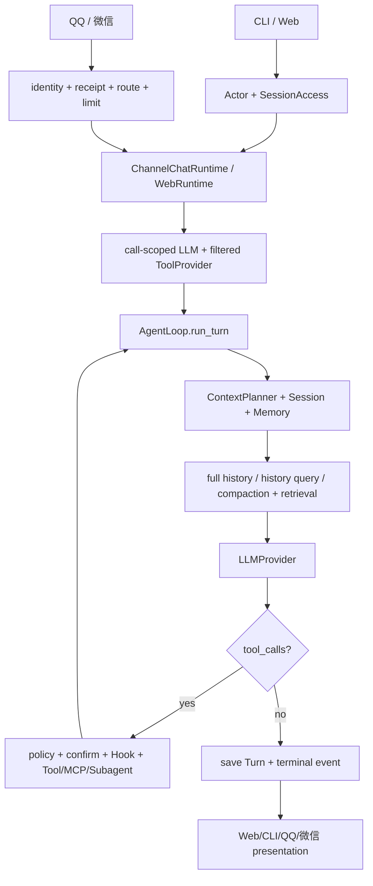

# 智策 Agent（ZhiCe-Agent）总体设计文档

> 目标：维护 ZhiCe-Agent 当前系统的总体架构、稳定边界、真实能力基线和后续演进方向。
>
> 文档类型：当前活文档。本文档始终以最新代码和当前主线口径为准；历史决策由日期设计记录保存。

---

## 1. 这份文档要解决什么问题

ZhiCe-Agent 已经形成 CLI、Web、用户权限、Tool、Skill、Memory、MCP、Hook、Subagent、QQ 与微信渠道共同运行的系统。总体设计需要解决两个长期问题：

1. **防止能力增长破坏核心边界**：AgentLoop 仍只负责通用循环，渠道、鉴权、部署和业务规则不能进入内核。
2. **让文档与真实代码同步**：当前实现、稳定协议、运行数据和未来设计必须明确分开，不能继续保留已经失效的早期假设。

所以 ZhiCe-Agent 的设计方式是：

> 保持一个小而清楚的 Agent 内核，让所有产品能力通过协议、运行时适配器、Tool 或 Skill 扩展。

这份文档描述当前系统，而不是尚未落地的教学草案。已实现能力以真实代码和对应 Part 活文档为准；Part 17～18 的当前生产基线集中维护在第 15 节，实施路线集中维护在第 17 节。

---

## 2. 核心设计思想

### 2.1 最重要的核心：Agent Loop

Agent 项目最核心的不是 Web，也不是数据库，也不是部署，而是 Agent Loop。

它的基本流程是：

```text
用户输入
  -> 构建上下文
  -> 调用 LLM
  -> LLM 决定是否调用工具
  -> 执行工具
  -> 把工具结果放回上下文
  -> 再调用 LLM
  -> 直到得到最终回答
  -> 保存会话
```

换句话说，Agent Loop 负责让 LLM “边想边做事”。

这个循环是所有能力的根：

- 想读文件？LLM 调 `read_file` 工具。
- 想搜索项目？LLM 调 `grep` 工具。
- 想运行通用工作区命令？LLM 调受控 `exec` 工具。
- 想使用业务能力？LLM 先加载 Skill；显式可执行型通过 `run_skill`，指令型组合已有 Tool。
- 想拆任务？LLM 调 `delegate_tasks`，由 Subagent Coordinator 做有界并行 fan-out/fan-in。

AgentLoop 已经是当前系统的稳定核心；新增能力应复用它，而不是建立第二套循环。

### 2.2 第二个核心：工具系统

工具系统的作用是把 Python 能力暴露给 LLM。

成熟 Agent 系统中的工具通常包括：

- 文件读取、写入、编辑。
- 目录列表。
- grep/glob 搜索。
- shell 执行。
- Skill 加载。
- MCP 工具。
- 记忆工具。
- 子代理工具。
- 消息发送工具。
- 前端 UI 渲染工具。

当前内置和运行时工具能力包括：

```text
read_file     读取文件
list_dir      查看目录
grep          搜索文本
exec          执行安全命令
load_skills   读取完整 Skill 说明
sync_skills   同步已配置 Skill source
run_skill     执行显式 runtime Skill
memory_read   按需检索当前 actor 的长期 Memory
memory_write  执行用户通过对话明确授权的 Memory 修改
discover_tools 按当前 actor/Profile 发现并激活 Tool
delegate_tasks 有界并行委派 Subagent
diagnose_my_recent_activity 诊断本人当前 Session 运行活动
MCP tools    按配置动态发现的外部 Tool
```

`write_file` 不是当前内置 Tool；需要写文件时由受控 `exec`、Skill 或明确接入的外部 Tool 完成。Skill、Memory、MCP 和 Subagent 均已进入当前工具主线。Subagent Tool 只负责通用 fan-out/fan-in，业务拆分判断由 Prompt、Profile 和父 Agent 完成，不写入 AgentLoop。

工具系统最值得学习的设计是：

```text
Tool 类
  -> 定义 name / description / parameters
  -> 实现 execute(args)

ToolRegistry
  -> 注册工具
  -> 给 LLM 返回工具 schema
  -> 根据 LLM 的 tool_call 执行对应工具
```

这样 Agent Loop 不需要知道每个工具怎么实现，它只需要把 LLM 的工具调用交给 `ToolRegistry`。

### 2.3 第三个核心：Skill 体系

这是 Agent 项目里很有价值的思想之一。

很多 Agent 项目会把业务逻辑直接写进 Agent Loop，比如：

```python
if user_asks_weather:
    call_weather_api()
elif user_asks_report:
    generate_report()
```

这样做短期很快，长期会让 Agent Loop 变成一锅粥。

更好的做法是：

> Agent Loop 不写业务功能。业务功能做成 Skill。

一个 Skill 的结构是：

```text
extends/{source_name}/skills/{skill_name}/
+-- SKILL.md
+-- scripts/
    +-- run.py
```

当前落地代码中，`${ZHICE_AGENT_SKILL_REPO}` 表示本地技能仓库根目录；运行时会按 `${ZHICE_AGENT_WORKSPACE}/config/config.yml` 的 `skills` 分区同步到 `${ZHICE_AGENT_WORKSPACE}/extends/{source_name}/`，`SkillLoader` 固定从各 source 的 `skills/` 目录扫描。Skill 的运行时身份是 `source/name`，其中 `name` 来自 Skill 外层目录名。

`SKILL.md` 是给 LLM 看的说明书，里面写：

- 这个 Skill 什么时候用。
- 参数有哪些。
- 怎么执行脚本。
- 输入 JSON 示例。
- 输出 JSON 格式。
- 错误码含义。
- 失败后该不该重试。

脚本负责真正执行能力。

LLM 的使用流程是：

```text
1. 看到 skill 摘要
2. 判断 skill 可能有用
3. 调 load_skills 读取完整 SKILL.md
4. 若存在合法显式 runtime，调用 run_skill
5. SkillExecutor 以 ndjson-v1 接收 progress/result
6. 若无 runtime，把 Skill 作为指令组合已有 Tool
7. LLM 根据结构化 ToolResult 回答用户
```

智策 Agent 项目应该完整保留这个思想。

当前 Skill Runtime 使用显式 source 命名空间，不引入用户私有层、开发暂存层、团队层和公共层之间的隐式覆盖链：

```text
skill_repo/skills/{skill_name}/SKILL.md
skill_repo/skills/{skill_name}/scripts/*.py

同步后：
${ZHICE_AGENT_WORKSPACE}/extends/{source_name}/skills/{skill_name}/SKILL.md
${ZHICE_AGENT_WORKSPACE}/extends/{source_name}/skills/{skill_name}/scripts/*.py
```

### 2.4 第四个核心：协议边界

成熟系统通常会设置协议层，它的思想是：

> 各模块之间尽量通过接口沟通，而不是直接依赖具体实现。

当前协议层已经覆盖核心运行、用户安全和扩展能力：

```text
LLMProvider      调 LLM 的接口
ToolProvider     工具注册与执行接口
SkillProvider    技能发现与加载接口
SessionStore     会话存储接口
MemoryStore      长期 Memory 存储接口
MCP Runtime      外部 Tool 运行边界
RuntimeEvent     通用生命周期事件
Hook Runtime     pre/post Tool 扩展边界
Subagent Runtime 子任务编排边界
Channel          外部渠道事件、回复目标与能力声明
```

这样做的好处是：

- LLMProvider 可以在 OpenAI-compatible、LiteLLM 和 failover chain 之间切换。
- SessionStore 继续使用 JSONL 保存聊天真值，SQLite 保存用户、索引、路由、绑定和运行侧状态。
- SkillProvider 可以从多个显式 source 同步并加载 Skill。
- Agent Loop 不需要跟所有具体实现纠缠。

### 2.5 第五个核心：Prompt 文件化

这里采用一个重要规范：

> 所有 LLM 会看到的 prompt，都放在 Markdown 文件里。

智策 Agent 项目也应该坚持这个原则。

推荐：

```text
prompts/
+-- identity.md
+-- tool_use_policy.md
+-- skills_intro.md
+-- diagnostics.md
+-- exec.md
+-- memory_policy.md
+-- memory_extraction.md
```

不要在 Python 里到处写长 prompt。

原因：

- Prompt 是 Agent 的“操作系统说明书”。
- Prompt 应该能被人直接阅读。
- Prompt 的演进应该走版本管理。
- 后续调 Agent 行为时，改 Markdown 比翻 Python 字符串舒服。

### 2.6 第六个核心：Session 是上下文的一部分

Session 不只是日志。

Session 会影响下一轮对话，因为历史消息会被重新放回 LLM 上下文。

Session 消息真值使用 JSONL。当前普通 CLI 未指定 `--session` 时默认使用当天会话，例如：

```text
contexts/sessions/chat-YYYYMMDD.jsonl
```

显式传入 `--session chat-YYYYMMDD` 或其它名称时，仍然可以恢复指定会话。

每一行是一条消息：

```json
{"role":"user","content":"hello","timestamp":1781000000.0}
```

JSONL 作为聊天真值的优点：

- 简单。
- 可读。
- 容易调试。
- 与用户、权限和运行索引数据库解耦。

SQLite 已用于 auth、session index、external identity、channel account、conversation route、receipt、Activity 与 Audit 等结构化状态。未来的会话搜索和上下文索引可以继续使用 SQLite 派生表，但不能替代 JSONL Session 真值。

当前上下文治理已经完成 Part 15：预算允许时携带完整 Session Turn；明确历史元问题走确定性扫描；长会话同时使用结构化 compaction、检索到的旧原始 Turn 和最近连续 Turn。检索由 SQLite FTS5/BM25、可选 embedding/cosine、entity、anchor 与 recency 混合排序，最终通过 `ContextPlan` 在每次初始或 Tool 后 LLM 调用前重新应用 failover-safe token 预算。Session JSONL 仍是完整真值，`context_index.sqlite3`、compaction 和 embedding 都是用户隔离、可失效、可重建的派生状态。Part 10 Memory 继续独立保存跨 Session 的稳定事实。

---

## 3. 智策 Agent（ZhiCe-Agent）项目的总体设计

### 3.1 当前实现目标

当前代码库已经落地的是一个多用户、多入口、多渠道共享同一 Agent 内核的本地优先系统，核心能力是：

```text
ZhiCe-Agent（CLI + Web + QQ + 微信）：
能启动，
能加载 workspace 配置，
能读取 Markdown Prompt，
能保存和恢复会话，
能完成无工具聊天和工具调用循环，
能按 actor、Profile、RBAC、Hook 和确认策略过滤并执行 Tool，
能通过 OpenAI-compatible 或 LiteLLM Provider 调用模型，
能按 endpoint priority 做结构化 failover，并对 retryable 错误执行受总 deadline 约束的有限重试、退避和 cooldown，同时保留安全 attempts 证据，
能用 /model 管理当前 Session 的 endpoint/model 偏好，
能通过 `zcagent gateway` 启动本地 FastAPI gateway，
能提供 REST/SSE 兼容 API、WebSocket 主聊天通道和静态 Web UI，
能在 Web 端管理本人会话、模型、账号、渠道绑定和运行诊断，并让显式授权管理员查询确定性系统事故与跨组件脱敏时间线，
能用稳定 `turn_id` / `turn_index` 串起一轮用户请求、WebSocket 事件和 JSONL 会话消息，
能在预算内携带完整 Session 历史，并在长会话中组合确定性历史证据、结构化 compaction、混合检索旧 Turn 与最近连续 Turn，
能用 SQLite FTS5/BM25、可选 embedding 精确 cosine、entity、anchor 和 recency 生成可解释 ContextPlan，
能通过 RuntimeEvent、分层日志和 workspace 每日 JSONL 观察 turn、context、LLM、tool、hook、subagent、channel 和 session 生命周期，
能通过本地 SQLite 用户、角色、特权和可撤销 cookie 登录态保护 Web API / WebSocket，
能按内部 user_id 隔离用户上下文、session index 和 session 模型偏好，
能让登录用户直接使用本人资源与安全工具，并在跨用户、管理、审计和危险操作前进行特权检查，
能让 CLI 与 Owner 共用 workspace Memory、普通用户使用私有 Memory，
能通过 memory_read 按需检索，通过用户对话授权后的 memory_write 修改长期 Memory，
能在 Session 空闲后提取具有多 Turn 证据的高可信长期 Memory，
能接入 stdio、Streamable HTTP 和 SSE MCP Server，归一化 Tool、elicitation、OAuth 与 artifact，并动态刷新 Catalog、重连 Server 和取消活动调用，
能通过受限 pre/post Tool Hook 扩展策略和展示元数据，
能通过 `delegate_tasks` 运行有界并行 child，并由父 Agent fan-in 归纳，
能用 `/subagent` 管理当前 Session 的 auto/off/once 语义，
能通过中性 Channel 协议接入 QQ 与微信，而不让平台 SDK 进入 AgentLoop，
能把 QQ/微信外部身份绑定到内部用户，并持久维护 conversation route、receipt、限流和渠道生命周期，
能在 CLI、Web、QQ 和微信之间复用 Session、Memory、Tool、MCP、Hook、Subagent 与模型偏好语义，
能在单 Gateway、单 worker、单 workspace writer 边界内恢复遗留 Turn 并从 Session 真值重建派生状态，
能通过 `deploy/` 私有覆盖层、Dockerfile、compose 和运维脚本组装私有运行镜像，
能通过 `zcagent init` 生成运行时文件。
```

这就是当前代码基线。ZhiCe-Agent 已经不是聊天原型，而是具备身份、权限、长期 Memory、外部 Tool、运行扩展、子任务编排和多渠道接入的完整本地优先 Agent Runtime。

### 3.2 当前目录结构

```text
zhice_agent/
+-- config/
|   +-- *.example.*
+-- prompts/
|   +-- *.md
+-- agent/
|   +-- cli.py
|   +-- message.py
|   +-- config.py
|   +-- prompt_loader.py
|   +-- app/
|   |   +-- gateway.py
|   |   +-- runtime.py
|   |   +-- api/
|   |   +-- services/
|   +-- auth/
|   +-- channels/
|   |   +-- qq/
|   |   +-- weixin/
|   +-- context/
|   +-- core/
|   +-- embedding/
|   +-- hooks/
|   +-- llm/
|   +-- mcp/
|   +-- memory/
|   +-- presentation/
|   +-- protocols/
|   +-- session/
|   +-- skills/
|   +-- subagents/
|   +-- tools/
|   +-- web/static/           # committed production build in Python wheel
+-- skill_repo/
|   +-- skills/
+-- integrations/
|   +-- weixin_sidecar/
+-- web/
|   +-- frontend/              # Vue 3 / Vite / TypeScript source
+-- docs_design/
+-- tests/
|   +-- unit_test/
+-- pyproject.toml
+-- README.md
```

这份目录结构是当前轻量形态。项目已经从 CLI-only 演进到带本地 auth/RBAC 的 Web gateway：`AgentLoop` 和 `ContextBuilder` 位于 `agent/core/`，身份/权限/用户 Session 服务位于 `agent/auth/`，HTTP/WS 壳位于 `agent/app/`，Vue source 位于 `web/frontend/`，production build 位于 `agent/web/static/` 并随 Python wheel 发布。当前不保留 `agent/gateway.py`、`agent/loop.py` 或 `agent/context.py` 兼容导出层。

参考大型 Agent 项目时，更应该吸收它的边界思想，而不是直接复制目录重量：

```text
app shell       -> CLI / HTTP API / Web / 渠道 / 鉴权 / 产品服务
agent core      -> AgentLoop / ContextBuilder / ToolRegistry / Provider / Session
protocols       -> LLMProvider / ToolProvider / SkillProvider / SessionStore 等稳定协议
```

当前代码里：

- `agent/core/loop.py`、`agent/core/context.py`、`agent/core/turns.py`、`agent/tools/`、`agent/llm/`、`agent/session/` 属于核心与可替换能力层。
- `agent/auth/` 是 app/application 侧身份、权限、session access、confirmation 和 audit 实现；AgentLoop 只消费 `agent/protocols/auth.py` / `tool.py` 中的上下文和策略协议。
- `agent/context/` 和 `agent/embedding/` 实现 ContextPlan、确定性历史查询、compaction、索引、混合检索和可选 OpenAI-compatible EmbeddingProvider；AgentLoop 只消费协议和装配结果。
- `agent/memory/`、`agent/mcp/`、`agent/hooks/` 和 `agent/subagents/` 是通过协议接入核心循环的独立 Runtime。
- `agent/channels/` 负责中性 Channel Runtime、身份、conversation route、receipt、限流和具体 adapter；QQ SDK 与微信 sidecar 不进入 AgentLoop。
- `agent/app/gateway.py`、`agent/app/runtime.py`、`agent/app/api/*`、`web/frontend/*` 和 `agent/web/static/*` 属于 app shell / Web 边界。
- `integrations/weixin_sidecar/` 是微信官方 Transport 的 Node 进程边界，不运行第二套 Agent Runtime。
- `agent/cli.py` 属于入口层；gateway 实现直接位于 `agent/app/gateway.py`，不再保留顶层 re-export 文件。
- `agent/protocols/` 已经承担协议层职责，应该保持只放接口和数据结构。

迁移原则：

- 不为了“看起来像平台”继续拆出空目录。
- 依赖方向固定为 `app -> core -> protocols`，`protocols` 禁止 import 具体实现。
- `core` 不 import `app`，AgentLoop 不知道 CLI、HTTP、Web、鉴权或渠道。
- 先在设计文档里写清迁移范围，再做文件移动，避免纯路径重构打断当前里程碑学习。

---

## 4. 核心运行流程

### 4.1 一轮对话发生了什么

CLI、Web、QQ 和微信最终进入同一个 Turn 执行链。入口差异在进入 AgentLoop 前收敛：

```text
1. 入口验证登录态或外部身份，建立 ActorContext。
2. Web/CLI 解析本人 Session；外部渠道完成 receipt、限流和 conversation route。
3. Runtime 解析命令与 channel capabilities；普通聊天生成稳定 turn_id。
4. AgentLoop 加载完整 Session Turn，ContextPlanner 生成 full/history_query/compacted_retrieval 模式的 `ContextPlan`。
5. call-scoped Provider 和 actor/Profile-filtered ToolProvider 计算 failover-safe ContextBudget。
6. 模型可先调用 discover_tools，再调用内置 Tool、Skill、Memory、MCP 或 delegate_tasks。
7. Tool 执行依次经过策略、确认、Hook、workspace guard、RuntimeEvent、Activity/Audit 和结果回填。
8. AgentLoop 重复 LLM/Tool 循环，保存完整 Turn；失败、停止和部分结果同样闭合生命周期。
9. 入口按能力输出最终结果：Web 流式 Markdown，CLI 普通文本，QQ/微信由各自 Adapter 引用、分块和降级渲染。
```

### 4.2 Mermaid 流程图



所有入口共享命令、模型偏好、Session、Memory、Tool、MCP、Hook 和 Subagent 语义；差异只由入口声明的 capabilities 和 presentation adapter 处理。

---

## 5. 数据结构设计

下面第 5～14 节描述当前稳定数据结构、协议和运行边界。具体字段以 `agent/message.py` 与 `agent/protocols/` 为准；总体设计只保留跨模块需要共同理解的契约。

### 5.1 Message

消息是 Agent 的最基本数据。

```python
from dataclasses import dataclass, field
from typing import Any, Literal

Role = Literal["system", "user", "assistant", "tool"]

@dataclass
class Message:
    role: Role
    content: str
    name: str | None = None
    tool_call_id: str | None = None
    tool_calls: list[dict[str, Any]] = field(default_factory=list)
    metadata: dict[str, Any] = field(default_factory=dict)
    turn_id: str | None = None
    turn_index: int | None = None
    parent_turn_id: str | None = None
```

角色含义：

```text
system      给 LLM 的系统指令
user        用户输入
assistant   LLM 输出
tool        工具执行结果
```

### 5.2 ToolResult

```python
@dataclass
class ToolResult:
    output: str
    is_error: bool = False
    metadata: dict[str, Any] = field(default_factory=dict)
```

工具永远返回统一结构。

这样 AgentLoop 不需要关心每个工具内部细节。

### 5.3 ToolDefinition

当前代码没有单独的 `ToolDefinition` dataclass，而是让每个 `Tool` 直接声明 `name`、`description`、`parameters`，由 `ToolRegistry.definitions()` 生成 OpenAI-compatible `tools` schema。

```python
class Tool(Protocol):
    name: str
    description: str
    parameters: dict[str, Any]

    def execute(self, args: dict[str, Any]) -> ToolResult:
        ...
```

当前工具协议保持 LLM-facing schema 轻量，但执行链已经具备 actor、Profile、上下文、策略、确认、Hook 和审计边界：

- `name`、`description`、`parameters` 是 function calling 风格模型需要理解的核心信息。
- `ToolRegistry.definitions()` 返回 `list[dict[str, Any]]`，也就是 OpenAI-compatible schema。
- LLM-facing Provider 由 Turn-scoped `DiscoverableToolProvider` 包装：首次 definitions 只有 `discover_tools`，发现后才动态增加已激活业务 schema。
- Catalog 在 actor/Profile 过滤之后生成，未激活 Tool dispatch 返回 `TOOL_NOT_ACTIVATED`。
- 如果后续要支持更多模型供应商差异，再把中性 `ToolDefinition` 抽出来，让 provider adapter 负责格式转换。
- 风险分类、执行决策和确认结果由 `ToolExecutionDecision`、`ToolExecutionPolicy` 与 `ToolConfirmationBroker` 表达，不把安全语义塞进 OpenAI-compatible schema。

当前使用 OpenAI-compatible dict 作为共同 LLM-facing 格式，因为 `OpenAIProvider` 和 `LiteLLMProvider` 都能消费该 schema。接入不兼容格式的模型时，转换逻辑必须收口到 LLM provider 或小型 adapter 中。

### 5.4 SkillInfo

```python
@dataclass
class SkillInfo:
    source: str
    name: str
    qualified_name: str
    description: str
    root: Path
    skill_file: Path
    scripts_dir: Path
    summary: str
    metadata: dict[str, Any] = field(default_factory=dict)
```

这个结构用于向 LLM 展示 Skill 摘要，并保留 `source/name` 限定名，避免跨 source 同名 Skill 调用歧义。

### 5.5 SessionState

```python
@dataclass
class SessionState:
    session_id: str
    messages: list[Message]
    metadata: dict[str, Any] = field(default_factory=dict)
```

---

## 6. 协议接口设计

### 6.1 LLMProvider

```python
class LLMProvider(Protocol):
    def chat(
        self,
        messages: list[dict[str, Any]],
        tools: list[dict[str, Any]] | None = None,
    ) -> LLMResponse:
        ...
```

返回统一格式：

```python
@dataclass
class LLMResponse:
    content: str
    tool_calls: list[dict[str, Any]] = field(default_factory=list)
    metadata: dict[str, Any] = field(default_factory=dict)
```

这样 OpenAI、LiteLLM、OpenRouter、本地模型都可以被包装成同一种接口。

当前 `LLMProvider`、`ToolProvider` 和 `AgentLoop` 协议保持同步调用；Web active turn、MCP Transport、Subagent worker 和渠道轮询在各自 Runtime 边界处理并发，不把事件循环语义泄漏进 AgentLoop。若未来需要改变核心协议，必须单独设计并完成全入口迁移。

LLMProvider 内部负责把工具 schema 传给目标模型需要的请求格式：

```text
actor/Profile-filtered ToolProvider
  -> DiscoverableToolProvider
  -> discover_tools + activated OpenAI-compatible schemas
  -> LiteLLM tools
  -> 其他供应商的工具调用格式
```

这样 `AgentLoop` 和 `ToolRegistry` 不需要知道当前模型到底使用 OpenAI、Anthropic、Gemini 还是本地兼容服务。

### 6.2 LLM 错误结构

LLM 错误也属于 provider 边界的一部分。`AgentLoop` 不解析 HTTP body 或字符串片段判断错误原因；Provider 已将供应商异常转换为结构化、可脱敏且可用于重试决策的 `LLMProviderError`，AgentLoop 只负责稳定收尾、保存会话并展示安全提示。

#### 当前已实现

```python
class LLMProviderError(RuntimeError):
    def __init__(
        self,
        message: str,
        *,
        code: str = "PROVIDER_ERROR",
        http_status: int | None = None,
        retryable: bool = False,
        safe_message: str | None = None,
        endpoint: str = "",
        model: str = "",
        attempts: list[dict[str, Any]] | None = None,
        retry_after_seconds: float | None = None,
    ):
        ...
```

`LLMConfigurationError` 与 `LLMContextBudgetError` 继承该结构。`safe_message` 有界且必须脱敏；`attempts` 只保存安全的 endpoint、错误码、耗时和重试决策，不能包含 API key、Authorization header、完整请求体、原始响应或长 traceback。

Provider 层负责把具体供应商错误转换为稳定错误码：

```text
401 / invalid_api_key       -> AUTH_FAILED
403 / permission denied     -> AUTH_FAILED
404 / model not found       -> MODEL_NOT_FOUND
429 / rate limit            -> RATE_LIMITED
DNS / timeout / connect     -> NETWORK_ERROR
JSON decode failed          -> INVALID_RESPONSE
其他 HTTP 4xx/5xx           -> PROVIDER_HTTP_ERROR
未知异常                    -> PROVIDER_ERROR
```

配置错误不是 retryable；限流、网络抖动和部分 5xx 可标记为 `retryable=True`，由 Provider 在总 deadline 内执行同 endpoint 有界重试、`Retry-After`、退避与 cooldown，并把安全 attempts 交给 Activity/诊断链。

### 6.3 Tool

```python
class Tool(Protocol):
    name: str
    description: str
    parameters: dict[str, Any]

    def execute(self, args: dict[str, Any]) -> ToolResult:
        ...
```

### 6.4 ToolProvider

```python
class ToolProvider(Protocol):
    def definitions(self) -> list[dict[str, Any]]:
        ...

    def execute(self, name: str, args: dict[str, Any]) -> ToolResult:
        ...
```

`ToolProvider` 提供 OpenAI-compatible 工具定义和统一执行入口。若接入不兼容 OpenAI tools schema 的 provider，schema 转换下沉到 provider adapter，AgentLoop 不感知供应商格式。

### 6.5 SkillProvider

```python
class SkillProvider(Protocol):
    def list_skills(self) -> list[SkillInfo]:
        ...

    def get_skill_body(self, name: str) -> str:
        ...
```

### 6.6 SessionStore

```python
@dataclass
class SessionSummary:
    session_id: str
    preview: str
    updated_at: float
    message_count: int
    title: str = ""
    channel: str = ""
    conversation_type: str = ""
    continuation_mode: str = "writable"


class SessionStore(Protocol):
    def load(self, session_id: str) -> SessionState:
        ...

    def append(self, session_id: str, messages: list[Message]) -> None:
        ...

    def clear(self, session_id: str) -> None:
        ...

    def rename(self, session_id: str, title: str) -> None:
        ...

    def delete(self, session_id: str) -> None:
        ...

    def list_sessions(self) -> list[SessionSummary]:
        ...
```

`clear` 被 `/reset` 使用，`rename/delete/list_sessions` 被 CLI、Web 和 Session 服务复用。`channel`、`conversation_type` 与 `continuation_mode` 用于表达跨渠道来源和只读/派生继续边界。

### 6.7 用户、执行与运行事件协议

当前核心循环还依赖以下 provider-neutral 契约：

```text
ActorContext             当前用户、角色和权限
ToolExecutionContext     actor/session/turn/channel/tool call 的可信执行上下文
ToolExecutionPolicy      allow/deny/confirm 决策
ToolConfirmationBroker   高风险 Tool 的明确用户决定
RuntimeEvent             turn/context/llm/tool/hook/subagent 生命周期事件
RuntimeEventSink         CLI、Web、SSE 和渠道的统一事件出口
CancellationToken        当前 Turn 和 child 的取消传播
```

这些结构只携带稳定语义。Cookie、HTTP request、QQ/微信消息对象、SDK client 和具体数据库连接都不能进入协议层。

### 6.8 Context、Embedding、Memory、MCP、Subagent 与 Channel 协议

扩展 Runtime 通过窄协议接入：

```text
ContextPlan / ContextSelection
ContextPlanner / CompactionStore / TurnSearchIndex
EmbeddingProvider / EmbeddingIdentity
MemoryStore / MemoryContext
MCP Runtime / Catalog / normalized result
SubagentCoordinator / child request / batch result
ChannelCapabilities / InboundChannelEvent / ChannelReplyTarget
ChannelExecutionContext / ChannelChatRuntime
```

AgentLoop 只消费这些能力提供的 Tool、上下文、事件或结果。SQLite FTS、embedding HTTP client、MCP SDK、Subagent workspace 实现、QQ Bot SDK 和微信 sidecar 协议均留在具体 Runtime/adapter 层。

---

## 7. AgentLoop 设计

### 7.1 AgentLoop 负责什么

AgentLoop 只负责通用循环：

1. 接收用户消息。
2. 加载历史。
3. 构造上下文。
4. 调用 LLM。
5. 执行工具。
6. 回填工具结果。
7. 重复直到最终回答。
8. 保存消息。

### 7.2 AgentLoop 不负责什么

AgentLoop 不应该负责：

- 天气业务怎么查。
- 报告业务怎么写。
- 外部协作消息怎么发。
- 审批怎么走。
- 前端怎么显示。
- 某个 Skill 的参数怎么解释。
- HTTP 状态码、供应商错误体、限流和模型不存在等 LLM provider 细节怎么分类。

这些应该放到工具、Skill、渠道层或者前端层。

### 7.3 简化伪代码

```python
class AgentLoop:
    def run_turn(
        self,
        session_id,
        user_text,
        *,
        actor,
        turn_id,
        turn_index=None,
        channel="cli",
        llm=None,
        tools=None,
        context_budget=None,
        cancellation_token=None,
        on_event=None,
    ):
        session = self.sessions.load(session_id)
        user_msg = Message(
            role="user",
            content=user_text,
            turn_id=turn_id,
            turn_index=turn_index,
        )
        messages = self.context_builder.build(
            history=session.messages,
            user_message=user_msg,
            context_budget=context_budget,
        )
        new_messages = [user_msg]

        for iteration in bounded_tool_loop:
            cancellation_token.raise_if_cancelled()
            definitions = tools.definitions()
            messages = rebudget(messages, definitions, context_budget)
            response = llm.chat(messages, definitions)
            assistant = persistable_assistant_message(response, turn_id, turn_index)
            new_messages.append(assistant)

            if not assistant.tool_calls:
                break

            for call in assistant.tool_calls:
                execution_context = ToolExecutionContext(
                    actor=actor,
                    session_id=session_id,
                    turn_id=turn_id,
                    turn_index=turn_index,
                    channel=channel,
                )
                result = execute_with_policy_confirmation_hooks_and_events(
                    tools,
                    call,
                    execution_context,
                    cancellation_token,
                    on_event,
                )
                messages.append(tool_result_message(call, result, turn_id, turn_index))

        self.sessions.append(session_id, close_turn(new_messages))
        return final_assistant_text(new_messages)
```

这里的重点不是让 `AgentLoop` 变成错误分类中心，而是让它稳定收尾：

- 保存本轮已经产生的 `user`、`assistant(tool_calls)`、`tool`、`assistant(error)` 消息。
- 对 `LLMConfigurationError` 给出可操作配置提示。
- 对 `LLMProviderError` 使用 provider 给出的安全错误文本格式化提示。
- 对未知异常只展示错误类型，不展示原始异常正文，避免泄露 secret。
- 不在 `AgentLoop` 里解析 HTTP body、供应商错误 JSON 或模型私有字段。
- `code`、`http_status`、`retryable`、`safe_message`、`attempts` 等结构化字段只由 Provider 产生；AgentLoop 不重新解释供应商错误。

---

## 8. ContextBuilder 与 ContextPlanner 设计

`ContextBuilder` 负责 system prompt、Skill、Memory、运行环境和最终 messages 装配；`ContextPlanner` 负责当前 Session 历史以什么形式进入本次 LLM 调用。两者共同输出 provider-neutral `ContextPlan`，AgentLoop 不直接 import compaction、SQLite FTS 或 embedding 实现。

核心输入：

- 已授权当前 Session 的完整 Turn。
- 当前用户消息和当前 Turn Tool 链。
- failover-safe `ContextBudget` 与实际 Tool schemas。
- 身份、Tool、Skill、Memory 和运行环境 Prompt。
- `SessionHistoryQueryResolver`、`CompactionStore`、`TurnSearchIndex` 与可选 `EmbeddingProvider`。

`ContextPlan` 至少记录最终 messages、选择模式、Turn 来源、预算估算、compaction id 和检索原因，用于 Tool 后重新预算与 `context.selection` trace。

### 8.1 system prompt 结构

推荐：

```text
# 你的身份
{identity.md}

# 工具使用规则
{tool_use_policy.md}

# Skill 使用规则
{skills_intro.md}

# 当前可用 Skill 摘要
{skill_summaries}

# 运行环境
workspace={workspace}
session_id={session_id}
```

### 8.2 ContextPlan 选择模式

当前实现包含三种主要模式：

```text
full
  预算允许，完整携带当前 Session 全部 Turn

history_query
  “最开始问什么、问过谁、有几个问题”等明确历史元问题
  通过确定性 Session 扫描生成直接证据

compacted_retrieval
  历史超过安全预算
  组合结构化 compaction + 检索旧 Turn + 最近连续原始 Turn
```

检索只处理未进入 recent raw window 的旧 Turn，使用 SQLite FTS5/BM25、可选 embedding/cosine、entity exact、anchor exact 和少量 recency 加权。选出 Top-K 后恢复原始时间顺序，再注入 ContextPlan。

### 8.3 预算、原子性和失败降级

- `estimate_llm_tokens()` 同时统计 messages 与本次实际 Tool schemas，每次初始和 Tool 后 LLM 调用前重新预算。
- user、assistant tool_calls、tool result 和 assistant final 以完整 Turn/Tool block 为原子，不产生孤立 Tool 消息。
- 预算收缩顺序为 retrieved top-k、最低分 retrieved Turn、compaction 低优先级字段、较早 recent Turn、过长 tool result；system 安全规则、current user 和最新必要 Tool 链不能删除。
- EmbeddingProvider 未配置或调用失败时诚实降级到 FTS/entity/anchor；索引不可用时降级到 recent Turn 与已有有效 compaction；失败写入 trace，不伪装成语义检索成功。

### 8.4 派生状态与生命周期

- Session JSONL 始终是完整真值。
- `${user_context}/context/context_index.sqlite3` 保存 FTS、Turn 文档和 embedding BLOB，`${user_context}/context/compactions/` 保存结构化 compaction；SQLite 损坏时隔离 `.corrupt-*` 并从 JSONL 懒重建。
- 新 Turn 提交后同步 upsert 词法文档；旧 Session 和 embedding 在检索前按有界批次懒回填。
- clear/delete 清理派生索引；渠道解绑保留 Session，因此保留索引。
- CLI、Web、QQ、微信和 external WS 复用同一个 ContextPlanner；Subagent child 继续使用独立 Session 和显式任务上下文。

完整实现依据：`docs_design/zhice-agent-part15-context-engineering-design.md`。

---

## 9. Prompt 文件设计

### 9.1 `prompts/identity.md`

说明 Agent 是谁。

示例：

```markdown
你是一个智策 Agent，帮助用户思考、开发、研究和自动化。

你会认真理解用户目标，必要时使用工具，而不是凭空猜测。

你不把业务流程硬编码在自己身上。当某个能力以 Skill 形式存在时，你应该先加载并阅读 Skill 说明。

你回答要清晰、具体、可执行。
```

### 9.2 `prompts/tool_use_policy.md`

说明工具使用规则。

示例：

```markdown
当工具能显著提高准确性或能让你完成实际操作时，使用工具。

工具失败后，不要用完全相同的参数反复重试。

执行可能破坏文件或仓库状态的命令前，必须确认用户确实要求这样做。

当已有工具结果足够回答时，停止继续调用工具，直接回答用户。
```

### 9.3 `prompts/skills_intro.md`

说明 Skill 是什么。

示例：

```markdown
Skill 是外部能力包，每个 Skill 有一个 SKILL.md 文件和可选 scripts 脚本。

Skill 摘要只告诉你它大概能做什么。完整 SKILL.md 会告诉你参数、示例、执行命令和返回格式。

当某个 Skill 可能有用但你还没有看到完整正文时，先调用 load_skills。

加载 Skill 后，严格按 SKILL.md 的说明执行。
```

### 9.4 `prompts/diagnostics.md`

说明何时调用当前 Session 自助诊断、如何按时间分析安全 `trace_events`、如何区分具体异常与包装码，以及证据不足时必须怎样报告限制。该 Prompt 是可选运行策略：存在时由主 ContextBuilder 作为独立 `Diagnostics Policy` 加载，缺失时不阻断聊天；通用 Tool discovery 与调用安全规则继续只放在 `tool_use_policy.md`。

### 9.5 `prompts/exec.md`

说明何时使用 Exec、如何选择最小非交互命令、危险操作与确认边界、shell/路径限制以及如何解释 exit code/stdout/stderr。该 Prompt 只指导模型使用方式，属于可选 `Exec Policy`；真正的 workspace guard、RBAC、确认、Hook、危险命令拦截、timeout 和输出截断始终由运行时代码强制执行。

---

## 10. 工具体系设计

### 10.1 BaseTool

```python
class BaseTool:
    name: str
    description: str
    parameters: dict[str, Any]

    def execute(self, args: dict[str, Any]) -> ToolResult:
        try:
            return self._execute(args)
        except ToolExecutionError as exc:
            return ToolResult(output=exc.message, is_error=True, metadata=exc.metadata)

    def _execute(self, args: dict[str, Any]) -> ToolResult:
        raise NotImplementedError
```

`BaseTool` 负责具体工具共享的参数校验、workspace 路径 guard、错误包装和输出截断。actor/Profile 过滤、风险分类、危险确认、Hook 和 Activity/Audit 由 Tool 外层执行链统一处理。

### 10.2 ToolRegistry

```python
class ToolRegistry:
    def __init__(self, tools: list[Tool]):
        self._tools = {}
        for tool in tools:
            self._register(tool)

    def definitions(self) -> list[dict[str, Any]]:
        return [
            {
                "type": "function",
                "function": {
                    "name": tool.name,
                    "description": tool.description,
                    "parameters": copy.deepcopy(tool.parameters),
                },
            }
            for tool in self._tools.values()
        ]

    def execute(self, name: str, args: dict[str, Any]) -> ToolResult:
        tool = self._tools.get(name)
        if not tool:
            return ToolResult(
                output=f"Tool not found: {name}",
                is_error=True,
            )
        return tool.execute(args)
```

`ToolRegistry` 的职责边界：

- 管理工具注册、重名检查和按名称分发执行。
- 返回 OpenAI-compatible tool schema；这是当前 Provider 实现已支持的最小公共格式。
- 把未知工具、参数错误和工具异常转换为 `ToolResult`，避免异常穿透到 AgentLoop。
- `DiscoverableToolProvider`、Profile filter、contextual execution 和 pre/post Hook 已位于 Registry 外层；Registry 仍只管理注册、schema 和名称分发。

当前 Tool 链已经包含动态发现、能力过滤、Hook、确认、RuntimeEvent 和审计；这些能力通过组合实现，不继续膨胀 `ToolRegistry`。

### 10.3 当前内置工具与动态工具

当前已实现：

```text
list_dir      列出目录
read_file     读取文件
grep          搜索文本
exec          执行安全命令
load_skills   读取完整 Skill 说明
sync_skills   同步已配置 Skill source
run_skill     执行显式 runtime Skill
memory_read   检索当前 actor 的长期 Memory
memory_write  修改当前 actor 的长期 Memory
discover_tools 发现并激活当前可用 Tool
delegate_tasks 委派有界并行 Subagent
diagnose_my_recent_activity 诊断本人当前 Session
MCP tools     从已启用 MCP Server 动态注册
```

当前不提供内置 `write_file`；Skill 正文加载通过 `load_skills`，显式可执行 Skill 通过 contextual `run_skill`，指令型 Skill 组合已有 Tool。

### 10.4 exec 工具的安全规则

`exec` 最容易出问题，必须早加护栏。

当前安全边界至少包括：

- 默认工作目录限制在 workspace。
- 禁止访问 workspace 外的路径。
- 命令超时。
- 输出截断。
- 拦截明显危险命令。

危险命令示例：

```text
rm -rf
git reset --hard
del /s
rmdir /s
format
```

---

## 11. Skill 体系设计

### 11.1 Skill 目录

```text
skill_repo/skills/example_calculator/
+-- SKILL.md
+-- scripts/
    +-- calculate.py
```

同步后运行时路径为：

```text
${ZHICE_AGENT_WORKSPACE}/extends/zhice-official/skills/example_calculator/
+-- SKILL.md
+-- scripts/
    +-- calculate.py
```

### 11.2 SKILL.md 示例

````markdown
---
name: example_calculator
description: 用 Python 脚本执行基础四则运算。
runtime:
  type: python
  entrypoint: scripts/calculate.py
  protocol: ndjson-v1
  timeout_seconds: 30
---

# Example Calculator

当用户需要精确计算时使用这个 Skill。

## 参数

| 字段 | 类型 | 必填 | 说明 |
|---|---|---|---|
| operation | string | 是 | add、subtract、multiply、divide 之一 |
| a | number | 是 | 第一个数字 |
| b | number | 是 | 第二个数字 |

## 执行方式

```json
{"skill":"zhice-official/example_calculator","params":{"operation":"add","a":3,"b":5}}
```

## 返回格式

```json
{
  "status": "success",
  "code": "OK",
  "data": {"result": 8},
  "message": "3 + 5 = 8",
  "error_stack": ""
}
```

## 错误码

| code | 含义 | 重试策略 |
|---|---|---|
| OK | 成功 | 继续 |
| INVALID_PARAM | 参数错误 | 修改参数后重试 |
| DIVIDE_BY_ZERO | 除数为 0 | 不要用相同参数重试 |
````

### 11.3 Skill 脚本规范

所有 Skill 脚本都应该：

- 接收 `--params` JSON 字符串。
- 最后一行输出 JSON。
- 不 import `agent.*`。
- 需要上下文时通过环境变量读取。

标准成功返回：

```json
{
  "status": "success",
  "code": "OK",
  "data": {},
  "message": "",
  "error_stack": ""
}
```

标准失败返回：

```json
{
  "status": "error",
  "code": "INVALID_PARAM",
  "data": null,
  "message": "operation is required",
  "error_stack": ""
}
```

### 11.4 SkillLoader

SkillLoader 负责：

- 扫描每个启用 source 的 `extends/{source}/skills/*/SKILL.md`。
- 解析 frontmatter。
- 返回包含 `source`、`name`、`qualified_name` 的 Skill 摘要。
- 按 `source/name` 或无歧义裸名返回完整 `SKILL.md`。

伪代码：

```python
class SkillLoader:
    def __init__(self, skill_roots: list[SkillRoot]):
        self.skill_roots = skill_roots

    def list_skills(self) -> list[SkillInfo]:
        ...

    def get_skill_body(self, name: str, source: str | None = None) -> str:
        ...
```

source-aware `SkillRoot` 仍是 `agent.skills.loader` 的内部扫描输入，不放入协议层。Part 18 已通过独立的 source 状态存储、指纹索引、权限投影和同步审计提供管理能力；对外稳定协议是 `SkillInfo`、`ExecutableSkillInfo`、`SkillRunRequest`、`SkillResult`、`ProgressSink`、`SkillExecutor`、`SkillProvider` 和 `SkillError`，不需要暴露目录扫描细节。

---

## 12. Session 设计

### 12.1 JSONL 存储

目录：

```text
contexts/sessions/
+-- chat-YYYYMMDD.jsonl
+-- default.jsonl
+-- project-a.jsonl
```

每行：

```json
{
  "role": "user",
  "content": "hello",
  "timestamp": 1781000000.0,
  "metadata": {}
}
```

### 12.2 为什么 Session 真值继续使用 JSONL

因为它：

- 容易实现。
- 容易阅读。
- 容易调试。
- 追加写、恢复和问题排查简单。
- 不与用户、权限和产品索引数据库耦合。

### 12.3 JSONL 与 SQLite 的职责分工

当前不是在 JSONL 与 SQLite 之间二选一：

- JSONL 保存完整 Session 消息与 Turn 真值。
- SQLite 保存用户、角色、登录态、session index、模型偏好、渠道身份、conversation route、receipt、Activity 和 Audit。
- Web、CLI 与外部渠道都通过 `SessionStore` 和 `SessionAccess` 访问本人可见 Session，不能绕过 ownership。
- Part 15 已实现的 FTS、embedding 和 compaction 属于可失效、可重建的派生状态，不替代 Session JSONL。

---

## 13. LLM Provider 设计

### 13.1 配置文件

`${ZHICE_AGENT_WORKSPACE}/config/llm_endpoints.json`：

```json
{
  "default": "openai_gpt5",
  "openai_gpt5": {
    "protocol": "openai",
    "provider": "",
    "base_url": "https://api.openai.com/v1",
    "api_key": "${ZHICE_LLM_OPENAI_API_KEY}",
    "model": "gpt-5.5",
    "supported_models": ["gpt-5.5", "gpt-5.4", "gpt-5.4-mini"],
    "context_window": 131072,
    "max_tokens": 16384,
    "temperature": 0.7,
    "priority": 1,
    "enabled": true,
    "role": "default"
  },
  "litellm_claude": {
    "protocol": "litellm",
    "provider": "anthropic",
    "api_key": "${ANTHROPIC_API_KEY}",
    "model": "claude-opus-4.8",
    "supported_models": ["claude-opus-4.8", "claude-opus-4.6"],
    "context_window": 200000,
    "max_tokens": 16384,
    "temperature": 0.7,
    "priority": 1,
    "enabled": true,
    "role": "default"
  }
}
```

`protocol="openai"` 表示 `base_url` 直接指向 OpenAI-compatible 模型网关。`protocol="litellm"` 表示在 ZhiCe-Agent 进程内调用 LiteLLM SDK；`base_url` 对 litellm 是可选字段，只在需要自定义 `api_base` 时填写。预算配置只保留两个字段：`context_window` 是总窗口，缺失时默认 `131072`；`max_tokens` 是单次最大输出并直接传给当前 Provider。有效输入预算固定为 `context_window - max_tokens`。

### 13.2 为什么要包一层 Provider

不要让 AgentLoop 直接依赖某个 SDK。

好处：

- 当前可以通过 `OpenAIProvider` 直连 OpenAI-compatible endpoint。
- 当前可以通过 `LiteLLMProvider` 调用进程内 LiteLLM SDK，再接 Anthropic、Gemini、DeepSeek 等模型商。
- 可以继续增加 OpenRouter 或本地模型 Provider，而不改变 AgentLoop。
- 当前可以做轻量 endpoint failover：启动首选 endpoint 失败后，按 `priority` 尝试其它 enabled endpoint。
- 当前会为所有 enabled failover 候选计算最小有效输入上限，使同一份 messages/tools 在切换 endpoint 后仍满足输入预算。
- 所有入口都把 `/model` 选择写入当前 Session metadata；call-scoped provider 不修改共享进程状态。
- `/model reset` 清当前 Session 偏好，`/new` 创建使用系统默认的新 Session；当前不增加用户默认模型层。

AgentLoop 只认：

```python
llm.chat(messages, tools)
```

---

## 14. 配置设计

### 14.1 默认 workspace 与运行态 env

默认 workspace 由 `Path.home() / ".zhice"` 计算：Windows 是 `C:\Users\<user>\.zhice`，Linux/macOS 是 `~/.zhice`，Docker 镜像内是 `/home/zhice/.zhice`。

workspace 解析优先级固定为：

```text
CLI --workspace
  > 进程 ZHICE_AGENT_WORKSPACE
  > Path.home() / ".zhice"
```

普通启动在 workspace 确定后加载 `${workspace}/config/.env`。这个运行态 env 不得反向定义 `ZHICE_AGENT_WORKSPACE`，避免 dotenv 改写已经确定的工作区。显式 `--env-file` 是兼容入口，可以在没有 `--workspace` 时提供 `ZHICE_AGENT_WORKSPACE`；源码项目 `config/.env` 只作为遗留迁移 fallback，不再是默认主路径。

运行态文件由 `zcagent init` 生成到 workspace 下：

```text
${ZHICE_AGENT_WORKSPACE}/
+-- config/
|   +-- llm_endpoints.json
|   +-- config.yml       # skills/operations/channels/hooks/mcp 等统一运行配置
|   +-- mcp.json
|   +-- subagents.yml
|   +-- hooks.yml
|   +-- channels.yml
|   +-- context.yml
|   +-- embedding_endpoints.json
+-- prompts/
+-- contexts/
|   +-- sessions/
+-- state/
|   +-- auth.sqlite3
+-- extends/
+-- logs/
```

### 14.2 当前配置原则

保持显式、可诊断和可部署：

- 不做多环境 overlay。
- 不做复杂部署编排配置。
- 不做复杂 Pydantic schema。
- 不把模型 key 写进代码。
- 默认工作目录是 `Path.home() / ".zhice"`；部署和本地启动使用同一解析协议，不以源码目录充当运行工作区。
- workspace 优先级是 `--workspace > ZHICE_AGENT_WORKSPACE > 默认目录`；`${workspace}/config/.env` 只能提供运行变量，不能反向定义 workspace。
- 显式 `--env-file` 可兼容提供 workspace；项目 `config/.env` 只保留遗留迁移 fallback。
- 仓库只提交 `config/llm_endpoints.example.json`，不提交真实 `llm_endpoints.json`。
- 本地运行态 `${ZHICE_AGENT_WORKSPACE}/config/llm_endpoints.json` 统一使用 `api_key` 字段，可写直接本地值，也可写 `${ENV_VAR}` 占位。
- endpoint 支持可选 `context_window`、输出侧 `max_tokens`、`priority`、`enabled`、`role`、`supported_models`，并支持 keyed object 与 `"endpoints": [...]` 两种配置形态；`context_window` 缺失时默认 `131072`。
- 顶层 `"default": "endpoint_name"` 或 `"default": {"ref": "endpoint_name"}` 只作为别名，不是必须存在的真实 endpoint。
- `zcagent init` 完成提示必须区分核心与可选配置：LLM endpoint 是聊天前置条件；预算字段已有默认值；Skill source、MCP、Subagent 和 Hook 只在显式启用时配置。已有非法 endpoint 文件应提示直接编辑，普通 `init` 不会覆盖现有文件。
- 普通 `zcagent init` 默认从唯一公开模板 `config/.env.example` 补齐 `${workspace}/config/.env`；已有 env 保留，`--force` 覆盖，`--write-env` 仅作为兼容参数且不再改变生成结果。
- `channels.yml`、`mcp.json`、`subagents.yml` 和 `hooks.yml` 位于 workspace `config/`，未配置表示对应可选能力未启用。
- `context.yml` 缺失时使用安全默认值；`embedding_endpoints.json` 缺失时上下文 capability 标记为 degraded，但完整历史、确定性历史查询、compaction 和 FTS/BM25 继续工作。
- QQ AppID/AppSecret、微信凭证和其它 Secret 从 `${workspace}/config/.env`、进程环境或部署平台 Secret 注入；配置文件只保存环境变量引用或非敏感字段。

---

## 15. 当前 Part 17 与 Part 18 基线

Part 12～18 和 Capability Selection 已进入当前代码基线，其事实和边界分别维护在对应 Part 活文档。Part 18 已完成代码、本机验证、服务器部署、长期 Cookie 认证和宿主机权威配置跨 Digest 应用；浏览器 PTY/iframe、idle 后重连和容器故障救援仍作为真实环境交互验收单列。

```text
Part 17 运行可靠性、系统级诊断、生产部署与发布
  -> Part 18 正式 Skill Runtime、Skill 管理与独立服务器 Ops
```

### 15.1 Part 17：运行可靠性、系统级诊断、生产部署与发布

Part 17 已在 Part 16 稳定前端产品面和 Part 15 上下文派生状态之上，把本地运行方式收敛为可诊断、可恢复、可构建私有镜像并部署到云端的生产形态。当前活文档是 `docs_design/zhice-agent-part17-reliability-diagnostics-deployment-design.md`，完整方案与实施说明见 `docs_design/2026-07-29-part17-runtime-reliability-diagnostics-and-deployment-design.md`。

当前实现事实：

- 为 `LLMProviderError` 增加稳定错误码、HTTP 状态、retryable、安全用户提示和有界 attempts。
- 区分鉴权失败、模型不存在、限流、网络错误、超时、无效响应和 Provider 不可用。
- 对 retryable 错误增加受总 deadline 约束的同 endpoint 有限重试、`Retry-After`、退避和进程内 cooldown；Provider 重试不能重复执行 Tool。
- trace/Activity 记录 endpoint 尝试、重试、跳过原因、最终实际模型和 LLM/Tool/Session/Context/MCP 耗时，不记录 Secret 或完整请求。
- 增加系统级诊断引擎、确定性事故聚合、Turn/request/provider/tool/context/MCP 时间线和用户/组件/时间范围筛选。
- 增加 `diagnostics.system.use` 特权和 `diagnose_system_activity` Tool；普通用户仍只能诊断本人当前 Session。
- 扩展 stopped/error Turn 查询、MCP `tools/list_changed`、Catalog 原子刷新、连接重建、活动调用取消和 Server 运行统计。
- 增加遗留 running Turn 恢复、备份/恢复、索引重建和单进程生产拓扑约束。
- 第一版固定单 Gateway 进程、单 worker、单 workspace writer；不引入共享队列、外部向量后端、Kubernetes 或多环境 overlay。
- 新建公开可见的 `deploy/` 编排与脚本目录；根目录只保留三个 CMD 用户入口和容器定义，本机真实 `.env`、`config.yml`、`models.json` 与云目标统一放在 Git 忽略的 `deploy/private/`，PowerShell 编排放在 `deploy/pipelines/`，底层步骤放在 `deploy/scripts/`，不复制完整 workspace。
- 镜像构建直接使用仓库已有代码、Prompt、Skill source、Vue build 和可复现微信 sidecar build，并把三个私有配置放入固定容器 workspace。
- 本机完成 build、最终镜像烟测和 push；云端按不可变 digest 直接运行私有镜像，只为 contexts/state/logs/extends 等运行数据挂 volume。
- 公开 Git、公开 wheel、公开镜像和构建日志不得包含真实 Secret 或本地用户数据；受控私有部署镜像可以按操作者明确选择携带真实配置，其 registry 拉取权限按 Secret 权限管理。

部署层继续保持 `app -> core -> protocols`，core 不依赖容器、反向代理、向量数据库或平台 SDK。Part 17 的诊断数据接入 Part 16 已有管理页面，不建立第二套 Web。

当前全量验证为 Python `986 passed, 2 skipped`、Ruff、前端 `56 passed`、lint/typecheck/build、deploy/Ops 专项 `123 passed`、Shell syntax 与 Python 静态编译全部通过。随后已完成本地 image build/run smoke、阿里云 ACR push、腾讯云按不可变 Digest deploy、Caddy HTTPS、公网健康、认证初始化、容器重启持久化和 Part 18 宿主机权威配置跨 Digest 应用验收。三入口发布自动化复用已验收链路，不把真实目标配置或凭证提交到仓库。

### 15.2 Part 18：正式 Skill Runtime、Skill 管理与独立服务器 Ops

Part 18 当前实现与固定范围：

- 指令型/可执行型 Skill 并存；显式 Python runtime、`ndjson-v1`、SkillExecutor、ProgressSink、`run_skill` 和 `skill.*`。
- source 状态、commit/同步时间/健康/安全错误、指纹索引缓存、actor/Profile 权限交集和 Skills 管理页。
- Owner-only Ops 配置投影，新窗口与 iframe 回退；Gateway 不代理宿主机控制或终端流。
- 宿主机 systemd Caddy/dashboard/ttyd、既有 Cloudflare Tunnel、服务器侧 root-only credential、长期签名 Cookie、loopback ttyd Basic Auth、restricted `zhice-ops-shell` 和固定 root wrapper。
- 云端 `.env`、`config.yml`、`models.json` 迁为宿主机权威副本，逐文件只读 bind mount，并提供备份/验证/diff/restore/apply。
- 新增宿主机 `diagnose.sh`，固定 `zhice-agent` 容器；真实主站和 Ops 地址迁入 Git 忽略的私有部署配置。
- 多运行形态纠偏与双视图已实现：终端启动自动拉起 loopback Ops、本地 Compose 同时拉起独立 Ops sidecar，三种形态统一监控面板与 restricted 运维终端；云端 `OpsUrl` 只来自私有配置，容器配置 apply 使用 root-owned 固定规格 recreate。

明确不做：多 profile、keyring/Secret Manager、CLI Session 管理、`zcagent diagnose`、多服务器管理、Skill 市场和宿主机通用 Shell。


---

## 16. 测试策略

### 16.1 单元测试

测试按主题维护在 `tests/unit_test/{topic}/`，每个主题目录必须同步维护 `test_case.md`。当前核心主题包括：

```text
tests/unit_test/tools/test_tool_registry.py
tests/unit_test/tools/test_readonly_tools.py
tests/unit_test/tools/test_exec_tool.py
tests/unit_test/tools/test_shell_policy.py
tests/unit_test/session_store/test_session_store.py
tests/unit_test/prompt_loader/test_prompt_loader.py
tests/unit_test/llm_provider/test_openai_provider.py
tests/unit_test/llm_provider/test_failover_provider.py
tests/unit_test/agent_loop/test_agent_loop.py
tests/unit_test/agent_loop/test_agent_loop_tools.py
tests/unit_test/auth/
tests/unit_test/memory/
tests/unit_test/mcp/
tests/unit_test/hooks/
tests/unit_test/runtime_events/
tests/unit_test/subagents/
tests/unit_test/channels/
tests/unit_test/qq_channel/
tests/unit_test/weixin_channel/
tests/unit_test/context_engineering/
```

当前 LLM 错误相关单元测试至少要覆盖：

- 缺少 `api_key` 和缺少 `${ENV_VAR}` 时返回明确配置提示。
- CLI 启动时缺少或未正确填写 `models.json` 会阻断聊天入口，而 `config.yml` 缺少 `skills` 分区表示 Skill source 未启用，静默跳过同步。
- AgentLoop 遇到 provider 错误时保存 `user -> assistant(error)`，如果错误发生在工具调用之后，也保留之前的 `assistant(tool_calls)` 和 `tool` 消息。

Part 17 Provider 错误分类已覆盖：

- HTTP 401/403 转为 `AUTH_FAILED`，并且不泄露 secret。
- HTTP 404 转为 `MODEL_NOT_FOUND`。
- HTTP 429 转为 `RATE_LIMITED`，`retryable=True`。
- 网络连接失败或超时转为 `NETWORK_ERROR`。
- Provider 返回非 JSON 转为 `INVALID_RESPONSE`。

### 16.2 Fake LLM 测试

核心循环默认使用 Fake LLM，保证行为确定且不依赖外部网络。

Fake LLM 可以测试核心循环：

```text
第一次调用：返回 read_file tool_call
工具执行：返回文件内容
第二次调用：返回最终回答
```

这样可以稳定验证：

- AgentLoop 会执行工具。
- 工具结果会回填。
- 最终回答会保存。
- LLM/provider 抛错时，AgentLoop 会保存错误 assistant 消息，而不是崩溃或丢失本轮轨迹。

### 16.3 集成与真实环境测试

会启动真实本地协议 Server 或子进程的测试使用 `integration` marker：

```bash
python -m pytest -m integration tests/unit_test/mcp tests/unit_test/weixin_channel
npm test --prefix integrations/weixin_sidecar
```

真实 LLM、MCP、QQ 和微信测试必须由环境变量或专用入口显式开启。外部渠道除了单元测试，还需要真实账号/群聊/重连验收；未配置外部依赖时默认测试保持离线稳定。

Part 15 另外覆盖 full/history_query/compacted_retrieval 三种 ContextPlan、compaction 增量与失效、FTS/embedding 混合排序、旧 Session 懒回填、clear/delete、用户隔离、跨渠道一致性和显式串行 10,000 Turn exact cosine p95。

### 16.4 架构边界测试

架构检查至少覆盖：

- `agent/protocols` 不 import `agent/tools`。
- `agent/tools` 不 import `agent/core/loop`。
- `skills/*/scripts` 不 import `agent.*`。
- QQ SDK 和微信 SDK/Transport 不进入 AgentLoop 或协议层。
- app、渠道和具体 Runtime 只能沿 `app -> core -> protocols` 方向依赖。

提交前统一运行：

```bash
python -m ruff check .
python -m pytest
```

---

## 17. 实现路线图

本节同时保留已完成 Milestone 的实现记录和尚未实现部分的依赖顺序。当前代码基线已完成到 Part 19；Milestone 19 的真实外部服务 smoke 仍按显式凭据单列，Milestone 20 是已确认但尚未实现的下一项特色应用方案。

### Milestone 0：项目骨架（已实现）

目标：

- 项目能启动。
- 配置能加载。
- CLI 能显示提示符。

交付：

```text
pyproject.toml
config/.env.example
agent/config.py
agent/cli.py
agent/prompt_loader.py
prompts/identity.md
```

验收：

```bash
python -m agent.cli
```

能启动。

### Milestone 1：无工具聊天（已实现）

目标：

- 用户输入一句话。
- LLM 返回回答。
- 保存 session。

交付：

```text
LLMProvider
LLMProviderError / LLMConfigurationError
OpenAIProvider
SessionStore
AgentLoop.run_turn
```

已实现边界：

- Provider 抛出 `LLMProviderError` / `LLMConfigurationError`。
- AgentLoop 保存失败轮次为 `assistant` error marker，不让 CLI 崩溃。
- Part 17 已补齐完整错误码、retryable 元信息、同 endpoint 有限重试、总 deadline、退避、cooldown 和 attempts 证据。

### Milestone 2：工具调用（已实现）

目标：

- LLM 可以调用文件工具。

交付：

```text
Tool / ToolProvider / ToolResult
BaseTool
ToolRegistry
list_dir
read_file
grep
prompts/tool_use_policy.md
Fake LLM 测试
```

阶段取舍：

- 当前实现直接输出 OpenAI-compatible tool dict，保证工具调用链先跑通。
- 后续 Milestone 已补齐动态能力发现、Profile filter、ToolExecutionPolicy、确认和 Hook；`read_only`、`exclusive` 与中性 `ToolDefinition` 没有被强行加入基础 Tool schema。

### Milestone 3：exec 工具（已实现）

目标：

- LLM 可以执行受控命令。

交付：

```text
exec tool
workspace guard
timeout
危险命令拦截
输出截断
secret 脱敏
```

### Milestone 4：模型端点与 failover（已实现）

目标：

- 支持 OpenAI-compatible 和 LiteLLM provider。
- 支持多个 endpoint 按 priority failover。
- 支持 `/model` 查看、列表、切换和 reset。

交付：

```text
LLMEndpoint(priority/enabled/role/supported_models)
load_llm_endpoints
EndpointFailoverProvider
create_llm_provider_chain
/model slash command
```

当前取舍：

- `/model` 已按当前 Session 持久化；CLI、Web、REST、SSE 和 WebSocket 每个 Turn 都使用 call-scoped provider。
- failover 已支持 endpoint 级顺序尝试；Part 17 已补齐同 endpoint 有限重试、错误分类、总 deadline、退避和 cooldown。
- call-scoped selection 携带所有 enabled endpoint 的 failover-safe `ContextBudget`。

### Milestone 5：Skill 加载（已实现）

目标：

- LLM 可以看到 Skill 摘要。
- LLM 可以加载完整 `SKILL.md`。
- LLM 可以执行 Skill 脚本。

交付：

```text
SkillSourceSync
SkillLoader
load_skills tool
sync_skills tool
config/config.example.yml 的 skills 分区
prompts/skills_intro.md
```

Prompt 文件化是贯穿所有阶段的横向规范；Skill Runtime、ProgressSink 和独立服务器 Ops 已由 Part 18 落地。

### Milestone 6：Web 基础运行面（已实现）

目标：

- 浏览器里能聊天。
- 入口层与 Agent core 保持 `app -> core -> protocols`。
- 浏览器主聊天使用 WebSocket，REST/SSE 保留兼容调用。
- Web 端支持会话查看、重命名、删除、模型选择和停止 active turn。

交付：

```text
agent/app/gateway.py
agent/app/runtime.py
agent/app/api/routes.py
agent/app/api/ws.py
agent/app/api/schemas.py
agent/core/loop.py
agent/core/context.py
FastAPI backend
web/frontend Vue source + agent/web/static production build
会话列表与聊天窗口
WebSocket 流式输出
REST/SSE 兼容接口
```

### Milestone 7：Turn 运行单元与上下文治理（已实现）

目标与交付：

- 把一次用户请求定义为可持久化、可查询、可用于上下文裁剪的 Turn。
- Web accepted/done/stopped、AgentLoop 消息保存和历史恢复使用同一个 `turn_id`。
- Part 7 当时建立最近 Turn 与旧相关 Turn 的混合选择和 message/token budget，为 Part 15 完整上下文工程提供 Turn 原子与预算基线。

历史实现依据：`docs_design/zhice-agent-part7-turn-context-design.md`；当前上下文选择统一以 Part 15 活文档为准。

### Milestone 8：Gateway / Agent 运行日志优化（已实现）

目标与交付：

- 终端输出简短、分层、脱敏的 Agent 运行痕迹。
- 使用 `user_id -> session_id -> turn_id` 串起运行主链。
- JSONL trace 记录 LLM、Tool、Session 与 RuntimeEvent 生命周期。
- workspace trace 按日期写入 `logs/log-YYYY-MM-DD.jsonl`。

当前实现依据：`docs_design/zhice-agent-part8-gateway-agent-logging-design.md`。

### Milestone 9：用户、登录与权限执行边界（已实现）

目标与交付：

- 落地本地用户、登录态、角色、权限、ownership 和唯一 Owner 边界。
- 建立用户上下文目录、Session 索引、模型偏好和跨渠道身份绑定。
- 危险 Tool 使用权限、明确确认与安全审计，不再只做一刀切拦截。
- Web 提供个人设置、用户管理、渠道绑定管理和受控诊断入口。

当前实现依据：`docs_design/zhice-agent-part9-user-auth-permission-design.md`。

### Milestone 10：Memory 与受控长期记忆（已实现）

目标：

- 在 Session 短期上下文之外保存稳定、长期且高可信的用户信息。
- 区分 CLI/Owner 共用 workspace Memory 与普通用户私有 Memory。
- 让读取、明确写入和后台提取都经过权限、安全与审计边界。

交付：

```text
MemoryStore / MemoryContext / MemoryEntry
MarkdownMemoryStore
memory_read / memory_write
MemoryExtractionScheduler / MemoryExtractionService
/memory
Memory trace 与 audit
```

当前边界：

- `MEMORY.md` 是长期记忆真值，Session 仍是完整聊天真值。
- 后台提取只接受具有多 Turn 原文证据的高可信长期信息，不建立候选确认状态机。
- Memory 受控检索仍不使用向量数据库；Part 15 的 Session embedding 与混合检索是独立派生上下文能力，不改变 MemoryStore。

当前实现依据：`docs_design/zhice-agent-part10-memory-design.md`。

### Milestone 11：MCP Tool 接入（已实现）

目标：

- 将 MCP Server 暴露的 Tool 接入统一 ToolProvider 和 AgentLoop。
- 支持本地与远程 Transport，同时保持配置、凭证、结果和文件落盘边界。
- 单个 MCP Server 异常只局部降级，不破坏基础聊天能力。

交付：

```text
MCPConfig / MCPRuntime / MCPCatalog
stdio / Streamable HTTP / SSE transport
MCP Tool naming 与 schema 适配
elicitation / auth / artifact
/mcp
MCP health、trace 与错误归一化
```

当前边界：

- 已进入当前代码基线；Windows OS 级 stdio 强读取隔离仍待后续硬化。
- Part 17 已补齐 MCP reload/cancellation、OAuth 状态、Catalog 刷新和更完整运行诊断。

当前实现依据：`docs_design/zhice-agent-part11-mcp-design.md`。

### Milestone 12：RuntimeEvent 与 Hook Runtime（已实现并关闭）

目标：

- 用 transport-neutral RuntimeEvent 表达 Turn、Context、LLM 和 Tool 的真实运行状态。
- 让 CLI、WebSocket、SSE 和前端消费同一状态语义。
- 提供受限 pre/post Tool Hook 扩展点，同时保留内核安全判断。

交付：

```text
RuntimeEvent / EventEmitter
turn-scoped sequence
CLI / WS / SSE 状态输出
前端确定性运行状态
HookConfig / HookLoader / HookRunner / HookRuntime
pre_tooluse / post_tooluse
```

当前边界：

- 不展示思维链或虚假百分比，RuntimeEvent 不写入 Session。
- pre Hook 修改后的参数仍重新经过 schema、RBAC、危险确认和具体 Tool 安全检查。
- SkillExecutor、`skill.*` 与 ProgressSink 已由 Part 18 独立实现，不回写进 Part 12 Hook 边界。

当前实现依据：`docs_design/zhice-agent-part12-hooks-design.md`。

### Milestone 13：并行 Subagent 编排（已实现并关闭）

目标：

- 复用同一 AgentLoop，实现同一父 Turn 内有界并行 fan-out/fan-in。
- 让 child 获得独立 Session、RuntimeEvent scope、取消与资源限制。
- 通过 Profile 能力交集和 workspace 模式约束读写边界。

交付：

```text
SubagentCoordinator / SubagentRuntimeFactory
delegate_tasks
explorer / developer / operator profiles
shared_readonly / worktree / shared_exclusive
child Session 与 RuntimeEvent
/subagent auto|off|once
部分成功、取消、超时与诊断
```

当前边界：

- 当前是同一 Turn 内的有界并行，不是跨 Turn 后台 Job。
- child 最大深度为 1，能力只能取父能力、Profile 与 actor 权限的交集。
- 一个 child 失败不会抹掉其它 child 的已完成结果。

当前实现依据：`docs_design/zhice-agent-part13-subagent-design.md`。

### Milestone 14：外部渠道、QQ 与微信接入（已实现）

目标：

- 建立与具体 SDK 无关的 Channel 协议和 ChannelChatRuntime 适配层。
- 通过外部身份绑定和 conversation route 复用现有用户、Session 与 AgentLoop。
- 完成 QQ 私聊/群聊与微信 ClawBot Transport 的真实消息闭环。

交付：

```text
ChannelCapabilities / InboundChannelEvent / ChannelReplyTarget
ChannelExecutionContext / ChannelChatRuntime
channel account / external identity / conversation route
持久去重、限流、串行执行与 lifecycle trace
QQ adapter / transport / Markdown 与普通文本渲染
微信 QR 绑定 / sidecar / long-poll / ACK / reconnect
Web 渠道绑定管理
```

当前边界：

- QQ SDK 和微信官方 Transport 均停留在 adapter/transport 层，不进入 AgentLoop。
- QQ 实现一与微信 ClawBot 实现二已进入代码基线，微信单账号真实 POC 已通过。
- 微信双真实账号并发仍是现实环境验收项，不影响当前实现边界已经闭合的事实。

当前实现依据：`docs_design/zhice-agent-part14-external-channel-design.md`。

### Milestone 15：完整 Session 上下文工程（已实现并关闭）

已完成：

1. ContextPlan、EmbeddingProvider、TurnSearchIndex 和配置协议。
2. 预算内完整历史与确定性 Session 历史查询。
3. 结构化 compaction、增量存储和失效重建。
4. SQLite FTS5/BM25、embedding BLOB、精确 cosine 和混合 rank fusion。
5. AgentLoop/ContextBuilder 装配、Tool 后重新预算和跨渠道一致性。
6. context.selection、compaction、index、retrieval trace。
7. 旧 Session 懒回填、clear/delete、用户隔离、失败降级和性能回放。

完整历史、确定性历史查询、结构化 compaction、FTS5/BM25 与 embedding 混合检索、派生状态生命周期和 trace 已全部闭环。Session JSONL 保持完整真值，索引与 compaction 可重建；EmbeddingProvider 缺失时 capability 诚实降级。当前实现依据：`docs_design/zhice-agent-part15-context-engineering-design.md`。

### Milestone 16：Web 产品体验与 Vue 前端工程（已实现并关闭）

依赖顺序：

1. Vue/Vite/TypeScript、Router、Pinia、Design Tokens 和 build/wheel 链路。
2. 登录、Owner 初始化、Owner 控制且默认关闭的普通注册，以及路由守卫。
3. 聊天壳、Session、WebSocket、RuntimeEvent、confirmation 和 stop。
4. 账号菜单、设置中心、QQ/微信绑定和明暗曜石主题。
5. 账号、角色、失败优先的运行诊断，以及高级设置中的安全审计。
6. 前端测试、Gateway/API 测试、浏览器烟测、正式切换和旧静态应用删除。

以上六项均已落地。Vue 已成为唯一正式 Web 前端，包内 production build 可由 Gateway 直接服务；概览展示 Gateway、模型、近期失败和当前事故，运行诊断关联 Activity、Session 与账号信息并默认聚焦失败记录。Security Audit 保持独立的数据边界，在 UI 中收进高级设置并支持筛选、游标分页和导出。Part 16 未改变 AgentLoop、Session、RBAC、Channel 或现有 REST/WS 语义。当前实现依据：`docs_design/zhice-agent-part16-web-product-design.md`。

### Milestone 17：运行可靠性、系统级诊断、生产部署与发布（实现与生产部署验收完成）

依赖顺序：

1. Provider 错误协议、分类、retryable、有限重试、总 deadline、退避、cooldown 和 failover 证据。
2. 系统诊断权限、服务、Tool、事故聚合、时间线、stopped/error Turn 查询和 Part 16 管理页面接入。
3. MCP `tools/list_changed`、Catalog 原子刷新、reload/reconnect、活动调用取消和运行统计。
4. 遗留 running Turn 恢复、context compaction/index 备份与重建、单进程/单 writer 边界。
5. `deploy/` 私有配置覆盖层、Dockerfile、compose、固定镜像路径和可复现 Vue/微信 sidecar build。
6. 本地 build/push/run smoke 与云端 deploy/stop/status/logs/restart 五个 Shell 运维脚本，以及负责 versioned release、`sh -n` 校验和 `RemoteOpsDir/current` 原子切换的 Paramiko remote ops helper。
7. 真实云端部署、健康检查、优雅退出、volume 升级恢复和公开仓库/私有镜像数据边界验收。
8. 将本地部署、已有镜像上云、源码完整上云收敛为三个稳定入口，统一自动标签、精确 Digest、Paramiko 密码 SSH、known_hosts 主机密钥拒绝策略、五脚本原子同步与公网 health 检查；`SshPassword` 只允许保存在 Git 忽略的本机私有 JSON，并通过 sudo stdin 使用和输出脱敏。

依赖顺序中的 1～8 均已关闭：代码、脚本、Python/前端/deploy 静态检查已通过，本地 image build/run smoke、registry push、云端 deploy、真实 volume 持久化和公网生产健康检查也已完成。三入口自动化不仅通过 fake SSH/SFTP 单测与兼容性验证，也已逐一真实执行且退出码均为 `0`：本地入口完成 build/smoke/Compose healthy，已有镜像入口完成 push/Paramiko 原子同步/sudo deploy/远端公网 health，源码完整入口完成 build/smoke/push/deploy 全链。PowerShell 5.1 RepoDigest JSON 数组展开、Paramiko 2.8 warning stderr 和发布端 TUN fake DNS `198.18.1.0` 引发的本机 TLS 假阴性均已在真实验收中修复；当前以云服务器侧公网 health 为强判定，本机 health 只作附加诊断。

Part 17 不重新实现 Part 15 的索引或 Part 16 的管理页面，只消费其稳定协议、持久化边界和前端组件。部署不复制完整本地 workspace；只有三个真实配置进入私有镜像，运行数据留在云端 volume。

### Milestone 18：正式 Skill Runtime、Skill 管理与多运行形态 Ops（实现与生产部署完成）

依赖顺序：

1. 显式 runtime、SkillExecutor、`run_skill`、skill.* RuntimeEvent 和 ProgressSink。
2. Skill source 状态、索引缓存、权限过滤、同步审计和 Web 管理。
3. 独立 Ops、共享监控/终端双视图、固定 ttyd、restricted shell、既有 Cloudflare Tunnel、服务器侧 Caddy 长期 Cookie 登录与 loopback ttyd Basic Auth。
4. 宿主机权威配置首迁、备份/校验/diff/restore/apply 和只读 bind mount。
5. `diagnose.sh` 与固定容器 status/logs/restart 收敛。
6. Python/前端/Ops 本机自动验证，以及真实 Linux 部署、Cloudflare Tunnel、长期 Cookie 认证、固定容器重建与配置跨 Digest 保留。
7. 已按纠偏与统一双视图设计补齐本地进程 supervisor、本地 Docker sidecar、服务器 Caddy/dashboard/ttyd、私有 OpsUrl 投影和安全 recreate；浏览器 PTY/iframe、idle 后重连与容器故障救援作为环境交互验收继续单列，不属于未实现代码。

### Milestone 19：智能旅行规划特色应用（代码与本地/Fake MCP 全链已实现）

目标：

- 用第一个垂直应用证明现有 AgentLoop、MCP、Skill、Subagent 和 Vue Web 能组成真实业务闭环。
- 组合地图、双源天气、12306交通查询、通用网页搜索和隔离后的只读小红书内容，输出有来源、有时效、有预算和路线校验的个性化旅行计划。
- 通过 `TravelPlanV1`、actor-scoped Store 和专属页面展示每日行程、路线地图、预算、天气、避坑、来源和未知项。

依赖顺序：

1. `TravelRequestV1`、`EvidenceItemV1`、`TravelPlanV1` 与 fake fixture。
2. 官方 `travel-planner` Skill 和不访问网络的可执行 optimizer。
3. 高德地图、Tavily、12306查询型 MCP、Open-Meteo只读适配和全部真实 smoke。
4. `xhs-readonly-mcp`、上游许可证保留、Cookie隔离、限流和只读Catalog。
5. quick模式和最多三个child的deep模式、部分失败合并。
6. `finalize_travel_plan`、用户隔离 Store、API 和 `travel.plan_ready` RuntimeEvent。
7. Vue旅行页面、来源/时效标签、高德地图和无地图降级。

明确边界：不购票、不预订、不支付，不把攻略生成封装成单个MCP Tool，不用无来源模型知识伪造实时事实。当前方案以 `docs_design/2026-08-10-intelligent-travel-planner-application-design.md` 为准。

当前实现：`agent/applications/travel/` 已落地三类领域协议、证据去重、owner-scoped Store、service 和 `finalize_travel_plan`；`skill_repo/skills/travel-planner` 已落地严格 runtime schema 与纯计算 optimizer；`integrations/open_meteo_mcp` 和 `integrations/xhs_readonly_mcp` 已落地只读适配；`/api/travel/plans`、`travel.plan_ready` 和 Vue `/travel` 已接通。默认单元/Vue 测试和本地 Fake MCP Web→AgentLoop→Skill→Store 集成已覆盖；真实高德、Tavily、12306、小红书登录态和高德 JS 浏览器 smoke 必须在提供运行时凭据后单列执行。当前事实见 `docs_design/zhice-agent-part19-intelligent-travel-planner-design.md`。

### Milestone 20：拖拽工作流、定时调度与用户连接（方案已确认，尚未实现）

目标：

- 所有正常登录用户都能创建、发布、立即运行、定时、暂停和查看本人的工作流。
- 使用 Vue Flow 展示 Schedule、MCP Query、MCP Action、LLM Transform、Template、Condition、官方通知和个人邮件节点。
- 使用独立 WorkflowRuntime、SQLite真值、APScheduler MemoryJobStore 和稳定拓扑执行，不把 cron/DAG 写入 AgentLoop。
- 区分官方系统邮箱通知本人和用户OAuth授权的个人邮箱发送，复用现有RBAC、ToolProvider、Hook、Activity和Audit。

依赖顺序：

1. WorkflowDefinitionV1、不可变published version、SQLite Store和DAG校验。
2. Run Now、稳定串行Executor、Template/Condition/Fake Action。
3. actor-scoped MCP Query/Action节点、双allowlist、schema hash和发布确认门控。
4. 无Tool、无Session的LLM Transform节点和专用Prompt。
5. APScheduler 3.11.x单实例调度、重启重建、misfire、coalesce和运行额度。
6. Vue Flow画布、属性面板、字段映射、运行历史和实时事件。
7. 已验证本人邮箱的官方通知。
8. 用户级ExternalConnection、AES-GCM、Microsoft/Gmail OAuth、个人SMTP授权码和三类邮件Provider。

明确边界：任意代码、Shell/exec、循环、子工作流、分布式队列和完整Agent节点不属于该特色应用；当前固定为单Gateway、单scheduler。当前方案以 `docs_design/2026-08-10-visual-workflow-scheduler-design.md` 为准。


## 18. 应该坚持的设计原则

建议长期坚持：

- Agent Loop 的基本循环思想。
- ToolRegistry 设计。
- Skill 的 `SKILL.md + scripts` 设计。
- Prompt 文件化规范。
- Protocol/provider 边界。
- Session 作为上下文的一部分。
- 工具执行前后的安全意识。
- 子代理复用同一个 AgentLoop 的原则。

---

## 19. 当前系统验收基线

基础 Agent Runtime 验收：

1. CLI 能启动。
2. 用户能输入消息。
3. LLM 能返回普通回答。
4. 会话能保存到 JSONL。
5. LLM 能调用 `list_dir`。
6. LLM 能调用 `read_file`。
7. LLM 能调用 `grep`。
8. LLM 能安全调用 `exec`。
9. 明显危险命令会被拒绝。
10. 工具调用有最大轮数限制。
11. `zcagent init` 能生成本地运行态文件。
12. `zcagent gateway --check` 能验证本地 gateway 配置并快速退出。
13. `${ZHICE_AGENT_WORKSPACE}/config/llm_endpoints.json` 能配置多个 endpoint，并按 priority failover。
14. `/model` 能按当前 session 查看、列出、切换和 reset endpoint/model 偏好。
15. `zcagent gateway` 能启动本地 FastAPI/Web 服务，默认地址为 `http://127.0.0.1:10086/`。
16. Web 前端能通过 `/ws` 发送消息、展示 pending/streaming 状态和 assistant Markdown。
17. Web 端能读取、重命名、删除 session；删除当前 session 后进入空界面。
18. Web 模型选择只显示当前 endpoint 下的模型名，不暴露 endpoint/base_url/api_key。
19. Fake LLM 测试通过。
20. 默认测试不访问真实 LLM 或网络。

用户、权限与诊断验收：

1. `state/auth.sqlite3`、唯一 Owner 初始化、登录/登出、Owner 注册策略、普通注册、用户上下文、session_index、渠道身份映射和 Owner CLI session 索引对账。
2. session 级模型偏好、turn-local provider、登录用户安全工具基础能力、危险确认、当前 Session 自助诊断，以及拆分后的 Runtime Activity / Security Audit。
3. 所有 Web、CLI 索引和渠道 Session 访问都经过 ownership 与 `SessionAccess`，不同用户数据互相隔离。

Memory 验收：

1. CLI/Owner workspace Memory 与普通用户私有 Memory、极简 Markdown 内容、原子写入和本地相关性检索。
2. `memory_read` / `memory_write` 本人基础能力、对话式用户授权、模型自然语言询问、安全过滤、`/memory` 展示和隐私化 trace/audit。
3. Session 空闲提取只写入有多 Turn 原文证据的高可信长期信息，失败不影响聊天主链。

MCP 验收：

1. 支持 stdio、Streamable HTTP 和 SSE，自动发现 Tool 并接入统一执行链。
2. 共享 Runtime、OAuth refresh、ArtifactGateway、Elicitation、`/mcp`、health 和安全错误归一化已经闭环。
3. 单个 Server 失败只局部降级；Windows OS 级 stdio 强读取隔离仍是后续安全硬化项。

RuntimeEvent 与 Hook 验收：

1. CLI、WebSocket、SSE 和前端使用相同 RuntimeEvent 状态语义，不展示思维链或虚假进度。
2. pre/post Tool Hook 经过受限 Python Runner；pre 修改后重新执行 schema、RBAC、确认和 Tool 安全检查。
3. Hook 缺失、超时或失败遵守明确的 fail-open/fail-closed 边界，不能篡改 ToolResult 事实。

Subagent 验收：

1. `delegate_tasks` 支持同一父 Turn 内有界并行 fan-out/fan-in，并保留部分成功结果。
2. child 使用独立 Session、RuntimeEvent scope、CancellationToken 和能力交集，写任务按 workspace 模式隔离。
3. `/subagent auto|off|once` 是 Session 真值；CLI、Web 与支持命令的外部渠道共用语义。

外部渠道验收：

1. Channel 协议、账号生命周期、外部身份、conversation route、持久 receipt、限流和 per-route 串行执行已经落地。
2. QQ 私聊/群聊复用内部用户、Session 和 Agent Runtime；群聊触发、引用、分块和 Markdown-to-plain 由 QQ Adapter 处理。
3. 微信扫码绑定、共享 Node sidecar、long-poll、ACK、发送、重连和 token stale 边界已经闭环，单账号真实 POC 已通过。
4. QQ SDK 与微信 Transport 不进入 AgentLoop；任一渠道不可用不阻断 CLI/Web。
5. 微信双真实账号并发保留为现实环境验收项。

完整 Session 上下文工程验收：

1. 预算允许时完整 Session history 全部进入 ContextPlan，不再固定限制最近 3 + 相关 3。
2. “最开始问什么、问过谁、问了几个问题”等历史元问题走确定性 Session 扫描并携带直接证据。
3. 长 Session 使用结构化增量 compaction、混合检索旧 Turn 和最近连续原始 Turn，完整 Tool block 不被拆散。
4. SQLite FTS5/BM25、embedding 精确 cosine、entity、anchor 与 recency 混合排序真实可用；EmbeddingProvider 缺失时诚实降级。
5. `context.selection`、compaction、index、retrieval 和 history query trace 能解释选择来源与失败原因。
6. Session JSONL 保持完整真值，派生索引可重建；旧 Session 懒回填、clear/delete、用户隔离、跨渠道和 Subagent 边界通过测试。

---

## 20. 学习路线

### 第 1 课：Message 和 Session

学习：

- system/user/assistant/tool 四种消息。
- JSONL 会话存储。
- 历史消息如何回到上下文。

实现：

- `Message`
- `SessionStore`

### 第 2 课：LLMProvider

学习：

- chat completion。
- function calling。
- 不同模型返回格式如何归一化。

实现：

- `LLMProvider`
- `OpenAIProvider`

### 第 3 课：ToolRegistry

学习：

- 工具 schema。
- 参数 JSON。
- tool result message。

实现：

- `BaseTool`
- `ToolRegistry`
- `read_file`

### 第 4 课：AgentLoop

学习：

- LLM 推理循环。
- 工具调用。
- 工具结果回填。
- 最大迭代次数。

实现：

- `AgentLoop.run_turn`

### 第 5 课：Skill

学习：

- 能力说明书。
- Skill 发现。
- Skill 正文加载。
- 脚本执行。
- 结构化结果。

实现：

- `SkillLoader`
- `load_skills`
- `example_calculator`

### 第 6 课：安全

学习：

- workspace 边界。
- shell 命令风险。
- 输出截断。
- hook 思路。

实现：

- `exec` guard。
- 可选 hook runner。

### 第 7 课：Web

学习：

- chat API。
- REST/SSE 兼容接口和 WebSocket 主通道。
- 会话列表。

实现：

- FastAPI gateway 与 API service。
- 静态 Web 聊天、会话和账号界面。
- WebSocket `/ws`。
- Web active turn cancellation。

### 第 8 课：Turn

状态：已实现，当前代码已将 turn 作为运行、持久化和上下文选择的基线。

学习：

- 一次用户请求如何成为可持久化的 turn。
- Web stop、历史恢复、上下文裁剪和日志如何共享同一个 `turn_id`。
- 没有显式 `turn_id` 的历史如何保持可读，但不参与 turn-based context selection。

开发文档：`docs_design/zhice-agent-part7-turn-context-design.md`。

实现：

- `Message` turn 字段。
- `JsonlSessionStore` turn 读写。
- `AgentLoop.run_turn(turn_id=...)`。
- recent user turns 上下文裁剪。

### 第 9 课：可观测性

学习：

- Gateway / Agent 日志如何分层。
- 日志如何截断和脱敏。
- 终端日志为什么必须带日期时间。
- workspace `log-YYYY-MM-DD.jsonl` 如何按日期落盘并用于回放。
- LLM、tool、session 保存和 stop/error 如何通过 `session_id` / `turn_id` 串起来。

开发文档：`docs_design/zhice-agent-part8-gateway-agent-logging-design.md`。

实现：

- 运行日志优化。
- 日志参数分层。
- timestamped terminal logs。
- date-based workspace `log-YYYY-MM-DD.jsonl`。
- AgentLoop lifecycle logs 和 AgentLoop tool dispatch logs。

### 第 10 课：用户权限

学习：

- 用户、session、turn、tool call 和 audit log 的关系。
- 危险工具如何从一刀切拦截演进到权限、确认和审计。

实现：

- 用户权限系统设计：`docs_design/zhice-agent-part9-user-auth-permission-design.md`。
- 登录、权限、SessionAccess、危险确认和管理 UI。

### 第 11 课：Memory

学习：

- Session 短期真值与长期 Memory 的区别。
- workspace Memory、用户私有 Memory、明确授权写入和后台高可信提取。
- 为什么当前 Memory 不依赖向量数据库。

实现：

- `MemoryStore`、`MarkdownMemoryStore`、`memory_read`、`memory_write`。
- `MemoryExtractionScheduler` 与 `MemoryExtractionService`。

开发文档：`docs_design/zhice-agent-part10-memory-design.md`。

### 第 12 课：MCP

学习：

- 外部 Tool 协议、Transport、发现、认证和结果归一化。
- stdio、Streamable HTTP、SSE、elicitation 和 artifact 的安全边界。

实现：

- `MCPRuntime`、`MCPCatalog`、MCP Tool adapter 和 `/mcp`。

开发文档：`docs_design/zhice-agent-part11-mcp-design.md`。

### 第 13 课：RuntimeEvent 与 Hook

学习：

- 可验证运行状态与模型思维链的区别。
- CLI、WebSocket、SSE 和渠道如何复用同一事件语义。
- Hook 扩展点为什么不能替代核心安全。

实现：

- `RuntimeEvent`、turn-scoped emitter、前端状态展示。
- 受限 pre/post Tool Hook Runtime。

开发文档：`docs_design/zhice-agent-part12-hooks-design.md`。

### 第 14 课：Subagent

学习：

- 同一 AgentLoop 的 child 复用、有界并行和 fan-out/fan-in。
- Profile 能力交集、workspace 隔离、取消、超时和部分成功。

实现：

- `SubagentCoordinator`、`delegate_tasks`、child factory 和 `/subagent`。

开发文档：`docs_design/zhice-agent-part13-subagent-design.md`。

### 第 15 课：外部渠道

学习：

- Channel 协议、Adapter、Transport 和 Agent Runtime 的依赖边界。
- 外部身份绑定、conversation route、持久去重、限流和 per-route 串行。
- QQ 群聊/私聊与微信 long-poll/ACK/reconnect 的平台差异如何留在 adapter 层。

实现：

- 中性 Channel Runtime、QQ Adapter 和微信 sidecar。
- Web 渠道绑定、Session 跨端访问和渠道 lifecycle trace。

开发文档：`docs_design/zhice-agent-part14-external-channel-design.md`。

### 第 16 课：完整 Session 上下文工程

状态：已实现并进入当前代码基线。

学习：

- 预算内完整历史、确定性历史查询和结构化 compaction。
- FTS5/BM25、embedding、精确匹配、recency 与混合排序。
- Session 真值与可重建派生索引的区别。

实现：

- `ContextPlan`、`ContextPlanner`、`SessionHistoryQueryResolver`、`CompactionStore` 和 `LLMContextCompactor`。
- `SQLiteTurnSearchIndex`、`fuse_hits()` 与 `OpenAICompatibleEmbeddingProvider`。
- `context.selection`、compaction、index、retrieval trace 和失败降级。

当前实现文档：`docs_design/zhice-agent-part15-context-engineering-design.md`。

---

## 21. 最终建议

ZhiCe-Agent 当前应被维护为一个边界清楚、可诊断、可扩展的本地优先 Agent Runtime，而不是继续按聊天原型描述。

当前系统基线是：

```text
CLI / Web / QQ / 微信共享同一 AgentLoop、SessionStore 和用户语义；
LLMProvider、ToolProvider、SkillProvider、Memory、MCP、Hook、Subagent 和 Channel 通过稳定边界组合；
JSONL 保存完整 Session 真值，SQLite 保存用户、权限、索引、路由、receipt、Activity 与 Audit；
Tool 执行经过 actor/Profile、RBAC、确认、Hook、workspace guard、RuntimeEvent 和审计；
外部平台 SDK 只存在于 adapter/transport 层；
任何可选能力失败都应局部降级，不能破坏其它入口；
Secret、完整外部标识、原始请求和敏感 Tool 参数不得进入普通日志与用户错误提示。
```

当前代码已完成 Part 18 的 Skill Runtime、source 管理与多运行形态 Ops：

```text
Part 18 正式 Skill Runtime、Skill 管理与服务器 Ops
  -> 本地进程 supervisor、本地 Docker sidecar、私有 OpsUrl 与安全 recreate（已实现）
```

Part 15 已稳定上下文工程，Part 16 已完成 Vue Web 产品面，Part 17 已完成可靠性、诊断和私有镜像发布基线，Part 18 已完成正式 Skill Runtime、source 管理、多运行形态 restricted Ops、服务器部署与宿主机权威配置链。Milestone 19 智能旅行规划代码、本地自动验证和 Fake MCP Web 全链已进入当前基线；真实外部服务 smoke 仍按显式凭据与登录态单列，不伪写成已验收。下一依赖顺序是 Milestone 20 拖拽工作流、定时调度与用户连接全部目标；在其代码落地前不能写成当前能力。

这样做的好处是：

- 当前事实只写入活文档，历史取舍保留在日期设计记录。
- 已实现能力继续留在第 17 节作为实施记录，第 15 节只维护 Part 17～18 当前生产基线。
- 新能力继续遵循 `app -> core -> protocols`，不得把业务、渠道 SDK 或部署细节写入 AgentLoop。
- 特色应用优先复用现有 Provider 和运行证据；旅行规划不重建 AgentLoop，工作流调度不借用聊天 Session 充当后台 Job。
- 每个 Part 必须以真实代码、正常/异常/边界测试和可诊断运行链闭环。
