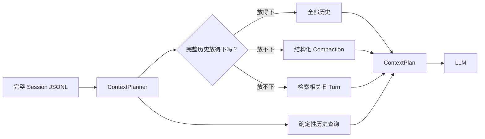
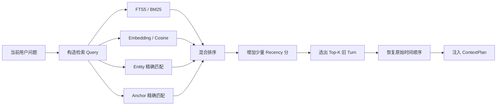

# 智策 Agent 第十五部分详细设计文档：完整会话上下文工程

> 文档类型：当前活文档。本文档记录 Part 15 已落地的完整 Session 上下文工程口径。
>
> 当前状态：完整实现与回归已完成；预算内完整历史、确定性历史查询、结构化 compaction、混合检索、派生状态生命周期和 trace 已进入当前代码基线。
>
> 承接：`docs_design/zhice-agent-part7-turn-context-design.md`、`docs_design/2026-07-22-endpoint-context-budget-and-hybrid-turn-selection-design.md`
>
> 日期设计记录：`docs_design/2026-07-26-full-session-context-engineering-design.md`

## 1. 背景

Part 15 设计前的 `ContextBuilder` 已经实现：

- Session JSONL 保存完整消息真值；
- 最近 3 个完整 Turn 无条件保留；
- 从最近 50 个候选 Turn 的更早部分最多选择 3 个本地词法相关 Turn；
- 中文短追问、确认和明确回指加分；
- failover-safe endpoint token 预算和完整 Tool block 裁剪。

这解释了当时近期效果为什么已经改善：早期方案单轮最多可带最近 3 个 Turn 和更早最多 3 个相关 Turn。截图对应的短会话没有超过这个上限，而且“问了什么/几个问题”等文本让旧 Turn 有机会被词法召回；这只是旧混合策略命中，不是当前实现。

真实 QQ Session 随后证明旧策略会错误删除有价值历史。一次 10 Turn 会话中，完整历史约 3522 tokens，“最近 3 + 旧相关 3”约 2853 tokens；系统为了节省约 669 tokens 删除了“介绍一下牛顿”，随后无法回答“我之前让我介绍过谁”。在 18 万级输入预算下，这个取舍不成立。

因此 Part 15 没有继续增加词法 marker，而是把上下文治理升级为完整链路：

```text
预算内完整历史
  + 确定性 Session 历史查询
  + 长会话结构化 compaction
  + FTS/BM25 与 embedding 混合召回
  + 可解释选择 trace
```

## 2. 官方依据与本项目取舍

OpenAI 官方当前公开建议：

- 多轮对话通过完整 input、`previous_response_id` 或 Conversations API 维护状态；
- 长对话接近窗口时使用 compaction 保留后续推理所需状态；
- Retrieval 使用向量语义搜索，并支持 query rewriting、score threshold、metadata filter、ranker 以及 embedding/关键词混合权重。

参考：

- [Conversation state](https://developers.openai.com/api/docs/guides/conversation-state)
- [Compaction](https://developers.openai.com/api/docs/guides/compaction)
- [Retrieval](https://developers.openai.com/api/docs/guides/retrieval)

ZhiCe 不能把 OpenAI Responses 的 opaque compaction item 作为唯一真值，因为当前必须继续支持 OpenAI-compatible、LiteLLM、多个 endpoint failover 和本地 JSONL Session。核心采用 provider-neutral 的结构化 compaction；特定 Provider 以后可以实现更高质量的 compactor，但不能改变 SessionStore 真值和通用 ContextPlan。

## 3. 目标

1. 预算允许时向 LLM 发送当前 Session 的全部完整 Turn，不再固定截成最近 3 + 相关 3。
2. “我问过什么、最开始问什么、有没有问牛顿、让我介绍过谁”等历史盘点走确定性 Session 查询，不依赖普通相关性猜测。
3. 历史过长时保留最近原始 Turn，并用可验证、可增量更新的结构化 compaction 表达更早状态。
4. 对未进入原始窗口的旧 Turn 同时使用 FTS/BM25、embedding、实体精确匹配和 recency 做混合召回。
5. 检索和裁剪以完整 Turn 为原子，tool call/result 不拆散。
6. ContextBuilder、SessionHistoryQuery、Compactor、EmbeddingProvider 和索引存储保持单向依赖，不在 AgentLoop 硬编码平台或业务判断。
7. CLI、Web、QQ、微信和 external WS 复用同一上下文方案；渠道不各做一套历史。
8. Session JSONL 始终保存完整真值；compaction 和索引都是可重建派生数据。
9. 每次上下文选择可通过 trace 回答“为什么带了这些 Turn、为什么没带其它 Turn”。
10. 完成已有 Session 的懒迁移、clear/delete 失效、并发、失败降级、安全与性能测试。

## 4. 非目标

- 不把长期 Memory 与 Session compaction 合并。Memory 是跨会话持久事实，compaction 是单 Session 的运行上下文。
- 不用向量检索替代完整会话状态。
- 不默认部署独立 Milvus、Qdrant、Weaviate 或 Elasticsearch 集群。
- 不把 OpenAI hosted vector store 作为用户聊天历史唯一存储。
- 不修改 Session JSONL 作为消息真值的地位。
- 不让 Subagent 自动读取父 Session 全部历史；child 仍按显式任务上下文隔离。
- 不在上下文摘要里保存或展示模型隐藏推理。

## 5. 总体架构

先用一张简化流程图理解核心选择逻辑：Session JSONL 始终保存完整聊天真值，`ContextPlanner` 只决定本次调用应该怎样把这些历史装进 `ContextPlan`。



这张图表达的是选择关系，不表示 compaction 和检索会修改或删除 JSONL：二者都只是可失效、可重建的派生状态。SQLiteTurnSearchIndex 每次操作使用短连接并显式 commit/rollback/close，避免 Windows 下 Session 清理、临时目录删除或索引重建被遗留文件句柄阻塞。

```text
JsonlSessionStore full turns
  -> SessionHistoryQueryResolver
       -> high-confidence history query: deterministic evidence
  -> ContextPlanner
       -> full mode when complete history fits
       -> long mode when history exceeds safe budget
            -> CompactionStore
            -> TurnSearchIndex
                 -> SQLite FTS5/BM25
                 -> EmbeddingProvider + local vector scan
                 -> entity exact match
            -> HybridTurnRetriever
  -> ContextPlan
       -> system
       -> compaction state
       -> history-query evidence
       -> retrieved old complete turns
       -> recent complete turns
       -> current user
  -> ContextBudgetFitter
  -> LLMProvider
```

AgentLoop 仍只调用统一的 ContextBuilder/ContextPlanner，不 import SQLite FTS、embedding SDK、OpenAI Responses 或渠道 SDK。

### 5.1 当前代码对齐与最小调整

实现核对真实仓库后采用以下具体口径：

- 仓库现有 Prompt 根目录是 `prompts/`，因此新增 `context_compaction.md`、`history_query_planner.md` 和 `context_query_rewrite.md` 均放在该目录，由 `PromptLoader` 读取，不新建 `agent/prompts/`。
- `ContextBuilder.build()` 在现有调用参数上增加当前已授权 `SessionStore`、实际 `LLMProvider` 和可见 Tool schemas；`AgentLoop` 只负责传入协议对象并消费 messages，不 import compaction/index/embedding 实现。
- 词法文档在 Turn 成功提交后同步 upsert；旧 Session 和 embedding 使用检索前的有界批次懒回填。第一实现不引入无归属后台线程，避免 Gateway/CLI/child 各自新增 worker 生命周期；SQLite WAL 与单事务写入保证幂等，embedding 失败只降级当前检索。该调整不改变 eventual consistency、可重建和用户隔离语义。
- 精确 cosine 使用直接运行依赖 `numpy>=1.26.0` 在当前 Session embedding 矩阵上向量化计算；显式串行 10,000 Turn 性能测试执行 7 次查询并要求 p95 小于 100ms，避免把 xdist 并发资源竞争误判为单 Session 检索延迟。
- 首次大范围 compaction 按最多 32 个新增 Turn、约 60000 字符拆成增量批次；每批原子保存并更新 source digest，失败时保留上一份有效 compaction。
- SQLite 损坏时仅隔离可重建的 `context_index.sqlite3`/WAL/SHM 为同目录 `.corrupt-*` 文件并从 JSONL 懒重建；不触碰 Session 真值。
- 没有 turn id 的旧 JSONL 消息按 user 边界生成仅运行时可见的 `legacy-turn-N`，下一新 Turn index 从推导数量继续，不重写旧文件。
- `/clear`、Web/CLI Session delete 在实际授权 SessionStore 上删除 compaction/index；渠道解绑仍保留 Session 和派生索引。
- 当前 Auth 已实现非 Owner 用户物理删除。删除流程按内部 user id 清理 sessions、memory、files、context 派生状态及关联认证/渠道/运行数据，并通过事务与补偿边界避免残留；仍绑定微信的账号必须先解绑。

## 6. ContextPlan 中性结构

新增只读数据结构：

```python
@dataclass(frozen=True)
class ContextPlan:
    mode: Literal["full", "history_query", "compacted_retrieval"]
    messages: tuple[dict[str, object], ...]
    selected_turn_ids: tuple[str, ...]
    recent_turn_ids: tuple[str, ...]
    retrieved_turns: tuple[RetrievedTurn, ...]
    compaction_id: str = ""
    compacted_through_turn_index: int = 0
    estimated_input_tokens: int = 0
    reason: str = ""

@dataclass(frozen=True)
class RetrievedTurn:
    turn_id: str
    turn_index: int
    final_score: float
    semantic_rank: int | None
    lexical_rank: int | None
    entity_match: bool
    reason: str
```

该结构用于装配和 trace，不写入 Session，不暴露给模型作为控制指令。

## 7. 第一层：预算内完整历史

### 7.1 选择规则

ContextPlanner 先按完整 Turn 构造候选，并估算：

```text
system prompt
+ full session turns
+ current user
+ current visible tool schemas
+ message/tool serialization overhead
```

`ContextBudget.input_token_limit` 已经为输出空间和 failover 链做过收窄。完整历史按明确 Token 水位触发长会话模式：

```text
compaction_trigger      = input_token_limit * 0.85
recent_raw_target       = input_token_limit * 0.15
post_compaction_maximum = input_token_limit * 0.35
```

若完整输入不超过 85% trigger，使用 `mode=full`，按原始时间顺序携带全部完整 Turn。不能因为 Turn 数超过 3、6 或 50 就主动删除。首次达到 trigger 后，优先保留约 15% 的最近原始 Turn，并把“固定内容 + compaction + recent raw turns”的可复用基础状态压到约 35% 以下。之后允许原始增量尾部自然增长，只有“compaction + 增量尾部 + 当前固定内容”再次达到 85% 才刷新，不能每新增一个 Turn 调一次 compactor。

三个水位必须分开：85% 回答“何时值得支付一次 compaction 延迟”，15% 回答“多少近期原文应保持逐字可见”，35% 回答“压缩完成后留下多少增长空间”。把它们合成一个 `target` 会造成刚压完很快再次触发，或为了低水位丢掉过多近期细节。

首次选择 raw/compacted 边界时不能只看 15% recent 预算。Planner 先从 35% 目标中扣除当前固定内容，并为结构化摘要预留至少 15% 输入预算；已有 compaction 则以“当前摘要估算 Token × 1.20”和 15% 两者较大值作为刷新预留。剩余空间才用于选择连续 recent raw Turn，从而尽量一次选准覆盖终点。

### 7.2 后续 Tool 迭代

每次 Tool result 回填后继续调用当前 `fit_messages()`：

- 优先截断过长 tool result；
- 删除已被 compaction 覆盖的最旧 raw Turn；
- 保持当前 user 和最新必要 tool chain；
- 不重新执行 Tool；
- 必要时从 `full` 动态切换到 `compacted_retrieval`，但同一 Turn 的 ContextPlan 变更必须写 trace。

### 7.3 配置

删除“默认最多 6 个历史 Turn”作为正常策略。`max_history_turns` 和 `max_relevant_turns` 只保留一个版本周期用于配置迁移告警，随后移除。新配置只表达预算和长会话策略，不表达固定删历史数量。

## 8. 第二层：确定性 Session 历史查询

### 8.1 为什么独立处理

以下问题的答案存在于 SessionStore 的结构化顺序中，不应该交给 embedding 猜：

- 我最开始问了什么？
- 我刚才/上一轮问了什么？
- 我一共问了几个问题？
- 最近 5 个问题是什么？
- 我有没有问过牛顿？
- 我之前让你介绍过谁？
- 在问“编程基础”之前，我问了什么？

### 8.2 Resolver

新增 `SessionHistoryQueryResolver`：

```python
resolve(query: str, turns: Sequence[TurnGroup]) -> HistoryQueryResult | None
```

支持的计划类型：

- `first_user_turn`
- `last_user_turn`
- `recent_user_turns(limit)`
- `count_user_turns`
- `contains(text_or_entity)`
- `before(anchor)` / `after(anchor)`
- `match_action(action="介绍", target_type="entity")`
- `list_user_questions(scope)`

先用确定性中文/英文规则识别高置信历史意图、范围、序数和实体。若明确包含“我问过/之前/最开始/最近几轮/有没有”等历史元问题，但规则无法形成完整计划，允许调用受限 `HistoryQueryPlanner`：它只输出结构化查询计划，不能直接回答，也不能访问其它 Session。

### 8.3 执行与证据

计划在已授权的当前 SessionStore 上执行，结果包含：

```text
total_user_turns
matched_turn_ids / turn_indexes
exact user messages
bounded assistant responses when requested
before/after relationships
truncated flag
```

简单查询可直接生成确定性答案；需要自然语言归纳时，把 `<session_history_evidence>` 作为高优先级受控上下文交给模型。模型不得声称 evidence 以外的历史。

`/history` 命令继续存在；自然语言历史查询和 `/history` 共用底层查询服务，不复制扫描逻辑。

## 9. 第三层：结构化 Compaction

### 9.1 触发

完整历史达到输入预算 85% 时进入长会话模式。Compaction 覆盖较早 Turn，最近原始窗口按约 15% 预算动态保留，而不是固定 3 个。

默认目标：

- 首次达到 85% 才触发，并把固定内容 + compaction + recent raw turns 的基础状态压回约 35%；
- recent raw turns 目标约占输入预算 15%，保留完整 Turn 与完整 Tool block；
- 已有 compaction 与原始增量尾部未再次达到 85% 时直接复用，不调用 LLM compactor；
- retrieval evidence 加入后仍须服从最终输入预算；
- `min_recent_turns=8` 是连续性偏好，不是突破 Token 安全边界的硬承诺；单 Turn 或 Tool 结果很大时按完整块进一步缩减，至少尽力保留最新一个完整 Turn；
- current user、system、Tool schema 和本 Turn 增长空间优先级更高。

15% recent raw 目标只适用于 compactor 可用的成功压缩路径。SessionStore、compaction Prompt 或 LLM 不可用时，Planner 不能先按 15% 删除原文，而应在最终输入硬预算内尽量保留连续近期 Turn，并明确标记相应降级。

35% 是性能低水位目标，不是必须在同一 Turn 再支付一次 LLM 延迟的硬限制。如果真实 compaction 生成后略高于 35% 但仍不超过 85%，保留当前连续 raw 尾部并写 `context.compaction.low_watermark_missed`，不立即二次压缩。只有新基础状态仍超过 85% 安全水位时，Planner 才从最旧 recent Turn 开始缩减，并先把这些 Turn 紧急增量并入 compaction，再移动 raw/compacted 边界；失败时保留原 raw 尾部并降级，不能制造覆盖断层。首次覆盖超过 32 个新增 Turn 时仍按有界批次调用，这是单请求大小边界，不属于低水位重试。

Compaction可以使用App层注入的独立`LLMProvider`。`config/models.json`的`routing.compaction`与`routing.chat`使用同一`endpoint`或`endpoint/model`解析协议；显式模型必须等于端点默认模型或命中`supported_models`。路由缺失或不可用时安全回退当前Turn Provider。`config.yml`的`context`分区不重复模型路由，AgentLoop也不读取端点名或import具体Provider实现。

开启后台预热后，已提交Session的“旧compaction + raw增量尾部 + 固定内容”达到80%时，ContextBuilder为当前用户隔离的`context_root + session_id`启动最多一个daemon任务。80%～85%期间当前回答继续使用完整历史；后台只压缩已提交Turn。后续请求达到85%时，若任务仍运行则等待同一Future，不并发重复调用；完成后仍通过source digest校验再复用。后台失败、clear/delete、进程退出或摘要失效均回退同步主链。

### 9.2 Provider-neutral Compaction

新增 `ContextCompactor` Protocol，默认实现通过现有 `LLMProvider` 和 `prompts/context_compaction.md` 生成严格结构化数据：

```json
{
  "schema_version": 1,
  "session_id": "...",
  "source_start_turn_index": 1,
  "source_end_turn_index": 120,
  "source_digest": "sha256...",
  "topics": [],
  "user_questions": [],
  "entities": [],
  "decisions": [],
  "confirmed_facts": [],
  "unresolved_items": [],
  "constraints": [],
  "files_and_errors": [],
  "tool_result_references": []
}
```

Compaction 是带来源范围的派生状态，不是自由摘要。每一项尽量携带来源 `turn_id`，以便旧细节检索和诊断。

### 9.3 增量与失效

- 只压缩已完成 Turn；当前运行 Turn 不进入 compaction。
- 新 compaction 以上一个有效 compaction 加新增 Turn 增量生成。
- 增量刷新按 Token 水位触发，不按每轮或固定 Turn 间隔触发；水位以下的新增 Turn 保持原文桥接。
- `source_digest` 与 JSONL 源 Turn 不一致时自动失效并重建。
- `/clear`、Session delete、用户删除和测试重置必须删除对应 compaction/index。
- Session JSONL 不因 compaction 删除任何消息。
- Compactor 失败时聊天降级为 recent raw + lexical/semantic retrieval，并写 warning，不伪造成功摘要。

### 9.4 存储

用户隔离目录：

```text
${user_context}/context/
  compactions/{session_id}.json
  context_index.sqlite3
```

Owner/CLI workspace 使用 owner context 目录；普通用户使用本人 context 目录。路径由 `UserContextResolver` 派生，不能由外部 user/session 文本拼接。

## 10. 第四层：混合 Turn 检索

旧 Turn 的候选生成、混合排序和上下文注入流程如下。FTS、embedding、entity、anchor 是并行的证据来源；它们共同决定“选哪些 Turn”，最终仍恢复真实时间顺序，不能按搜索分数打乱会话历史。



### 10.1 索引单位

一个完整 Turn 对应一个 `TurnDocument`：

```text
session_id, turn_id, turn_index
user_text
assistant_text
bounded tool result summaries
entities
exact anchors (file/error/model/session id)
content_hash
embedding model/dimension/vector
```

索引不保存 Secret、隐藏推理或未脱敏 Tool 原始输出。完整正文真值仍在 SessionStore。

### 10.2 本地存储实现

完整版第一版即包含 embedding 语义召回，但不要求外部向量数据库服务：

- SQLite 普通表保存 metadata 和 float32 embedding BLOB；
- SQLite FTS5 提供全文/BM25 候选；
- Python/Numpy 对当前 Session 候选做精确 cosine similarity；
- 典型本地单用户数百到数千 Turn 时，精确扫描比部署新服务更简单、可恢复且足够快。

新增 `TurnSearchIndex` Protocol，SQLite 只是第一实现，以后可替换 pgvector/Qdrant。

### 10.3 EmbeddingProvider

新增中性协议：

```python
class EmbeddingProvider(Protocol):
    @property
    def identity(self) -> str: ...
    @property
    def batch_size(self) -> int: ...
    def embed(self, texts: Sequence[str]) -> list[list[float]]: ...
```

第一实现为 OpenAI-compatible embeddings endpoint；SDK/config 只位于 provider/app 层，ContextPlanner 不依赖 OpenAI 类型。Embedding端点和用途路由统一位于：

```text
${ZHICE_AGENT_WORKSPACE}/config/models.json
```

仓库提交`config/models.example.json`，`routing.embedding`支持`endpoint`与`endpoint/model`，端点内配置`base_url`、`api_key`、`model`、`supported_models`、`dimensions`和`batch_size`。Secret使用环境变量引用。模型、维度或provider identity变化时，对旧向量按content hash懒重建。

### 10.4 混合排序

不能直接相加原始 cosine 与 BM25，因为量纲不同。使用候选集合上的 rank fusion：

```text
semantic_rank = cosine top-k rank
lexical_rank  = FTS5/BM25 top-k rank
rrf_score     = weighted reciprocal-rank fusion
final_score   = rrf_score
              + entity_exact_bonus
              + anchor_exact_bonus
              + recency_weight / (60 + recency_rank)
```

默认权重作为可测试配置：

```text
semantic = 0.45
lexical  = 0.30
entity   = 0.15
anchor   = 0.08
recency  = 0.02
```

`recency_rank = max_turn_index - turn_index + 1`。Recency 与 semantic/lexical 一样使用有界 reciprocal-rank 量纲，只作为近似分候选的轻量 tie-break；不能直接把 `0.02 * normalized_recency` 加到约 `weight / (60 + rank)` 的 RRF 分数上，否则最近但无关的 Turn 会压过 semantic rank 1 的早期事实。

至少有一路超过阈值才召回；文件名、错误码、模型名、Session ID 等 exact anchor 不能被低语义分覆盖。选出 top-k 后恢复原始时间顺序，再以完整 Turn 注入。

### 10.5 Query rewriting

只在长会话检索模式触发：

- 先做确定性实体、代码、文件、错误码提取；
- 完整、自包含的 query 保持原文，不因长度短而自动拼接最近 Turn；
- 只有短代词或明显省略 query 才与最近用户 Turn 共同形成检索 query；
- 短代词或明显省略导致召回不足时，允许一次受限 query rewrite；
- rewrite 只生成检索字符串，不回答用户问题；
- rewrite 失败时继续使用原 query，不阻断聊天。

## 11. 什么时候使用外部向量数据库

本次完整实现“向量检索”，但不默认引入“独立向量数据库服务”。满足任一条件再迁移：

1. 单用户/租户超过约 5 万个 Turn，或单部署超过约 10 万个有效 embedding。
2. 本地精确 cosine 检索 p95 持续超过 100ms，且优化批量计算后仍不满足延迟目标。
3. Part 17 生产部署后使用多进程/多实例 Gateway，需要跨进程实时共享索引。
4. 需要水平扩容、分片、副本、在线备份或独立检索服务 SLA。
5. 需要跨大量 Session/用户的管理员级搜索，并已有严格权限过滤与租户隔离。

选型顺序：

- 如果生产已使用 PostgreSQL：优先 `pgvector`，减少新服务数量；
- 如果需要独立高吞吐向量服务：评估 Qdrant；
- OpenAI hosted vector store 更适合文件知识库，不作为本地私有聊天历史默认真值或唯一索引。

迁移只增加新的 `TurnSearchIndex` 实现，不改变 ContextPlanner、SessionStore 或 AgentLoop。

## 12. 索引生命周期

```text
turn committed to SessionStore
  -> synchronously upsert lexical document + content hash
  -> retrieval sees missing/outdated provider identity
  -> bounded embedding batch upsert before semantic scan
```

- FTS 文档先可用，embedding 可短暂 eventual consistency。
- 首次进入旧Session的长历史检索时按Turn懒回填；批次由实际Embedding端点的`batch_size`限制（模板默认16），SQLite WAL/事务串行化同一用户索引写入，不创建额外常驻Worker。
- 检索发现缺失向量时仍使用 lexical/entity，不等待全量回填。
- 索引任务幂等键为 `(session_id, turn_id, content_hash, provider_identity)`。
- clear/delete/unlink 不混淆：Session clear/delete 删除派生索引；渠道解绑保留 Session，因此保留索引。

## 13. 上下文装配优先级

长会话最终顺序：

```text
system prompts
session compaction state
deterministic history-query evidence (if any)
retrieved old complete turns
recent raw complete turns
current user
current turn tool chain
```

预算不足时按以下顺序收缩：

1. 降低检索 top-k。
2. 删除最低分 retrieved Turn。
3. 截断 compaction 中低优先级展示字段，但保留 decisions/constraints/unresolved。
4. 减少最早 recent raw Turn，但不得低于动态最小连续窗口。
5. 截断过长 tool result。
6. 固定区仍超限则返回 `LLMContextBudgetError`。

不能删除 current user、system 安全规则、最新必要 tool chain，也不能拆 tool-call block。

## 14. Trace 与诊断

每次初始和 Tool 后 LLM 调用记录：

```json
{
  "event": "context.selection",
  "session_id": "...",
  "turn_id": "...",
  "mode": "full|history_query|compacted_retrieval",
  "candidate_turn_count": 120,
  "selected_turn_indexes": [2, 18, 113, 114, 115],
  "recent_turn_indexes": [113, 114, 115],
  "retrieved": {
    "2": {"semantic_rank": 1, "lexical_rank": 4, "entity": true, "score": 0.82}
  },
  "compaction_id": "compact-...",
  "compacted_through_turn_index": 112,
  "estimated_input_tokens": 12450,
  "input_token_limit": 183616,
  "reason": "full_history_fits|session_history_query|history_exceeds_safe_limit"
}
```

补充事件：

- `context.compaction.budget_planned/start/done/reused/low_watermark_missed/failed/usage`
- `context.compaction.background_started/background_done/background_waited/background_failed`
- `context.index.lexical_upserted`
- `context.index.embedding_upserted/failed`
- `context.retrieval.done`
- `context.history_query.resolved/ambiguous`

Trace 记录 Turn id/index、分数和原因，不记录完整消息、完整 embedding、Secret 或隐藏推理。

## 15. 配置

上下文策略统一位于`${ZHICE_AGENT_WORKSPACE}/config/config.yml`的`context`分区：

```yaml
context:
  full_history:
    enabled: true
  history_query:
    enabled: true
    planner_fallback: true
  compaction:
    enabled: true
    trigger_budget_ratio: 0.85
    recent_keep_ratio: 0.15
    post_compaction_max_ratio: 0.35
    min_recent_turns: 8
    background_enabled: true
    background_trigger_budget_ratio: 0.80
  retrieval:
    enabled: true
    top_k: 6
    semantic_weight: 0.45
    lexical_weight: 0.30
    entity_weight: 0.15
    anchor_weight: 0.08
    recency_weight: 0.02
  index:
    backend: sqlite
```

`zcagent init`非覆盖式同步根目录全部Prompt，并只补齐工作区`config/models.json`与`config/config.yml`；已有运行配置默认保留，只有显式`--force`才替换。缺失`context`分区使用上述安全默认值。旧`target_budget_ratio`已删除且不做懒映射。Compaction价格只配置在实际Chat端点的`pricing.input_per_million/output_per_million`；Provider usage仍记录，价格均为0时`cost_available=false`，不能把未知价格估算成真实账单。Embedding请求批次只配置在Embedding端点的`batch_size`，Context不保留第二份副本。Part 15 Prompt、Embedding路由、可用凭据缺失或无效时，CLI明示`degraded`，Web/QQ/微信通过统一capability status暴露，trace写入`context.startup_degraded`的安全原因但不记录Secret或环境变量名。full history、确定性history query和FTS/BM25继续工作；但“完整版验收”环境必须配置真实EmbeddingProvider并通过语义改写用例。

## 16. 安全与隔离

- 查询范围固定为 actor 已授权的当前 Session；自然语言不能指定未授权 session id 绕过 `SessionAccessService`。
- 用户 context index 物理隔离；共享生产索引实现必须用 owner/tenant metadata fail closed 过滤。
- Compaction/embedding 输入经过现有脱敏与消息边界，不包含 Secret、credential、绑定码和隐藏推理。
- 检索结果是历史数据，不是 system instruction；注入时使用受控 evidence delimiter，历史中的提示注入仍按普通用户数据处理。
- 普通用户只能查看自己的选择 trace 摘要；完整诊断仍服从现有 Activity/Audit 权限。
- 用户删除、Session 删除和 retention 清理必须同时清除派生索引与 compaction。

## 17. 与现有模块边界

### SessionStore

继续保存完整 JSONL 消息真值，新增/复用 `load_turns()` 派生完整 Turn。SessionStore 不 import embedding、FTS 或 LLM。

### Memory

Memory 继续保存跨 Session 的稳定偏好和事实。Compaction 不写 Memory；Memory extraction 不把 compaction 当作三条原文证据。

### AgentLoop

只消费 `ContextPlan.messages` 并在每次 LLM 调用前重新预算。历史意图、索引查询和 compaction 通过注入协议完成，不在 loop 内硬编码“牛顿”等业务词。

### Channel

QQ、微信、Web 和 CLI 都通过同一 Session route/ContextPlanner，渠道只负责展示，不决定上下文历史。

### Subagent

child 仍使用独立新鲜 Session；只有父任务文本显式提供的历史 evidence 才进入 child，不能通过索引读取父用户完整会话。

## 18. 变更文件计划

新增：

```text
agent/protocols/embedding.py
agent/protocols/context.py
agent/context/planner.py
agent/context/history_query.py
agent/context/compaction.py
agent/context/index.py
agent/context/retrieval.py
agent/context/turn_document.py
agent/embedding/openai_compatible.py
prompts/context_compaction.md
prompts/history_query_planner.md
prompts/context_query_rewrite.md
config/context.example.yml
config/models.example.json 的 embedding 分区
tests/unit_test/context_engineering/test_case.md
tests/unit_test/context_engineering/*
```

修改：

```text
agent/core/context.py
agent/core/loop.py
agent/app/runtime.py
agent/config.py
agent/auth/user_context.py
agent/session/jsonl_store.py
agent/app/logging.py
pyproject.toml
README.md
docs_design/README.md
docs_design/zhice-agent-overall-design.md
docs_design/zhice-agent-part7-turn-context-design.md
```

具体实现可以调整文件拆分，但依赖方向不能改变。

## 19. 实现顺序

虽然按依赖分阶段开发，但不把任一中间阶段宣告为“上下文完整版完成”：

1. 中性协议、ContextPlan、配置和用户隔离存储。
2. 预算内完整历史与确定性 SessionHistoryQuery。
3. 结构化 Compactor、增量存储和失效处理。
4. SQLite FTS5 TurnDocument 索引。
5. EmbeddingProvider、本地 vector scan 和混合 rank fusion。
6. ContextBuilder/AgentLoop 装配与 Tool 后重新规划。
7. Trace、诊断、旧 Session 懒回填和删除生命周期。
8. 全部正常/异常/边界/性能/E2E 测试后统一验收。

## 20. 测试方案

### 正常路径

- 10 Turn、完整历史 3522 tokens 时选择 `full`，包含“介绍牛顿”。
- 截图中的 5 个问题可准确计数并按原文顺序列出。
- “我之前让我介绍过谁”直接扫描 Session 并命中牛顿，不依赖 embedding。
- 长 Session 生成 compaction，保留最近 raw Turn 并召回旧相关 Turn。
- 同义改写只有少量关键词重叠时由 semantic retrieval 命中。
- 文件名/错误码由 lexical/anchor 路径优先命中。
- CLI/Web/QQ/微信同一 Session 得到一致 ContextPlan。

### 异常路径

- Embedding endpoint 超时：降级 FTS，聊天不失败，trace 标记 degraded。
- Compactor 返回非法 JSON：拒绝写入，使用已有有效 compaction 或 raw/retrieval 降级。
- FTS/SQLite 损坏：隔离并可从 Session JSONL 重建。
- source digest 不匹配：旧 compaction/index 不得继续使用。
- History planner 输出未授权 session id：执行层忽略并锁定当前授权 Session。
- 固定上下文仍超过预算：明确返回 `LLMContextBudgetError`。

### 边界路径

- 空 Session、单 Turn、无显式 turn id 的旧消息。
- 只有 tool calls 的异常历史、缺失 tool result、超长 tool output。
- 中文、英文、中英混合、日期、文件名、错误码和代码标识符。
- “我问了几个问题”中的陈述句/反问句计数边界。
- clear/delete 与索引任务并发。
- 多用户同名 Session、跨渠道同一内部 Session、Subagent child 隔离。
- embedding 模型/维度切换和批量回填中断恢复。

### 性能与回放

- 100、1000、10000 Turn 的索引大小、构建耗时和检索 p50/p95。
- 本地 10000 Turn exact cosine p95 目标不超过 100ms；超过则触发外部向量后端评估。
- 使用真实失败 Session 回放当前方案与新方案，断言 selected Turn 和最终 evidence。
- ContextPlan snapshot 测试确保选择原因和时间顺序稳定。

## 21. 验收标准

只有同时满足以下条件才标记本功能完成：

1. 预算允许时完整 Session history 全部进入上下文。
2. 典型历史元问题走确定性查询并有直接测试。
3. 长 Session 具备结构化、增量、可失效的 compaction。
4. FTS/BM25、embedding、实体和 anchor 混合检索真实可用。
5. 不部署外部向量服务时，本地 SQLite vector 实现可运行；EmbeddingProvider 缺失有诚实降级状态。
6. Session JSONL 保持完整真值，索引与 compaction 可全部重建。
7. clear/delete/user isolation/cross-channel/subagent 边界通过测试。
8. `context.selection` 能解释每个被选 Turn 的来源和原因。
9. “牛顿 turn2”与截图 5 问题两个真实回归用例通过。
10. Ruff、专项测试、全量 pytest 和配置示例校验通过。

当前工作树验证结果：

- `python -m ruff check .`：通过。
- Part 15 专项与 AgentLoop/ContextBuilder/Turn 直接回归：通过。
- 显式串行 10,000 Turn 精确 cosine p95 用例：通过 `< 100ms` 断言。
- `python -m pytest`：执行当前全量回归；显式重型性能用例按测试标记单列执行，具体通过数以当次命令输出为准。
