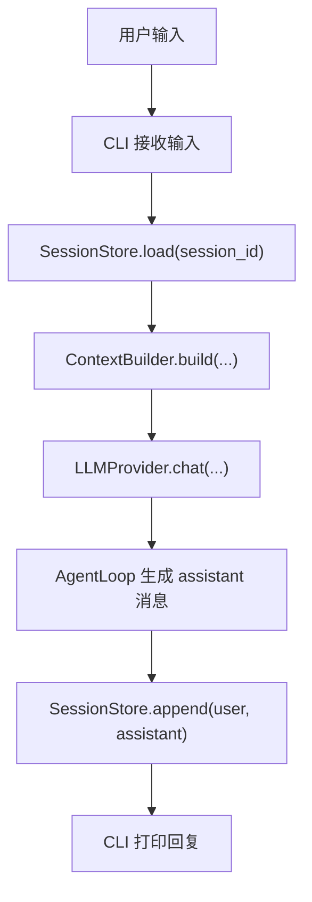
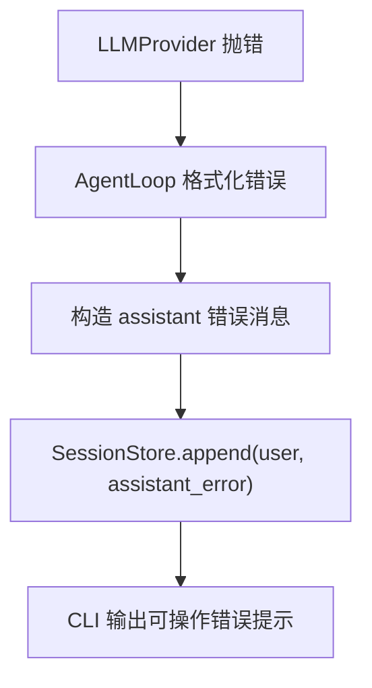
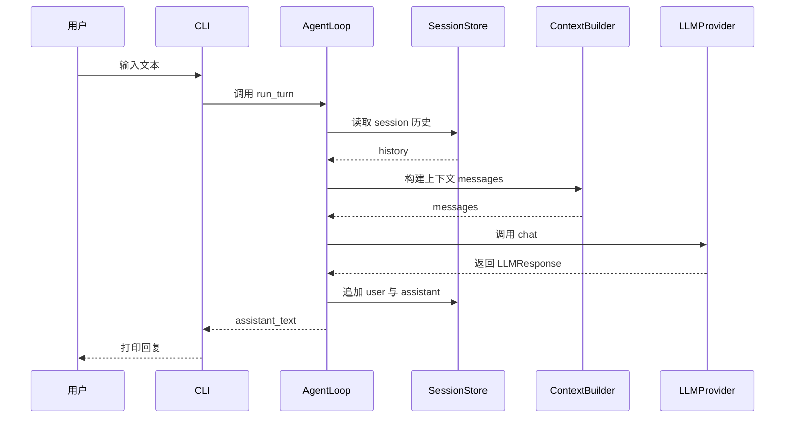

# ZhiCe-Agent 第二部分详细设计文档：无工具聊天链路

> 关联总设：`docs_design/zhice-agent-overall-design.md`
>
> 文档类型：阶段活文档。本文档始终按当前代码和当前阶段口径维护。
>
> 承接文档：`docs_design/zhice-agent-part1-foundation-design.md`
>
> 开发范围：Milestone 1 无工具聊天

---

## 1. 背景

第一部分已经完成项目底座，具备这些基础能力：

- 运行路径与目录配置
- Prompt 文件加载
- 通用消息模型
- JSONL Session 持久化
- 最小 CLI 入口

第二部分的目标是在不引入工具调用、不引入 Skill 执行的前提下，打通一条完整的本地对话链路：

1. CLI 接收用户输入
2. 读取当前 Session 历史
3. 构建发给 LLM 的 messages
4. 调用 LLM Provider
5. 返回 assistant 回复
6. 将 `user` 与 `assistant` 消息写回 Session

这一部分是 ZhiCe-Agent 从“可运行项目骨架”升级为“可本地对话 Agent”的关键阶段。

---

## 2. 目标

本部分完成后，应满足：

1. `zcagent` 可以基于指定 session 进行本地对话。
2. `ContextBuilder` 能稳定拼装系统 Prompt、运行时限制说明、历史消息和当前用户输入。
3. `AgentLoop.run_turn()` 能通过 `LLMProvider` 获取 assistant 回复。
4. LLM 调用必须经过协议接口，`AgentLoop` 不直接依赖具体 SDK。
5. 成功路径下，`user` 与 `assistant` 消息都会写入 `SessionStore`。
6. 失败路径下，也会写入带错误标记的 assistant 消息，避免本轮上下文丢失。
7. 单元测试可用 Fake LLM 覆盖主链路，不依赖真实网络。
8. 本地工作目录中的 LLM 配置和 Prompt 初始化可通过 `zcagent init` 完成。

---

## 3. 范围边界

### 3.1 本部分包含

- `LLMProvider` 协议与响应结构
- `LLMEndpoint` 配置结构
- OpenAI 兼容 Provider 实现
- `ContextBuilder`
- `AgentLoop.run_turn()`
- CLI 对话主链路
- 工作目录中的 endpoint 配置读取
- `zcagent init` 生成本地运行时文件
- Fake LLM / mock HTTP 单元测试

### 3.2 本部分不包含

- ToolRegistry 与工具调度
- Skill 脚本执行
- `exec` 能力
- 文件写入类工具
- 多轮工具编排
- Web UI / WebSocket
- 长期记忆、MCP、Subagent
- 多用户、多渠道隔离

---

## 4. 模块设计

### 4.1 `agent/protocols/llm.py`

负责定义统一的 LLM 配置、返回结构和调用协议。

当前结构：

```python
from dataclasses import dataclass, field
from typing import Any, Protocol


@dataclass(frozen=True)
class LLMEndpoint:
    name: str
    protocol: str
    base_url: str
    model: str
    api_key: str
    max_tokens: int = 4096
    temperature: float = 0.7


@dataclass
class LLMResponse:
    content: str
    tool_calls: list[dict[str, Any]] = field(default_factory=list)
    metadata: dict[str, Any] = field(default_factory=dict)


class LLMProvider(Protocol):
    def chat(
        self,
        messages: list[dict[str, Any]],
        tools: list[dict[str, Any]] | None = None,
    ) -> LLMResponse:
        ...
```

设计要求：

- `LLMEndpoint` 只表达运行所需的最小配置，不混入 CLI、Session 等上下文。
- `LLMResponse` 保留 `tool_calls` 字段，为第三部分工具调用预留兼容面。
- `metadata` 用于容纳 `model`、`finish_reason`、`usage` 等扩展信息。
- `LLMProvider` 保持同步接口，先把链路打通；异步化不是本阶段目标。
- 错误统一使用 `LLMProviderError` / `LLMConfigurationError`，避免上层耦合底层实现细节。

### 4.2 `agent/llm/openai_provider.py`

负责把协议层消息转换为 OpenAI 兼容的 Chat Completions 请求。

职责：

- 校验 endpoint 中的 `api_key`
- 将上层 `messages` 清洗为兼容格式
- 发送 HTTP 请求
- 解析响应为 `LLMResponse`
- 将 HTTP/网络/JSON 解析错误包装为统一错误

实现约束：

- 只负责协议适配与传输，不负责 Prompt 拼装、Session 保存、CLI 输出。
- 使用标准库 `urllib.request`，避免在第二部分引入更重依赖。
- 对错误返回进行脱敏，不能把真实 `api_key` 回显给用户。
- `OpenAIProvider` 保留为直连 OpenAI-compatible endpoint 的默认实现。

消息清洗规则：

- 只保留 `role`、`content`、`tool_calls`、`tool_call_id`、`name`
- assistant 在存在 `tool_calls` 且 `content` 为空时，传 `None`
- 其他空内容统一转成 `"(empty)"`，避免上游接口校验失败

### 4.2.1 `agent/llm/litellm_provider.py`

负责通过进程内 LiteLLM SDK 接入 Anthropic、Gemini、DeepSeek 等非 OpenAI 模型商。

当前实现方式：

- 引入 `litellm` Python 包。
- 不在 ZhiCe-Agent 进程里直接引入各家模型 SDK。
- 通过 `litellm.completion(...)` 调用模型。
- 复用 OpenAI-compatible 的消息清洗和 tools schema，响应解析和错误脱敏在 `LiteLLMProvider` 内完成。

因此 `protocol="litellm"` 不要求用户额外启动 LiteLLM Proxy。`base_url` 是可选字段：不填时由 LiteLLM SDK 根据模型前缀选择默认模型商接口；填写时作为 `api_base` 传给 LiteLLM SDK，用于公司内部网关或自定义 OpenAI-compatible 服务。

配置示例：

```json
{
  "claude": {
    "protocol": "litellm",
    "provider": "anthropic",
    "api_key": "${ANTHROPIC_API_KEY}",
    "model": "claude-sonnet-4",
    "max_tokens": 4096,
    "temperature": 0.7
  }
}
```

启动时通过 `zcagent --endpoint claude` 选择该 endpoint。配置层保留 `provider` 和未加前缀的 `model`，由 `LiteLLMProvider` 调用 SDK 时拼接为 LiteLLM 可识别的 `anthropic/claude-sonnet-4`。

### 4.3 `agent/context.py`

负责将 Prompt、运行时限制说明、Session 历史和当前用户输入组装为发给 LLM 的 `messages`。

当前依赖的 Prompt：

- `prompts/identity.md`
- `prompts/tool_use_policy.md`
- `prompts/skills_intro.md`

系统 Prompt 内容由以下几层拼接而成：

1. 身份说明
2. 工具使用规则
3. Skill 使用规则
4. 当前阶段限制说明
5. 运行时元信息：
   - `workspace=...`
   - `session_id=...`

设计要求：

- 历史消息只保留最近 `max_history_messages` 条。
- 超长消息按 `max_message_chars` 截断，并在尾部追加 `[truncated]`。
- 当前第二阶段不支持工具调用，因此历史中的 `tool` 消息会被跳过。
- 当前用户消息必须是 `role="user"`，否则抛出明确错误。
- Prompt 缺失时不吞错，直接向上抛出，交给 CLI 在启动阶段提前失败。

### 4.4 `agent/loop.py`

负责无工具单轮对话主循环。

核心流程：

1. 从 `SessionStore` 读取历史
2. 构造本轮 `user_msg`
3. 调用 `ContextBuilder.build()`
4. 调用 `LLMProvider.chat()`
5. 生成 `assistant_msg`
6. 追加 `[user_msg, assistant_msg]` 到 Session
7. 返回 assistant 文本

错误路径设计：

- 若 LLM 抛错，不让异常直接炸出 CLI
- 将错误格式化为用户可操作的提示文本
- 仍然写入一条 `assistant` 错误消息，并加上：
  - `metadata["is_error"] = True`
  - `metadata["error_type"] = ...`
- 如果 Session 保存失败，再将保存失败附加到最终返回文本中

本阶段重点约束：

- `AgentLoop` 只能依赖 `LLMProvider`、`SessionStore`、`ContextBuilder`
- 不直接出现 OpenAI SDK 或 HTTP 请求代码
- 不在这里实现工具调度分支

### 4.5 `agent/config.py`

第二部分在第一部分配置底座上补充了与 LLM 相关的运行时能力。

新增职责：

- 从 `${ZHICE_AGENT_WORKSPACE}/config/llm_endpoints.json` 读取 endpoint
- 解析 `api_key`
- 初始化本地运行时文件
- 加载项目级 `config/.env`

关键点：

- 项目目录下的 `config/.env` 用于启动配置，尤其是 `ZHICE_AGENT_WORKSPACE`
- 真实 endpoint 配置放在工作目录，不放在仓库中
- `zcagent init` 会在工作目录生成：
  - `${ZHICE_AGENT_WORKSPACE}/config/llm_endpoints.json`
  - `${ZHICE_AGENT_WORKSPACE}/config/skill_sources.yml`
  - `${ZHICE_AGENT_WORKSPACE}/prompts/*.md`
  - 可选 `${ZHICE_AGENT_WORKSPACE}/.env`
- `zcagent init` 可重复执行：已存在的本地文件默认保留，缺失文件会自动补齐；只有显式传 `--force` 才覆盖已有文件。

### 4.6 `agent/cli.py`

CLI 是第二部分对话链路的真实入口。

启动职责：

- 先处理全局 `--env-file`
- 自动加载项目 `config/.env`
- 解析 `init`、`gateway`、默认 chat 子路径
- 组装 `PromptLoader`、`JsonlSessionStore`、`ContextBuilder`、`LLMProvider`、`AgentLoop`

chat 路径职责：

- 解析 `--session`、`--workspace`、`--endpoint`
- 未显式传 `--session` 时，默认进入当天本地 session：`chat-YYYYMMDD`
- 启动时只打印项目名，workspace 和 session id 保持在 gateway/check 等诊断输出中，避免普通对话窗口噪声过多。

第二部分相关命令：

- `/history`：查看当前 session 最近消息
- `/prompts`：查看当前已加载的 prompt 文件
- `/exit`：退出

说明：

- `/new`、`/reset`、`/sessions` 是后续在 CLI session 管理中补充的能力，不属于第二部分最初边界，但当前实现已经兼容。
- `gateway` 子命令在代码中已存在入口脚手架，但完整 Web 能力不属于本阶段验收内容。

---

## 5. 配置与运行时文件

### 5.1 项目级配置

项目根目录中的 `config/.env` 用于启动时确定工作目录等参数。

最小示例：

```env
ZHICE_AGENT_WORKSPACE=C:\Users\you\ZhiCe-Agent-Workspace
```

### 5.2 工作目录配置

`${ZHICE_AGENT_WORKSPACE}/config/llm_endpoints.json` 描述真实调用的 endpoint。

示例：

```json
{
  "default": {
    "protocol": "openai",
    "base_url": "https://api.openai.com/v1",
    "api_key": "your-local-key",
    "model": "gpt-5",
    "max_tokens": 4096,
    "temperature": 0.7
  }
}
```

当前实现还支持把 `api_key` 写成环境变量占位符：

```json
{
  "default": {
    "protocol": "openai",
    "base_url": "https://api.openai.com/v1",
    "api_key": "${ZHICE_LLM_OPENAI_API_KEY}",
    "model": "gpt-5"
  }
}
```

对应环境变量可来自：

1. 当前 shell / 系统环境
2. 项目 `config/.env`

### 5.3 `zcagent init`

第一次初始化时，用户执行：

```bash
zcagent init
```

默认行为：

- 在 `${ZHICE_AGENT_WORKSPACE}/config/llm_endpoints.json` 创建 endpoint 配置
- 在 `${ZHICE_AGENT_WORKSPACE}/config/skill_sources.yml` 创建 Skill source 配置
- 复制默认 prompts
- 默认保留已有用户文件，只补齐缺失文件

可选行为：

- `--force`：覆盖已存在本地文件
- `--write-env`：在工作目录额外生成 `.env` 模板

---

## 6. 数据流

### 6.1 正常对话流程



### 6.2 错误对话流程



### 6.3 时序图



---

## 7. 变更文件

第二部分实际涉及：

- `agent/protocols/llm.py`
- `agent/llm/__init__.py`
- `agent/llm/openai_provider.py`
- `agent/context.py`
- `agent/loop.py`
- `agent/config.py`
- `agent/cli.py`
- `tests/unit_test/context_builder/test_context_builder.py`
- `tests/unit_test/agent_loop/test_agent_loop.py`
- `tests/unit_test/llm_provider/test_openai_provider.py`
- `tests/unit_test/cli/test_cli_init.py`

说明：

- `agent/session/jsonl_store.py`、`agent/prompt_loader.py` 虽然主体来自第一部分，但第二部分依赖它们作为正式运行链路的一部分。
- 后续 session 命令扩展另有独立设计文档：`docs_design/2026-06-12-cli-session-commands-design.md`

---

## 8. 测试方案

### 8.1 `ContextBuilder`

验证：

- 能拼出 system prompt 与当前用户消息
- 能保留最近历史且顺序正确
- 能截断超长历史消息
- 能跳过 `tool` 消息
- 缺少必需 Prompt 时能抛出清晰错误

### 8.2 `AgentLoop`

验证：

- 成功路径下返回 assistant 文本
- 成功路径下会写入 `user` 与 `assistant`
- 历史消息会原样传给 `ContextBuilder`
- LLM 抛错时会记录错误 assistant 消息
- 缺少 API key 时能给出可操作提示
- 缺少环境变量占位符时能明确指出变量名
- Provider 请求失败时能指向 `llm_endpoints.json`
- Session 保存失败时不会覆盖原本的 LLM 返回

### 8.3 `OpenAIProvider` / `LiteLLMProvider`

验证：

- 请求体能正确映射到 `chat/completions`
- `tool_calls` 与空内容处理符合兼容要求
- 可从本地工作目录 JSON 提供 API key
- HTTP 错误不会泄漏 secret
- `protocol="openai"` 创建 `OpenAIProvider`
- `protocol="litellm"` 创建 `LiteLLMProvider`
- `LiteLLMProvider` 会调用 `litellm.completion(...)`

### 8.4 CLI

验证：

- `zcagent init` 能生成运行时文件
- `zcagent gateway --check` 可用
- 缺少 workspace 时能打印设置提示
- 缺少启动 prompts 时能引导用户执行 `zcagent init`
- 缺少或未正确填写 `${ZHICE_AGENT_WORKSPACE}/config/llm_endpoints.json` 时，`zcagent` 聊天入口直接失败并提示配置；因为 LLM 是聊天运行必需能力
- 缺少 `${ZHICE_AGENT_WORKSPACE}/config/skill_sources.yml` 时只打印 warning 并跳过 Skill 同步；因为 Skill source 是可选扩展能力

提交前建议运行：

```bash
python -m ruff check .
python -m pytest
```

---

## 9. 验收标准

1. `zcagent` 能完成一次真实的无工具本地对话调用。
2. `AgentLoop` 主链路只依赖协议与基础组件，不直接耦合具体 Provider 实现细节。
3. 成功与失败路径都能稳定写入 Session。
4. `ContextBuilder` 能稳定装配 Prompt、历史和运行时信息。
5. LLM endpoint 配置完全来自工作目录，不要求把真实 key 放进仓库。
6. 第二部分为第三部分工具调用预留兼容接口，但不提前引入额外复杂度。

---

## 10. 后续衔接

第二部分完成后，第三部分可以在此基础上继续扩展：

- 将 `LLMResponse.tool_calls` 真正接入 AgentLoop
- 引入 `ToolProvider` / `ToolRegistry`
- 将 `tool` 消息纳入 ContextBuilder
- 在 Session 中保存完整的 `user -> assistant(tool_calls) -> tool -> assistant` 轨迹

也就是说，第二部分的目标不是“一次性做成全功能 Agent”，而是把最关键的无工具聊天骨架先立稳。
