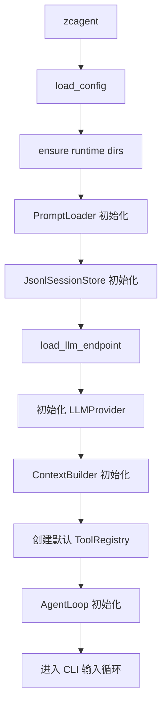
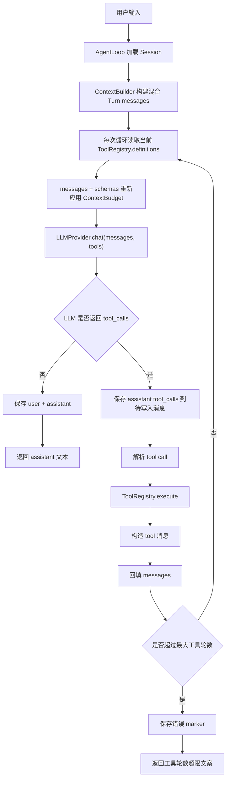
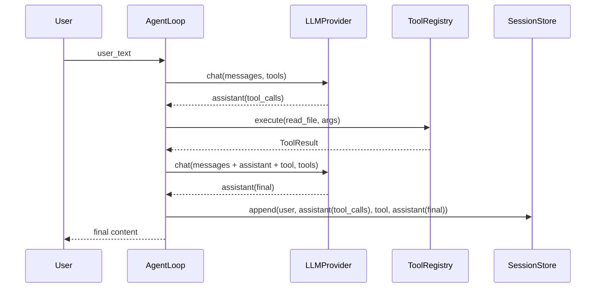
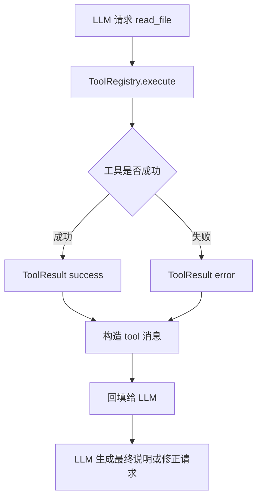

# 智策 Agent 第三部分详细设计文档：工具调用

> 当前补充：2026-07-21 已在本协议之上增加 Turn-scoped `discover_tools` 与动态 schema 激活。`ToolRegistry` 仍生成完整 OpenAI-compatible definitions，但 CLI/Web/child 的 LLM-facing Provider 首轮只披露 discovery schema，下一模型步才披露已激活业务 Tool。AgentLoop 在每次初始/工具结果模型调用前重新读取当前 definitions，把 Tool schemas 纳入 failover-safe ContextBudget，并重新裁剪 messages；当前实现见 `docs_design/2026-07-21-on-demand-tool-discovery-design.md` 和 `docs_design/2026-07-22-endpoint-context-budget-and-hybrid-turn-selection-design.md`。

> 关联总设：`docs_design/zhice-agent-overall-design.md`
>
> 文档类型：阶段活文档。本文档始终按当前代码和当前阶段口径维护。
>
> 承接文档：`docs_design/zhice-agent-part2-no-tool-chat-design.md`
>
> 参考规范：`AGENTS.md`
>
> 当前状态：Milestone 2 工具调用与只读本地工具闭环已实现；后续 Capability Selection、确认、Hook 与审计在该协议上扩展。

---

## 1. 第三部分当前交付

第三部分交付“工具调用”能力：AgentLoop 可以向 LLM 声明受控工具、识别 tool calls、执行并回填 ToolResult，再由模型生成最终回答。

这一部分仍保持轻量，优先实现只读本地工具，不做任意命令执行，不做文件写入，不接 Skill。工具系统先把协议边界、注册表、安全路径、输出截断和 session 保存顺序立住，为后续 `exec` 工具和 SkillLoader 打地基。

### 1.1 交付内容

```text
agent/
  loop.py                         # 扩展为支持工具调用循环
  context.py                      # 支持把 tool 历史消息传给 LLM
  protocols/
    tool.py                       # 新增 Tool/ToolProvider/ToolResult 协议
  tools/
    __init__.py
    base.py                       # 工具公共基类、路径 guard、输出截断 helper
    registry.py                   # ToolRegistry 实现
    readonly.py                   # list_dir/read_file/grep 只读工具
  cli.py                          # 可选：新增 /tools 调试命令
tests/
  unit_test/
    tools/
      test_case.md
      test_readonly_tools.py
      test_tool_registry.py
    agent_loop/
      test_agent_loop_tools.py
    context_builder/
      test_context_builder_tool_messages.py
```

第三部分不要求改变 LLM endpoint 配置格式。第二部分已经在 `LLMProvider.chat(messages, tools=None)` 中预留 `tools` 参数，并且 `OpenAIProvider` 已能把 `tools` 放入请求体、解析响应中的 `tool_calls`。

### 1.2 验收目标

第三部分完成后，应满足：

1. `AgentLoop` 在每次 LLM 调用前读取 `ToolProvider.definitions()` 并传给 `LLMProvider.chat`，支持 Turn 内动态 schema。
2. 当 LLM 返回 `tool_calls` 时，`AgentLoop` 能解析工具名和 JSON 参数，调用对应工具，并把工具结果作为 `tool` 消息回填。
3. 工具执行完成后，`AgentLoop` 会再次调用 LLM，让模型基于工具结果生成最终 assistant 回复。
4. session JSONL 中保存完整一轮轨迹：`user`、带 `tool_calls` 的 `assistant`、一个或多个 `tool`、最终 `assistant`。
5. 内置工具第一批只包含只读能力：`list_dir`、`read_file`、`grep`。
6. 所有文件读取默认限制在 `ZHICE_AGENT_WORKSPACE` 派生的 workspace 内，不能通过绝对路径、`..` 或符号链接逃逸。
7. 工具失败返回结构化 `ToolResult`，不把 Python traceback 或未处理异常直接抛给 AgentLoop。
8. 工具输出有长度限制，超长时截断并在 metadata 中记录截断信息。
9. 工具调用路径有 Fake LLM 单元测试覆盖，不依赖真实 LLM 或真实网络。
10. 默认测试命令 `python -m ruff check .` 和 `python -m pytest` 成功。

---

## 2. 为什么第三部分先做只读工具调用

总设把第一阶段拆成底座、无工具聊天、工具调用、exec、Skill 等渐进里程碑。第三部分先做只读工具调用，是因为工具调用是 AgentLoop 从“聊天器”变成“执行型 Agent”的第一条核心链路，但它不应该一上来就承担任意命令执行的风险。

只读工具的价值在于：

- 可以验证 LLM function calling / tool calls 的通用流程。
- 可以验证 session 如何保存中间 assistant 工具请求和 tool 结果。
- 可以先把 workspace guard、参数校验、输出截断、错误结构化这些安全能力做扎实。
- 可以让 Agent 读取仓库文件、查看目录、搜索文本，已经能覆盖很多开发辅助场景。
- 后续新增 `exec`、文件写入、Skill 执行时，可以复用同一套 `ToolProvider` 和 AgentLoop 调度逻辑。

本部分完成后，AgentLoop 的职责会变成规范中的完整形态：加载上下文、调用 LLM、调度工具、回填工具结果、保存会话。但业务判断仍然不写进 AgentLoop，具体能力通过 Tool 扩展。

---

## 3. 范围边界

### 3.1 本部分包含

- `ToolResult`、`Tool`、`ToolProvider` 协议。
- `ToolRegistry` 注册表。
- OpenAI-compatible tool schema 生成。
- LLM `tool_calls` 解析与参数 JSON 解析。
- AgentLoop 工具调用循环。
- `tool` 消息回填和 session 保存。
- 只读本地工具：
  - `list_dir`
  - `read_file`
  - `grep`
- workspace 路径 guard。
- 工具输出截断。
- 工具错误结构化。
- CLI 可选 `/tools` 调试命令。
- 单元测试和 Fake LLM 工具调用测试。

### 3.2 本部分不包含

- `exec` 工具。
- 文件写入、删除、移动、重命名。
- Git 操作工具。
- 网络访问工具。
- Web UI。
- SkillLoader 和 `skills/*/scripts` 调用。
- MCP、Hooks、Subagent、Memory。
- 多工具并行执行。
- 自动审批流。
- 完整 Context Compaction、摘要 checkpoint 和复杂历史替换；基础 endpoint token 预算已进入当前实现。

---

## 4. 核心设计决策

### 4.1 Tool 是 AgentLoop 的能力端口，不是业务分支

AgentLoop 不写类似 `if user_asks_to_read_file` 的业务判断。AgentLoop 只做通用调度：

1. 把工具 schema 交给 LLM。
2. 识别 LLM 请求了哪些工具。
3. 按工具名调用注册表。
4. 把工具结果作为 `tool` 消息回填。
5. 继续调用 LLM，直到得到无工具调用的最终回复，或达到最大工具轮数。

工具是否适用，由 LLM 根据 prompt 和 tool schema 判断；工具如何执行，由具体 Tool 负责。

### 4.2 第三部分只实现只读工具

第一批工具全部只读：

- `list_dir` 只列目录。
- `read_file` 只读取文本文件。
- `grep` 只搜索文本内容。

不提供 shell、写文件、删除文件、安装依赖、网络访问等能力。这样可以先验证工具闭环，同时避免在工具协议还没稳定时引入破坏性操作。

### 4.3 工具结果既给模型看，也写入 Session

工具调用不是临时日志，而是上下文的一部分。一次工具调用成功后，session 应保存：

```text
user: 用户原始问题
assistant: 模型请求工具，content 可为空，tool_calls 非空
tool: 工具执行结果，带 tool_call_id
assistant: 模型基于工具结果生成的最终回答
```

这样后续轮次可以看到工具证据，也便于人工排查模型为什么得出某个回答。

### 4.4 工具错误不终止整轮对话

工具执行失败时，Tool 返回 `is_error=True` 的 `ToolResult`。AgentLoop 仍把错误结果回填给 LLM，让模型可以解释失败原因、调整参数或向用户说明限制。

只有以下情况才由 AgentLoop 直接结束：

- LLM 调用失败。
- 工具调用轮数超过上限。
- 工具调用格式严重不合法且无法构造可回填结果。

### 4.5 延续当前同步接口

总体设计里的协议示例使用了 `async` 伪代码，但第二部分现有实现已经选择同步接口：`LLMProvider.chat(...) -> LLMResponse`、`AgentLoop.run_turn(...) -> str`。第三部分继续沿用同步接口，避免在工具系统尚未稳定时同时引入异步运行时复杂度。

后续如果 Web API、并发工具或 MCP 需要异步能力，应先新增设计文档，再统一评估是否把 `LLMProvider`、`ToolProvider` 和 `AgentLoop` 改为 async。

---

## 5. 模块设计

### 5.1 `agent/protocols/tool.py`

负责定义工具协议和统一返回结构。该文件只放接口和数据结构，禁止 import 具体工具实现。

```python
from dataclasses import dataclass, field
from typing import Any, Protocol

@dataclass
class ToolResult:
    output: str
    is_error: bool = False
    metadata: dict[str, Any] = field(default_factory=dict)

    def __post_init__(self) -> None:
        if self.output is None:
            self.output = ""

class Tool(Protocol):
    name: str
    description: str
    parameters: dict[str, Any]

    def execute(self, args: dict[str, Any]) -> ToolResult:
        ...

class ToolProvider(Protocol):
    def definitions(self) -> list[dict[str, Any]]:
        ...

    def execute(self, name: str, args: dict[str, Any]) -> ToolResult:
        ...
```

设计要求：

- `description` 保持短描述，长规则放在 `prompts/*.md`。
- `parameters` 使用 JSON Schema object。
- `execute` 永远返回 `ToolResult`，不把异常直接交给 AgentLoop。
- 错误码放入 `metadata["code"]`，例如 `INVALID_PARAM`、`PATH_OUTSIDE_WORKSPACE`、`NOT_FOUND`、`TOO_LARGE`、`INTERNAL_ERROR`。
- `ToolProvider` 是 AgentLoop 依赖的抽象端口，具体实现是 `ToolRegistry`。

### 5.2 `agent/tools/base.py`

负责工具公共能力，包括基类、路径解析、安全 guard、输出截断和错误包装。

建议内容：

```python
from pathlib import Path
from typing import Any

DEFAULT_MAX_TOOL_OUTPUT_CHARS = 12000

class BaseTool:
    name: str
    description: str
    parameters: dict[str, Any]

    def __init__(self, workspace: Path):
        self.workspace = Path(workspace).expanduser().resolve()

    def execute(self, args: dict[str, Any]) -> ToolResult:
        try:
            return self._execute(args)
        except Exception as exc:
            return ToolResult(
                output="工具执行失败。",
                is_error=True,
                metadata={"code": "INTERNAL_ERROR", "error_type": type(exc).__name__},
            )

    def _execute(self, args: dict[str, Any]) -> ToolResult:
        raise NotImplementedError
```

关键 helper：

```python
def resolve_workspace_path(workspace: Path, value: str | None) -> Path:
    ...

def truncate_output(text: str, max_chars: int = DEFAULT_MAX_TOOL_OUTPUT_CHARS) -> ToolResult:
    ...
```

路径 guard 要求：

- 空路径或 `"."` 表示 workspace 根目录。
- 相对路径以 workspace 为基准解析。
- 绝对路径也允许输入，但 resolve 后必须仍位于 workspace 内。
- 已存在路径必须使用 `Path.resolve()` 跟随符号链接后再判断。
- 任何逃逸 workspace 的路径返回 `PATH_OUTSIDE_WORKSPACE`。
- 工具不读取 workspace 外文件，即使用户或模型传入绝对路径。

### 5.3 `agent/tools/registry.py`

负责注册工具、生成 LLM tool schema、按名称执行工具。

核心类：

```python
class ToolRegistry:
    def __init__(self, tools: list[Tool]):
        ...

    def definitions(self) -> list[dict[str, Any]]:
        ...

    def execute(self, name: str, args: dict[str, Any]) -> ToolResult:
        ...
```

`definitions()` 返回 OpenAI Chat Completions 兼容格式：

```json
[
  {
    "type": "function",
    "function": {
      "name": "read_file",
      "description": "Read a text file inside the workspace.",
      "parameters": {
        "type": "object",
        "properties": {
          "path": {"type": "string"}
        },
        "required": ["path"],
        "additionalProperties": false
      }
    }
  }
]
```

设计要求：

- 工具名必须唯一。
- 工具名只允许字母、数字、下划线和短横线，避免 provider 兼容问题。
- 未知工具返回 `ToolResult(is_error=True, metadata={"code": "UNKNOWN_TOOL"})`。
- 参数不是 dict 时返回 `INVALID_PARAM`。
- `definitions()` 每次返回新对象，避免测试或调用方误修改注册表内部状态。

### 5.4 `agent/tools/readonly.py`

负责第一批只读工具。

#### 5.4.1 `list_dir`

用途：列出 workspace 内某个目录的直接子项。

参数：

```json
{
  "type": "object",
  "properties": {
    "path": {
      "type": "string",
      "description": "Directory path relative to the workspace. Defaults to '.'."
    },
    "max_entries": {
      "type": "integer",
      "minimum": 1,
      "maximum": 500,
      "description": "Maximum number of entries to return."
    },
    "include_hidden": {
      "type": "boolean",
      "description": "Whether to include hidden entries."
    }
  },
  "required": [],
  "additionalProperties": false
}
```

返回建议：

```text
DIR  agent
DIR  tests
FILE README.md 1451 bytes
FILE pyproject.toml 703 bytes
```

设计要求：

- 默认 `path="."`。
- 默认 `max_entries=200`。
- 默认不展示隐藏文件和隐藏目录。
- 排序规则：目录优先，然后按名称升序。
- 超过上限时截断，并在 metadata 中记录 `truncated=True`、`total_entries`、`returned_entries`。
- 目标不是目录时返回 `NOT_DIRECTORY`。

#### 5.4.2 `read_file`

用途：读取 workspace 内文本文件。

参数：

```json
{
  "type": "object",
  "properties": {
    "path": {
      "type": "string",
      "description": "File path relative to the workspace."
    },
    "start_line": {
      "type": "integer",
      "minimum": 1,
      "description": "1-based start line."
    },
    "max_lines": {
      "type": "integer",
      "minimum": 1,
      "maximum": 1000,
      "description": "Maximum lines to return."
    },
    "max_chars": {
      "type": "integer",
      "minimum": 1,
      "maximum": 50000,
      "description": "Maximum characters to return."
    }
  },
  "required": ["path"],
  "additionalProperties": false
}
```

设计要求：

- 只读取文件，不读取目录。
- 默认 `start_line=1`、`max_lines=300`、`max_chars=12000`。
- 默认按 UTF-8 读取；解码失败返回 `DECODE_ERROR`，不猜测复杂编码。
- 可在输出中带行号，便于模型引用，例如 `12: def main():`。
- 超过 `max_lines` 或 `max_chars` 时截断，并在 metadata 中记录截断信息。
- 文件过大仍允许按行读取前一段，不一次性读入全部内容。

#### 5.4.3 `grep`

用途：在 workspace 内搜索文本。

参数：

```json
{
  "type": "object",
  "properties": {
    "pattern": {
      "type": "string",
      "description": "Regular expression pattern to search for."
    },
    "path": {
      "type": "string",
      "description": "Directory or file path relative to the workspace. Defaults to '.'."
    },
    "case_sensitive": {
      "type": "boolean",
      "description": "Whether matching is case sensitive."
    },
    "max_matches": {
      "type": "integer",
      "minimum": 1,
      "maximum": 500,
      "description": "Maximum matching lines to return."
    },
    "include_hidden": {
      "type": "boolean",
      "description": "Whether to search hidden files and directories."
    }
  },
  "required": ["pattern"],
  "additionalProperties": false
}
```

返回建议：

```text
agent/core/loop.py: response = self.llm.chat(messages=messages, tools=None)
docs_design/zhice-agent-part2-no-tool-chat-design.md:595: - 新增 agent/protocols/tool.py
```

设计要求：

- 默认 `path="."`。
- 默认 `case_sensitive=False`。
- 默认 `max_matches=100`。
- 默认跳过隐藏目录和常见缓存目录：`.git`、`.pytest_cache`、`.ruff_cache`、`__pycache__`、`.venv`、`venv`、`node_modules`。
- 正则非法时返回 `INVALID_PATTERN`。
- 跳过二进制文件或解码失败文件，并在 metadata 中统计 `skipped_files`。
- 命中超过上限时截断，并在 metadata 中记录 `truncated=True`。
- 第一版用 Python 标准库实现，避免引入外部依赖或 shell 命令。

### 5.5 `agent/core/loop.py`

第三部分扩展 `AgentLoop`，新增 `tools` 依赖和工具调用循环。

建议签名：

```python
class AgentLoop:
    def __init__(
        self,
        llm: LLMProvider,
        sessions: SessionStore,
        context_builder: ContextBuilder,
        workspace: Path,
        tools: ToolProvider | None = None,
        max_tool_iterations: int = 25,
    ):
        ...
```

工具调用主流程：

```python
session = sessions.load(session_id)
user_msg = Message(role="user", content=user_text)
messages = context_builder.build(...)
pending_session_messages = [user_msg]
tool_definitions = tools.definitions() if tools else None

for iteration in range(max_tool_iterations + 1):
    response = llm.chat(messages=messages, tools=tool_definitions)
    assistant_msg = Message(
        role="assistant",
        content=response.content,
        tool_calls=response.tool_calls,
        metadata=response.metadata,
    )
    pending_session_messages.append(assistant_msg)
    messages.append(message_to_llm_dict(assistant_msg))

    if not response.tool_calls:
        sessions.append(session_id, pending_session_messages)
        return response.content

    if tools is None:
        # 没有工具提供者却收到工具调用，作为错误回填或直接结束。
        ...

    for raw_call in response.tool_calls:
        call = parse_tool_call(raw_call)
        result = tools.execute(call.name, call.arguments)
        tool_msg = tool_result_to_message(call.id, call.name, result)
        pending_session_messages.append(tool_msg)
        messages.append(message_to_llm_dict(tool_msg))

# 超过最大工具轮数
sessions.append(session_id, pending_session_messages + [error_msg])
return TOOL_ITERATION_LIMIT_TEXT
```

设计要求：

- 无工具路径行为保持兼容：如果 LLM 不返回 `tool_calls`，仍只保存 `user + assistant`。
- 有工具时，必须先保存模型请求工具的 assistant 消息，再保存 tool 消息。
- 一次 assistant 可请求多个 tool call，第三部分按顺序串行执行。
- `max_tool_iterations` 计算 assistant 请求工具的轮数，不计算最终无工具回答。
- 默认最大工具轮数为 25，防止模型无限调用工具，同时允许多步骤诊断完成目录定位、日志读取和证据汇总；达到上限后不再执行工具，并进入无工具总结/fallback。
- 工具返回错误时仍回填给 LLM，而不是让 AgentLoop 直接抛异常。
- LLM 调用失败沿用第二部分策略：保存 user 和 assistant error marker，不泄露 secret。
- 最终返回给 CLI 的文本必须是最终 assistant 文本，而不是工具 JSON。

### 5.6 Tool call 解析

OpenAI-compatible 响应里的工具调用通常形如：

```json
{
  "id": "call_abc",
  "type": "function",
  "function": {
    "name": "read_file",
    "arguments": "{\"path\":\"README.md\"}"
  }
}
```

第三部分需要支持：

- 标准 `function.name`。
- 标准 `function.arguments` 字符串 JSON。
- 少量兼容形态：`{"name": "...", "arguments": {...}}`。

解析失败策略：

- 缺少工具名：构造错误工具结果，`code=MISSING_TOOL_NAME`。
- arguments 不是合法 JSON：构造错误工具结果，`code=INVALID_ARGUMENT_JSON`。
- arguments JSON 不是 object：构造错误工具结果，`code=INVALID_PARAM`。
- 缺少 tool call id 时生成稳定 fallback id，例如 `call_{index}`，并在 metadata 标记 `generated_tool_call_id=True`。

### 5.7 ToolResult 回填格式

工具结果写入 `tool` 消息时，建议 content 使用稳定 JSON 字符串：

```json
{
  "status": "success",
  "output": "README.md 内容...",
  "metadata": {
    "tool_name": "read_file",
    "truncated": false
  }
}
```

错误结果：

```json
{
  "status": "error",
  "output": "路径超出 workspace，已拒绝读取。",
  "metadata": {
    "tool_name": "read_file",
    "code": "PATH_OUTSIDE_WORKSPACE"
  }
}
```

对应 `Message`：

```python
Message(
    role="tool",
    content=tool_result_json,
    name=call.name,
    tool_call_id=call.id,
    metadata={
        "tool_name": call.name,
        "is_error": result.is_error,
        **result.metadata,
    },
)
```

设计要求：

- `content` 始终是字符串。
- 不把 Python traceback 放入 `content`。
- `metadata` 可包含内部调试信息，但也不要放 secret 或完整异常栈。
- 工具输出截断后，`content` 中应是截断后的文本，metadata 记录截断状态。

### 5.8 `agent/core/context.py`

第二部分的 `ContextBuilder` 会跳过 `tool` 角色。第三部分需要允许历史中的 `tool` 消息进入 LLM messages。

调整要求：

- 允许角色：`system`、`user`、`assistant`、`tool`。
- `tool` 消息必须保留 `tool_call_id`。
- `tool` 消息可保留 `name`。
- `assistant` 消息如果带 `tool_calls`，要继续保留 `tool_calls`。
- 所有历史消息仍受 `max_history_messages` 和 `max_message_chars` 限制。
- CLI/Web 共用 60 message 兜底；每次 LLM 调用还要把当次实际 Tool schemas 纳入 endpoint `ContextBudget`。
- 超限时先删除最旧历史 Turn、再截断 tool result；只剩当前 Turn 仍超限时，可以整体删除较早的已完成 Tool 块，但 assistant call 与对应 result 必须一起删除，并至少保留最新调用链。

转换示例：

```python
{
    "role": "tool",
    "tool_call_id": "call_abc",
    "name": "read_file",
    "content": "{\"status\":\"success\",\"output\":\"...\"}"
}
```

### 5.9 `agent/cli.py`

CLI 仍只负责参数解析、依赖初始化、读取输入、打印输出。

第三部分初始化时：

```python
tool_registry = create_default_tool_registry(config.workspace)
agent_loop = AgentLoop(
    llm=llm,
    sessions=session_store,
    context_builder=context_builder,
    workspace=config.workspace,
    tools=tool_registry,
)
```

可选新增调试命令：

```text
/tools       打印当前注册工具名称和短描述
```

设计要求：

- CLI 不直接执行工具。
- CLI 不直接解析 LLM tool_calls。
- `/tools` 只用于本地调试，不影响 AgentLoop 主链路。

---

## 6. 数据流

### 6.1 启动流程



### 6.2 一轮工具调用流程



### 6.3 Session 保存顺序



### 6.4 工具失败流程



---

## 7. 安全与边界策略

### 7.1 Workspace guard

所有只读工具必须通过同一个路径解析函数：

```python
resolved = resolve_workspace_path(workspace, user_path)
```

判断规则：

1. `workspace` 在工具初始化时 resolve 为绝对路径。
2. 用户路径为空时使用 workspace。
3. 相对路径拼接到 workspace 后 resolve。
4. 绝对路径直接 resolve。
5. resolve 后必须满足 `resolved == workspace` 或 `resolved.is_relative_to(workspace)`.
6. 不满足时返回 `PATH_OUTSIDE_WORKSPACE`。

不能用字符串前缀判断代替 `Path.relative_to` / `is_relative_to`，避免 `C:\repo2` 误判为 `C:\repo` 内部路径。

### 7.2 输出截断

默认工具输出上限：

```text
DEFAULT_MAX_TOOL_OUTPUT_CHARS = 12000
```

工具可针对自身再提供更小默认值。截断时：

- `output` 末尾追加 `[truncated]`。
- metadata 记录：
  - `truncated=True`
  - `original_chars`
  - `returned_chars`

### 7.3 错误结构化

通用错误码：

```text
INVALID_PARAM
MISSING_PARAM
INVALID_PATTERN
PATH_OUTSIDE_WORKSPACE
NOT_FOUND
NOT_FILE
NOT_DIRECTORY
DECODE_ERROR
TOO_LARGE
UNKNOWN_TOOL
INVALID_ARGUMENT_JSON
INTERNAL_ERROR
```

错误结果示例：

```python
ToolResult(
    output="文件不存在：README2.md",
    is_error=True,
    metadata={"code": "NOT_FOUND"},
)
```

### 7.4 禁止事项

第三部分工具禁止：

- 调用 shell。
- 写文件。
- 删除、移动、重命名文件。
- 访问 workspace 外路径。
- 访问网络。
- 读取环境变量中的 secret。
- 把 traceback 暴露给 LLM 或用户。

---

## 8. 测试设计

### 8.1 `tests/unit_test/tools/test_tool_registry.py`

覆盖：

- 注册多个工具后能生成 OpenAI-compatible definitions。
- 工具名重复时报错。
- 未知工具返回 `UNKNOWN_TOOL`。
- 参数不是 dict 时返回 `INVALID_PARAM`。
- `definitions()` 返回副本，外部修改不污染注册表。

### 8.2 `tests/unit_test/tools/test_readonly_tools.py`

覆盖：

- `list_dir` 正常列出文件和目录。
- `list_dir` 默认隐藏隐藏文件。
- `list_dir` 对文件路径返回 `NOT_DIRECTORY`。
- `read_file` 能读取文本并带行号。
- `read_file` 支持 `start_line` 和 `max_lines`。
- `read_file` 对目录返回 `NOT_FILE`。
- `read_file` 超长输出会截断。
- `grep` 能找到匹配行。
- `grep` 支持大小写选项。
- `grep` 非法正则返回 `INVALID_PATTERN`。
- 三个工具都拒绝 `..` 和 workspace 外绝对路径。
- 符号链接逃逸 workspace 时被拒绝。

### 8.3 `tests/unit_test/agent_loop/test_agent_loop_tools.py`

使用 Fake LLM 和 Fake ToolRegistry，覆盖：

- 无工具返回时保持第二部分行为。
- `AgentLoop` 会把 tool definitions 传给 LLM。
- 单个 tool call 会被执行，并触发第二次 LLM 调用。
- 多个 tool call 按顺序执行并全部回填。
- 工具返回错误时，错误结果作为 `tool` 消息回填给 LLM。
- 最终 session 保存 `user -> assistant(tool_calls) -> tool -> assistant(final)`。
- 工具调用超过 `max_tool_iterations` 时返回友好错误并保存错误 marker。
- LLM 抛错时沿用第二部分错误保存策略。
- malformed arguments 不会导致 AgentLoop 崩溃。

Fake LLM 示例：

```python
class ScriptedLLM:
    def __init__(self, responses):
        self.responses = list(responses)
        self.calls = []

    def chat(self, messages, tools=None):
        self.calls.append({"messages": messages, "tools": tools})
        return self.responses.pop(0)
```

### 8.4 `tests/unit_test/context_builder/test_context_builder_tool_messages.py`

覆盖：

- 历史中的 `tool` 消息会进入 LLM messages。
- `tool_call_id` 被保留。
- `assistant.tool_calls` 被保留。
- tool 消息内容仍会按 `max_message_chars` 截断。

### 8.5 `tests/unit_test/llm_provider/test_openai_provider.py`

第二部分已有 Provider 工具字段测试。第三部分可补充：

- `tools` 非空时请求体包含 `tools`。
- `tools=None` 或空列表时不发送 `tools` 字段。
- 响应中的多个 `tool_calls` 能保持顺序。

---

## 9. 实现顺序

推荐按下面顺序开发：

1. 新增 `agent/protocols/tool.py`，定义 `ToolResult`、`Tool`、`ToolProvider`。
2. 新增 `agent/tools/base.py`，实现路径 guard、输出截断和 BaseTool。
3. 新增 `agent/tools/registry.py`，实现 `ToolRegistry` 及测试。
4. 新增 `agent/tools/readonly.py`，实现 `list_dir`、`read_file`、`grep` 及测试。
5. 修改 `ContextBuilder`，允许历史中的 `tool` 消息进入 LLM messages。
6. 扩展 `AgentLoop` 构造参数，接入 `ToolProvider`。
7. 实现 tool call 解析、工具执行、tool 消息回填和最大工具轮数限制。
8. 修改 CLI 初始化默认 `ToolRegistry`，可选新增 `/tools`。
9. 补充 AgentLoop 工具调用单元测试。
10. 运行 `python -m ruff check .` 和 `python -m pytest`。
11. 手动运行 `zcagent --session default`，用真实或 Fake endpoint 验证工具调用链路。

---

## 10. 后续衔接

第三部分完成后，第四部分可以进入 `exec` 工具，但必须在当前 Tool 框架之上增加更严格的安全层：

- workspace cwd guard。
- 命令超时。
- stdout/stderr 截断。
- 危险命令拦截。
- 破坏性操作显式确认。
- 命令执行错误结构化。

第五部分可以进入 SkillLoader：

- 扫描 `skills/*/SKILL.md`。
- 把 Skill 摘要加入上下文。
- 将 Skill 脚本封装为 Tool。
- 保证 `skills/*/scripts` 不 import `agent.*`。

第三部分留下的 `ToolProvider` 和 `ToolRegistry` 应成为后续 `exec`、Skill、外部 API 工具的共同入口，不需要推倒重写 AgentLoop。

---

## 11. 完成定义

当以下命令都能成功时，第三部分可以认为完成：

```bash
python -m ruff check .
python -m pytest
zcagent --session default
```

并且工具调用场景满足：

```text
用户：帮我看看 README 写了什么
assistant(tool_calls): read_file({"path": "README.md"})
tool: {"status":"success","output":"..."}
assistant(final): README 主要说明了 ...
```

session JSONL 中按顺序追加：

```json
{"role":"user","content":"帮我看看 README 写了什么"}
{"role":"assistant","content":"","tool_calls":[...]}
{"role":"tool","name":"read_file","tool_call_id":"call_abc","content":"{\"status\":\"success\",...}"}
{"role":"assistant","content":"README 主要说明了 ..."}
```

同时满足：

- `agent/core/loop.py` 不 import 具体工具实现，只依赖 `ToolProvider` 协议。
- `agent/protocols/tool.py` 不 import 任何具体工具。
- `agent/tools/readonly.py` 不调用 shell。
- 所有工具默认限制在 workspace 内。
- 工具失败不会导致 AgentLoop 崩溃。
- 默认测试不访问真实 LLM 或网络。
