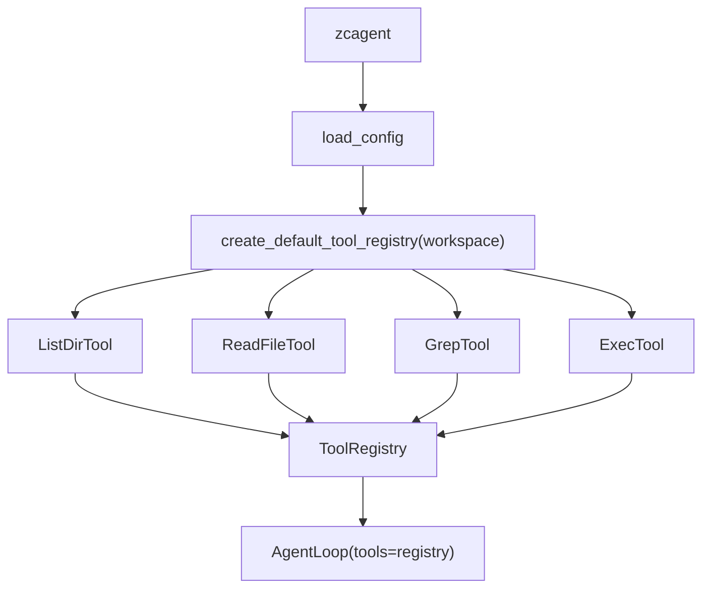
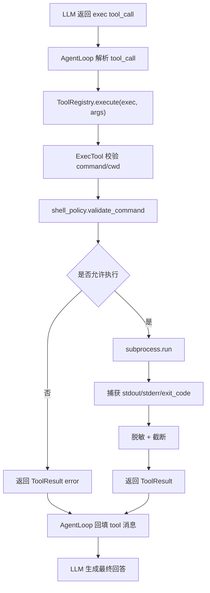
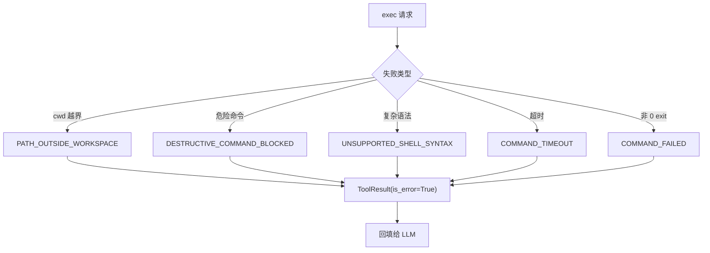

# 智策 Agent 第四部分详细设计文档：安全 exec 工具

> 关联总设：`docs_design/zhice-agent-overall-design.md`
>
> 文档类型：阶段活文档。本文档始终按当前代码和当前阶段口径维护。
>
> 承接文档：`docs_design/zhice-agent-part3-tool-calling-design.md`
>
> 参考规范：`AGENTS.md`
>
> 开发范围：Milestone 3 `exec` 工具，在现有 ToolRegistry 之上实现安全本地命令执行

---

## 1. 第四部分要开发什么

第四部分建议开发“安全 `exec` 工具”。目标是让 ZhiCe-Agent 在已经能读文件、列目录、搜索文本的基础上，进一步具备运行本地命令的能力，例如执行测试、运行 lint、查看只读 Git 状态、调用项目内脚本。

这一部分仍然保持轻量，核心不是做一个万能 shell，而是在当前工具框架里加入一个受约束的命令执行工具：

```text
用户提出需要验证
  -> LLM 选择 exec 工具
  -> exec 在 workspace 内执行安全命令
  -> 捕获 stdout/stderr/exit_code
  -> 截断并结构化返回
  -> AgentLoop 回填 tool 消息
  -> LLM 基于真实结果回答用户
```

第四部分不改变 AgentLoop 的核心调度模型。第三部分已经完成 `ToolProvider`、`ToolRegistry`、tool call 回填和 session 轨迹保存，`exec` 应只是新增一个具体 Tool，而不是把命令执行逻辑写进 AgentLoop。

### 1.1 交付内容

```text
agent/
  tools/
    exec.py                       # ExecTool 实现
    shell_policy.py               # 命令分类、危险命令拦截、输出脱敏 helper
    __init__.py                   # 默认 ToolRegistry 注册 exec
  cli.py                          # /tools 输出中能看到 exec
  prompts/
    tool_use_policy.md            # 补充 exec 使用边界
tests/
  unit_test/
    tools/
      test_exec_tool.py
      test_shell_policy.py
    agent_loop/
      test_agent_loop_tools.py    # 可选补充 exec tool call 场景
```

如果实现时发现 `agent/tools/base.py` 的 workspace path helper 已经足够，应复用现有 helper；只有当命令策略明显独立时，才新增 `shell_policy.py`，避免把安全策略散落到 `exec.py` 里。

### 1.2 验收目标

第四部分完成后，应满足：

1. `exec` 作为普通 Tool 注册到 `ToolRegistry`，AgentLoop 不 import 具体实现。
2. `exec` 只能在 `ZHICE_AGENT_WORKSPACE` 派生的 workspace 内执行命令，`cwd` 不能逃逸 workspace。
3. 命令必须有超时，默认 30 秒，第一版最大不超过 120 秒。
4. stdout 和 stderr 必须截断，默认总输出不超过 12000 字符。
5. 命令执行结果统一返回 `ToolResult`，包含 `exit_code`、`stdout`、`stderr`、`duration_seconds` 等 metadata。
6. 非 0 退出码返回结构化错误，不抛未处理异常。
7. 超时返回 `COMMAND_TIMEOUT`，并尽量保留已捕获输出。
8. 危险命令、破坏性命令、明显网络/安装命令和环境变量批量导出命令默认拦截。
9. `exec` 不支持多命令串联、管道、重定向、子 shell、后台任务等复杂 shell 语法。
10. 命令输出中疑似 secret 的内容要尽量脱敏。
11. 默认测试不依赖真实 LLM、真实网络或 workspace 外部路径。
12. `python -m ruff check .` 和 `python -m pytest` 成功。

---

## 2. 为什么第四部分做 exec，而不是直接做 Skill

总设中的 Skill 执行依赖一条基础链路：

```text
读取 Skill 说明
  -> LLM 理解参数和执行方式
  -> 调用脚本
  -> 读取脚本 stdout 最后一行 JSON
  -> 解释执行结果
```

这条链路里，“调用脚本”本质上需要一个安全命令执行能力。如果没有 `exec`，SkillLoader 即使能扫描 `SKILL.md`，也只能把说明展示给 LLM，无法真正运行 `skills/*/scripts/*.py`。

所以第四部分先做 `exec` 的价值是：

- 为第五部分 SkillLoader 提供脚本执行底座。
- 让 Agent 能用真实测试结果回答问题，而不是只靠读代码猜测。
- 把命令超时、输出截断、workspace guard、危险命令拦截等安全能力先独立打牢。
- 避免在 Skill 阶段同时处理“技能发现”和“命令安全”两类复杂问题。

这一部分仍然不是让模型拥有任意系统权限。`exec` 第一版只服务本地项目验证，优先支持读状态、跑测试、跑格式检查和执行 workspace 内脚本。

---

## 3. 范围边界

### 3.1 本部分包含

- `ExecTool`。
- 命令参数 schema。
- workspace 内 `cwd` guard。
- 命令超时。
- stdout/stderr 捕获。
- 输出截断。
- 非 0 exit code 结构化。
- 危险命令拦截。
- 多命令复杂语法拦截。
- 明显网络/安装命令拦截。
- 环境变量批量导出命令拦截。
- 输出 secret 脱敏。
- 单元测试和 Fake LLM 工具调用测试。
- `tool_use_policy.md` 中的 `exec` 使用规则。

### 3.2 本部分不包含

- 文件写入工具。
- 删除、移动、重命名文件工具。
- Git 自动提交、切分支、push、PR 工具。
- 依赖安装工具。
- 网络下载或外部 API 调用工具。
- 用户确认 UI。
- 长时间后台任务。
- 交互式命令。
- 伪终端。
- 流式输出。
- SkillLoader。
- Hook runner。
- MCP。
- 多命令并发执行。

---

## 4. 核心设计决策

### 4.1 exec 是 Tool，不是 AgentLoop 分支

`exec` 必须遵守第三部分建立的工具边界：

```text
LLM tool call
  -> ToolRegistry.execute("exec", args)
  -> ExecTool.execute(args)
  -> ToolResult
  -> AgentLoop 回填 tool 消息
```

AgentLoop 不判断“这个命令是否安全”，也不直接调用 `subprocess`。命令安全策略属于 `ExecTool` 和 `shell_policy`，这样后续如果增加 hook 或确认流，也能围绕 Tool 层扩展，不污染循环主体。

### 4.2 第一版默认只允许单条非交互命令

第一版 `exec` 不支持复杂 shell 语法。下面这些都应默认拦截：

```text
|
&&
||
;
>
>>
<
`...`
$(...)
Start-Process
nohup
&
```

原因是多命令串联会让安全策略很难准确判断，尤其在 Windows PowerShell、cmd 和类 Unix shell 之间语义差异很大。第四部分先支持最常用的单条命令，例如：

```bash
python -m pytest
python -m ruff check .
git status --short
git diff -- README.md
```

如果未来确实需要管道、重定向或后台任务，应先新增设计文档和更完整的命令解析策略。

### 4.3 破坏性命令先拒绝，不让模型自行确认

规范要求破坏性操作必须能从用户请求中明确确认，不能由模型自行猜测执行。当前 AgentLoop 还没有“暂停并等待用户确认某个 tool call”的交互协议，所以第四部分不实现破坏性命令确认流。

第一版策略是：

- 明显破坏性命令直接返回 `DESTRUCTIVE_COMMAND_BLOCKED`。
- `exec` 结果说明该命令被安全策略拒绝。
- LLM 可以向用户解释原因，或者建议改用非破坏性的检查命令。

被拦截的典型命令：

```text
rm
del
rmdir
Remove-Item
git reset --hard
git clean
git checkout --
git restore
format
mkfs
shutdown
```

后续如果要支持确认流，应单独设计：

```text
assistant proposes command
  -> CLI asks user to confirm exact command
  -> confirmation token is generated by CLI/runtime
  -> exec verifies token before running destructive command
```

模型不能自己生成确认 token。

### 4.4 默认拦截网络、安装和环境导出类命令

第四部分的目标是本地项目验证，不是让模型联网下载、安装依赖或导出环境变量。

第一版应拦截明显网络/安装命令：

```text
curl
wget
Invoke-WebRequest
irm
pip install
python -m pip install
npm install
pnpm install
yarn add
git clone
git pull
```

也应拦截环境批量导出命令：

```text
env
printenv
set
Get-ChildItem Env:
gci env:
```

这不是说这些能力永远不能做，而是它们应该经过更明确的用户授权和外部网络策略。第四部分先把本地安全执行闭环做好。

### 4.5 使用同步 subprocess，延续当前同步架构

当前 `LLMProvider`、`ToolProvider`、`AgentLoop` 都是同步接口。`exec` 第一版应继续使用同步 `subprocess.run`，配合 `timeout` 参数满足非交互命令执行。

建议内部执行形态：

```python
completed = subprocess.run(
    command,
    cwd=resolved_cwd,
    shell=True,
    text=True,
    capture_output=True,
    timeout=timeout_seconds,
    encoding="utf-8",
    errors="replace",
)
```

使用 `shell=True` 的原因是 Windows 本地命令、Python console command 和简单 shell 命令更容易兼容；对应的安全成本由“单命令限制、危险命令拦截、cwd guard、超时、输出截断”来控制。

如果实现时发现跨平台行为不可控，可以改为 `argv` 数组模式，但这会降低日常命令表达的便利性。无论选择哪种实现，设计边界必须保持：模型不能借 `exec` 逃逸 workspace、长时间占用进程或执行明显危险命令。

---

## 5. 模块设计

### 5.1 `agent/tools/exec.py`

新增 `ExecTool`：

```python
class ExecTool(BaseTool):
    name = "exec"
    description = "Run a safe non-interactive command inside the workspace."
    parameters = {
        "type": "object",
        "properties": {
            "command": {
                "type": "string",
                "description": "Single non-interactive command to run."
            },
            "cwd": {
                "type": "string",
                "description": "Working directory relative to the workspace. Defaults to '.'."
            },
            "timeout_seconds": {
                "type": "integer",
                "minimum": 1,
                "maximum": 120,
                "description": "Command timeout in seconds."
            },
            "max_output_chars": {
                "type": "integer",
                "minimum": 1000,
                "maximum": 50000,
                "description": "Maximum combined stdout and stderr characters."
            }
        },
        "required": ["command"],
        "additionalProperties": False,
    }
```

默认值：

```text
cwd="."
timeout_seconds=30
max_output_chars=12000
```

执行流程：

1. 校验 `command` 是非空字符串。
2. 校验 `cwd` 并 resolve 到 workspace 内。
3. 标准化命令字符串。
4. 调用 `shell_policy.validate_command(command)`。
5. 使用 `subprocess.run` 执行命令。
6. 捕获 `stdout`、`stderr`、`returncode` 和耗时。
7. 对输出做 secret 脱敏和长度截断。
8. 返回 `ToolResult`。

成功结果建议：

```text
exit_code: 0
cwd: .

stdout:
...

stderr:
...
```

metadata：

```python
{
    "tool_name": "exec",
    "exit_code": 0,
    "cwd": ".",
    "duration_seconds": 1.23,
    "timed_out": False,
    "truncated": False,
}
```

非 0 退出码：

```python
ToolResult(
    output=formatted_output,
    is_error=True,
    metadata={
        "code": "COMMAND_FAILED",
        "exit_code": completed.returncode,
        ...
    },
)
```

超时：

```python
ToolResult(
    output="Command timed out after 30 seconds.",
    is_error=True,
    metadata={
        "code": "COMMAND_TIMEOUT",
        "timed_out": True,
        "timeout_seconds": 30,
    },
)
```

### 5.2 `agent/tools/shell_policy.py`

该模块只做命令分类和输出脱敏，不执行命令。

建议提供：

```python
@dataclass
class CommandPolicyResult:
    allowed: bool
    code: str = "OK"
    message: str = ""
    category: str = "local"

def validate_command(command: str) -> CommandPolicyResult:
    ...

def redact_secrets(text: str) -> str:
    ...
```

命令校验顺序：

1. 空命令返回 `MISSING_PARAM`。
2. 过长命令返回 `COMMAND_TOO_LONG`。
3. 包含复杂 shell 语法返回 `UNSUPPORTED_SHELL_SYNTAX`。
4. 匹配危险命令返回 `DESTRUCTIVE_COMMAND_BLOCKED`。
5. 匹配网络/安装命令返回 `NETWORK_COMMAND_BLOCKED`。
6. 匹配环境导出命令返回 `ENV_DUMP_BLOCKED`。
7. 其他命令允许。

输出脱敏建议覆盖：

```text
api_key=...
OPENAI_API_KEY=...
Authorization: Bearer ...
sk-...
```

脱敏是兜底，不是主要安全边界。真正敏感的环境批量导出命令应在执行前拦截。

### 5.3 `agent/tools/__init__.py`

默认工具注册表应从第三部分：

```python
ToolRegistry([
    ListDirTool(workspace),
    ReadFileTool(workspace),
    GrepTool(workspace),
])
```

扩展为：

```python
ToolRegistry([
    ListDirTool(workspace),
    ReadFileTool(workspace),
    GrepTool(workspace),
    ExecTool(workspace),
])
```

保持 `agent/loop.py` 不 import `ExecTool`。CLI 通过 `create_default_tool_registry(config.workspace)` 间接获得工具集。

### 5.4 `prompts/tool_use_policy.md`

需要补充短规则，让 LLM 知道何时使用 `exec`：

```markdown
## exec 使用规则

- 只有当需要真实运行测试、lint、只读状态检查或项目内脚本时才使用 exec。
- 优先选择最小、非交互、单条命令。
- 不要使用 exec 做删除、移动、重置、安装依赖、联网下载或环境变量导出。
- 命令失败时，先根据 stdout/stderr 解释原因，不要盲目重复执行。
```

Python 代码里的 tool description 仍保持短描述，不放长安全规则。

---

## 6. 数据流

### 6.1 启动注册流程



### 6.2 一次 exec 调用流程



### 6.3 失败路径



---

## 7. 安全与边界策略

### 7.1 Workspace cwd guard

`cwd` 的解析规则沿用只读工具：

1. 空值或 `"."` 表示 workspace 根目录。
2. 相对路径从 workspace 拼接。
3. 绝对路径 resolve 后必须仍在 workspace 内。
4. 符号链接 resolve 后如果逃逸 workspace，拒绝。
5. 拒绝时返回 `PATH_OUTSIDE_WORKSPACE`。

`exec` 不提供“临时放宽到 workspace 外”的参数。

### 7.2 命令超时

默认：

```text
timeout_seconds = 30
max_timeout_seconds = 120
```

如果模型传入更大的值，按 `INVALID_PARAM` 拒绝，不悄悄放大。超时后返回 `COMMAND_TIMEOUT`，并在 metadata 里记录：

```python
{
    "timed_out": True,
    "timeout_seconds": timeout_seconds,
}
```

### 7.3 输出截断

stdout 和 stderr 先分别脱敏，再合并格式化，最后按 `max_output_chars` 截断。

metadata 记录：

```python
{
    "truncated": True,
    "original_chars": 30000,
    "returned_chars": 12000,
}
```

### 7.4 错误码

第四部分新增错误码：

```text
COMMAND_TOO_LONG
UNSUPPORTED_SHELL_SYNTAX
DESTRUCTIVE_COMMAND_BLOCKED
NETWORK_COMMAND_BLOCKED
ENV_DUMP_BLOCKED
COMMAND_TIMEOUT
COMMAND_FAILED
COMMAND_EXECUTION_ERROR
```

继续复用第三部分已有错误码：

```text
INVALID_PARAM
MISSING_PARAM
PATH_OUTSIDE_WORKSPACE
INTERNAL_ERROR
```

### 7.5 禁止事项

第四部分 `exec` 禁止：

- workspace 外 cwd。
- 交互式命令。
- 长时间后台任务。
- 多命令串联。
- 管道和重定向。
- 删除、移动、重置、格式化等破坏性命令。
- 依赖安装和联网下载。
- 批量打印环境变量。
- 把 traceback、secret 或完整环境内容交给 LLM。

---

## 8. 测试设计

### 8.1 `tests/unit_test/tools/test_shell_policy.py`

覆盖：

- 普通命令允许，例如 `python -m pytest`。
- 空命令返回 `MISSING_PARAM`。
- 超长命令返回 `COMMAND_TOO_LONG`。
- `&&`、`|`、`;`、`>` 等复杂语法返回 `UNSUPPORTED_SHELL_SYNTAX`。
- `rm -rf`、`del /s`、`Remove-Item -Recurse` 返回 `DESTRUCTIVE_COMMAND_BLOCKED`。
- `pip install`、`npm install`、`curl` 返回 `NETWORK_COMMAND_BLOCKED`。
- `env`、`printenv`、`Get-ChildItem Env:` 返回 `ENV_DUMP_BLOCKED`。
- `redact_secrets` 能隐藏常见 key 和 bearer token。

### 8.2 `tests/unit_test/tools/test_exec_tool.py`

覆盖：

- 成功执行本地安全命令并返回 exit code 0。
- `cwd` 默认为 workspace。
- `cwd` 可设置为 workspace 内子目录。
- `cwd` 使用 `..` 或 workspace 外绝对路径时返回 `PATH_OUTSIDE_WORKSPACE`。
- 非 0 命令返回 `COMMAND_FAILED`，并保留 stdout/stderr。
- 超时命令返回 `COMMAND_TIMEOUT`。
- 输出过长会截断并记录 metadata。
- 危险命令不会真正执行。
- 命令执行异常被转换为 `ToolResult`。
- 输出中的 secret-like 文本被脱敏。

Windows 测试要避免依赖 Unix 命令。建议优先用 Python 一行命令构造跨平台用例，例如：

```bash
python -c "print('ok')"
python -c "import sys; print('bad'); sys.exit(3)"
python -c "import time; time.sleep(2)"
```

### 8.3 `tests/unit_test/agent_loop/test_agent_loop_tools.py`

可补充一条 Fake LLM 场景：

```text
第一次 LLM 返回 exec({"command":"python -c \"print('ok')\""})
工具返回 exit_code 0
第二次 LLM 返回“命令执行成功”
session 保存 user -> assistant(tool_calls) -> tool -> assistant(final)
```

这里不需要调用真实 OpenAI，也不需要真实网络。

### 8.4 `tests/unit_test/cli/test_cli_init.py`

如果 `/tools` 已实现，应补充：

- `/tools` 输出包含 `exec`。
- `zcagent` 初始化默认 registry 时不会因为 `exec` 缺少 workspace 而失败。

---

## 9. 实现顺序

推荐按下面顺序开发：

1. 新增 `agent/tools/shell_policy.py`，实现命令校验和输出脱敏。
2. 新增 `tests/unit_test/tools/test_shell_policy.py`。
3. 新增 `agent/tools/exec.py`，实现 `ExecTool`。
4. 新增 `tests/unit_test/tools/test_exec_tool.py`。
5. 修改 `agent/tools/__init__.py`，把 `ExecTool` 注册进默认工具集。
6. 更新 `prompts/tool_use_policy.md`，补充 `exec` 使用规则。
7. 如有 `/tools` 命令，确认输出包含 `exec`。
8. 补充 AgentLoop Fake LLM 测试，验证 `exec` 能走完整工具回填链路。
9. 运行 `python -m ruff check .`。
10. 运行 `python -m pytest`。
11. 手动用 `zcagent --session default` 验证一次安全命令场景。

---

## 10. 后续衔接

第四部分完成后，第五部分可以进入 SkillLoader：

- 扫描 `skills/*/SKILL.md`。
- 解析 frontmatter 和摘要。
- 把 Skill 摘要加入上下文。
- 提供 `load_skills` 工具读取完整说明。
- 用第四部分的 `exec` 运行 `skills/*/scripts/*.py --params '{JSON}'`。
- 验证脚本最后一行 JSON 返回格式。

第四部分留下的能力会成为第五部分的关键底座，但第五部分仍然不应该把 Skill 业务逻辑写进 AgentLoop。Skill 发现、Skill 正文读取、Skill 脚本调用都应通过 Tool/SkillProvider 边界完成。

第六部分之后再考虑 Web、Memory、MCP、Hooks、Subagent 等扩展能力。

---

## 11. 完成定义

当以下命令都能成功时，第四部分可以认为完成：

```bash
python -m ruff check .
python -m pytest
zcagent --session default
```

并且 `exec` 场景满足：

```text
用户：帮我跑一下测试
assistant(tool_calls): exec({"command": "python -m pytest", "cwd": "."})
tool: {"status":"success","output":"exit_code: 0 ..."}
assistant(final): 测试已通过 ...
```

安全场景满足：

```text
assistant(tool_calls): exec({"command": "rm -rf ."})
tool: {"status":"error","metadata":{"code":"DESTRUCTIVE_COMMAND_BLOCKED"}}
assistant(final): 该命令会破坏工作区，已被安全策略拒绝 ...
```

同时满足：

- `agent/loop.py` 不 import `ExecTool`。
- `agent/protocols/tool.py` 不 import 具体工具。
- `exec` 默认 cwd 在 workspace 内。
- 危险命令不会真实执行。
- 命令超时不会挂住 AgentLoop。
- 工具输出不会无限进入 session。
- 默认测试不访问真实 LLM 或网络。
