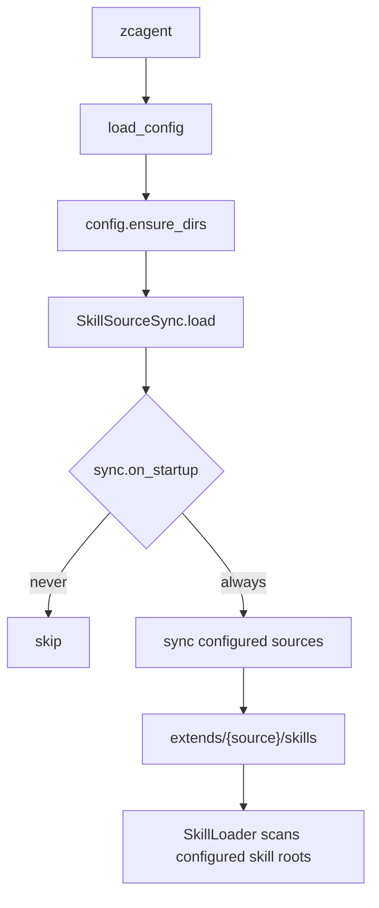
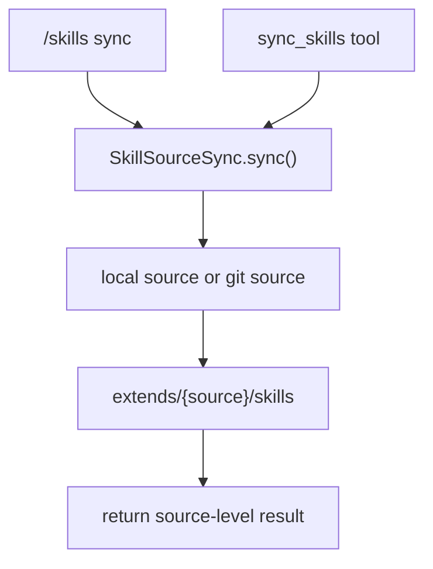
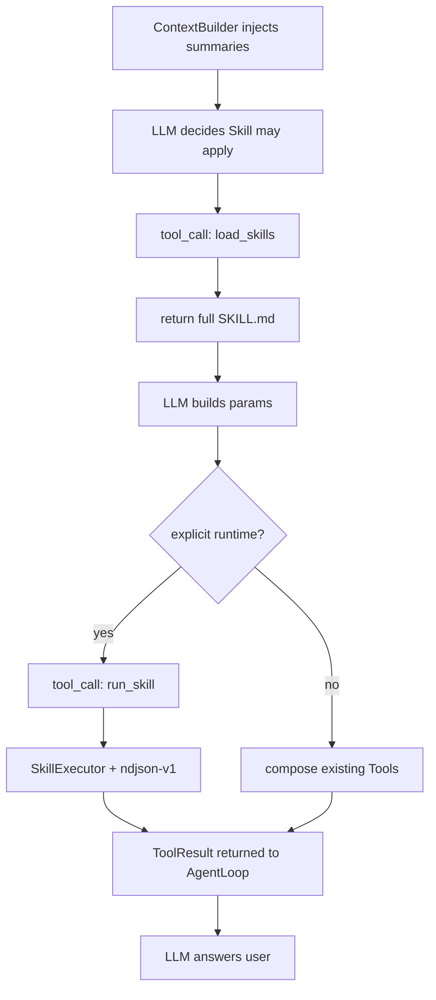

# 智策 Agent 第五部分详细设计文档：Skill 同步、加载与执行

> 关联规范：`AGENTS.md`
>
> 文档类型：阶段活文档。本文档始终按当前代码和当前阶段口径维护。
>
> 承接文档：`docs_design/zhice-agent-part4-exec-tool-design.md`
>
> 当前状态：Part 5 的 source/sync/loader 基线继续有效；Part 18 已在其上增加显式 runtime、`run_skill`、SkillExecutor、source 状态/索引缓存/权限过滤和 Web 管理。正式执行与运维口径以 `docs_design/zhice-agent-part18-skill-runtime-and-server-ops-design.md` 为准。
>
> 相关设计记录：`docs_design/2026-06-30-skill-source-namespace-design.md` 记录了 Skill source schema 与同名 Skill 命名空间的收敛背景；本文中的配置和数据流已同步为当前口径。

---

## 1. 背景

第五部分的目标不是把业务逻辑写进 `AgentLoop`，而是给 ZhiCe-Agent 增加一层可配置、可同步、可审计的 Skill 能力。

本轮确定后的关键边界是：

- 项目根目录 `skill_repo/` 是当前阶段的官方通用 Skill 本地源仓库，应该纳入版本管理。
- 运行时不直接扫描项目根目录 `skill_repo/skills/`，而是扫描 workspace 里的扩展仓库目录。
- 一个 Skill source 对应一个运行时目录：`${ZHICE_AGENT_WORKSPACE}/extends/{source.name}`。
- Skill 包保持参考项目风格：`{source_repo}/skills/{skill_name}/SKILL.md`，并可带 `scripts/`、`references/`、`assets/`。
- 本地 source 会把 `local_dir` 指向的整个技能仓库根目录镜像到 `extends/{source.name}`。
- git source 会直接 clone/fetch 到 `extends/{source}`，不再使用单独的 `cache_dir`。
- 第一版只做启动时一次同步和手动同步，不做后台轮询，避免网关启动后持续刷“拉取仓库”日志。

实际链路：

```text
configured Skill source
  -> SkillSourceSync 同步到 ${ZHICE_AGENT_WORKSPACE}/extends/{source}
  -> SkillLoader 扫描 extends/{source}/skills/{skill_name}
  -> ContextBuilder 注入 Skill 摘要
  -> load_skills 读取完整 SKILL.md
  -> 指令型：按 SKILL.md 组合已有 Tool
  -> 可执行型：run_skill -> SkillExecutor -> ndjson-v1
```

---

## 2. 目标

1. 建立 `SkillProvider` 协议，让上下文构建和工具调用只依赖接口。
2. 支持从配置的 Skill source 同步完整 Skill 包到 workspace `extends`。
3. 支持启动时按配置自动同步一次。
4. 支持 `/skills` 查看已发现 Skill。
5. 支持 `/skills sync` 手动刷新并同步配置来源。
6. 支持 `/skills sync --verbose` 展开同步明细。
7. 支持 `sync_skills` 工具，让后续“更新一下技能仓库”这类自然语言可以走受控工具调用。
8. 支持 `load_skills` 工具读取完整 `SKILL.md`。
9. 指令型 Skill 组合已有 Tool；显式 runtime 的可执行型 Skill 通过 `run_skill` 和 SkillExecutor 执行。
10. 保持 `AgentLoop` 只负责通用 LLM/tool/session 循环，不识别具体 Skill 业务。

---

## 3. 范围边界

本阶段包含：

- `agent/protocols/skill.py`
- `agent/skills/markdown.py`
- `agent/skills/loader.py`
- `agent/skills/sync.py`
- `agent/tools/skill.py`
- `config/config.example.yml` 的 `skills` 分区
- `skill_repo/skills/README.md`
- CLI `/skills` 与 `/skills sync`
- Tool：`load_skills`、`sync_skills`、`run_skill`
- 正式脚本执行使用显式 runtime；不得由文件名或 `exec.command` 猜入口
- 单元测试覆盖同步、加载、工具、CLI、上下文注入和 AgentLoop 工具链路

本阶段不包含：

- 后台轮询同步。
- Skill 市场。
- 多层 Skill 覆盖优先级。
- Skill 签名校验。
- 自动安装 Skill 依赖。
- 用户私有 source 与跨 source 覆盖优先级。
- 通过自然语言执行任意斜杠命令。
- 管理员诊断类“查看项目代码、终端日志并判断问题原因”的 Tool 或 Skill。

管理员诊断能力后续更适合做成受权限控制的 Tool，再按需配 Skill 工作流说明。

---

## 4. 目录模型

### 4.1 Source 目录

当前项目仓库里的官方 Skill 源：

```text
skill_repo/
  skills/
    README.md
    {skill_name}/
      SKILL.md
      scripts/
      references/
      assets/
```

如果后续官方 Skill 独立成 git 仓库，只需要改 `${ZHICE_AGENT_WORKSPACE}/config/config.yml` 的 `skills.sources`，让 source 指向真实 git 仓库。

### 4.2 Runtime 目录

运行工作区：

```text
${ZHICE_AGENT_WORKSPACE}/extends/
  zhice-official/
    skills/
      {skill_name}/
        SKILL.md
        scripts/
```

`extends/{source}` 是 source 仓库落盘目录。SkillLoader 固定从每个启用 source 的 `skills/` 扫描 Skill 包。这样本地 source 和 git source 的运行形态一致，也更接近参考项目的 `extends/{repo}/skills` 模型。

---

## 5. 配置设计

模板文件：`config/config.example.yml`

运行文件：`${ZHICE_AGENT_WORKSPACE}/config/config.yml` 的 `skills` 分区

当前模板：

```yaml
sync:
  # Whether zcagent syncs Skill sources on startup.
  # Values: never | always
  on_startup: always

  # Sync log policy.
  # changes_only: print only changed or failed syncs.
  # always: print every sync summary, including up-to-date sources.
  log: changes_only

  # Reserved background sync structure. Current code does not start polling.
  background:
    enabled: false
    interval_seconds: 0

sources:
  - name: zhice-official
    # Source name. Used in logs, namespaces, and commands, for example:
    # /skills sync zhice-official

    # Whether this source participates in sync.
    sync: true

    # Local source repository root. Preferred when it exists.
    # Repository layout is fixed as local_dir/skills/{skill_name}/SKILL.md.
    local_dir: "${ZHICE_AGENT_SKILL_REPO}"
```

字段说明：

- `extends_dir`：代码内部默认使用 `${ZHICE_AGENT_WORKSPACE}/extends`；不再出现在默认模板里。
- `sync.on_startup`：启动同步策略，只支持 `never`、`always`。
- `sync.background.enabled`：预留后台定时同步开关；当前代码不启动轮询。
- `sync.background.interval_seconds`：预留后台同步间隔秒数。
- `sync.log`：同步日志策略；`changes_only` 只打印变化或失败，`always` 每次都打印摘要。
- `sources[].name`：source 名称，用于日志、命名空间、`/skills sync <name>` 和 `source/name` 限定名。
- `sources[].sync`：是否同步该 source。
- `sources[].local_dir`：本地技能仓库根目录。存在时优先使用，不参与展示、调用或运行时目录命名。
- `sources[].git_url`：可选的真实远端 git 技能仓库地址；默认本地 source 模板不填写虚假兜底地址。
- `sources[].target`：Git branch，默认 `master`。

`${ZHICE_AGENT_SKILL_REPO}` 是本地 source 仓库根目录变量，不接受 Git URL。显式构造参数优先于该环境变量；环境变量未配置或为空时，运行时自动定位随项目或镜像提供的 `skill_repo/`。

git source 示例：

```yaml
sources:
  - name: zhice-official
    sync: true
    git_url: "https://github.com/your-org/zhice-official-skills.git"
    target: "master"
```

`zcagent init` 默认从统一模板补齐 `${ZHICE_AGENT_WORKSPACE}/config/config.yml`。重复执行 init 时，已有配置会保留，只有 `--force` 会覆盖已有文件。

如果启动时缺少该配置，CLI 打印：

```text
`config.yml` 缺少 `skills` 分区表示 Skill source 未启用，CLI/Gateway 静默使用空 SkillLoader；分区存在但非法或配置要求同步而失败时才输出结构化 warning。
```

这表示当前没有配置 Skill source，自动同步被跳过。该缺失不阻断基础聊天，因为 Skill source 属于可选扩展能力；workspace、prompts、LLM endpoint 仍属于聊天必需配置，缺失或非法时直接报错。

---

## 6. 模块设计

### 6.1 `agent/skills/sync.py`

核心类型：

- `SkillSource`
- `SkillSyncSettings`
- `SkillSourceResult`
- `SkillSyncResult`
- `SkillSourceSync`

职责：

- 读取并校验 `${ZHICE_AGENT_WORKSPACE}/config/config.yml` 的 `skills` 分区。
- 展开 `${ZHICE_AGENT_WORKSPACE}`、`${ZHICE_AGENT_SKILL_REPO}` 和环境变量占位符。
- 校验 `extends_dir` 必须在 workspace 内。
- 校验 source 名称唯一。
- 对本地 source，把 `local_dir` 指向的完整技能仓库根目录镜像到 `extends/{source.name}`。
- 对 git source，直接 clone/fetch 到 `extends/{source}` 并 checkout/reset 到配置 target。
- 返回按 source 组织的结构化结果：`synced`、`up_to_date`、`skipped`、`failed`。

安全边界：

- `extends_dir` 必须位于 workspace 内。
- `sync_skills` 只能选择已配置 source 名称，不能传入任意 git URL。
- git 操作使用 `subprocess.run(["git", ...], shell=False)`。
- 本地同步会忽略 `.git`、`.gitignore`、`tests`、`test`、`__pycache__`、`.pytest_cache`、`.ruff_cache`、`.mypy_cache`、`.venv`、`node_modules` 和 `.pyc`。

### 6.2 `agent/skills/loader.py`

职责：

- 支持扫描一个或多个 Skill root。
- 当前 CLI 传入的是每个启用 source 的 `extends/{source}/skills`。
- 每个 Skill 必须有 `SKILL.md`。
- frontmatter 只要求 `description`；`name` 缺失或与目录名不一致时，使用目录名作为 canonical name 并记录 warning。
- 返回带 `source`、`name`、`qualified_name` 的 `SkillInfo`。
- 记录无效 Skill 的 `load_errors`，但不阻断 CLI 启动。

`SkillLoader` 不负责同步，也不执行脚本。

### 6.3 Skill 脚本执行约定

当前同时保留指令型和可执行型 Skill。LLM 先通过 `load_skills` 读取完整 `SKILL.md`；存在合法显式 runtime 时只能调用 `run_skill`，没有 runtime 时把 Skill 作为组合现有 Tool 的指令包。

约定：

- Skill 脚本建议位于 `${ZHICE_AGENT_WORKSPACE}/extends/{source}/skills/{skill_name}/scripts/`。
- 可执行型 `SKILL.md` 必须声明 Python 相对入口、`ndjson-v1` 和 timeout，并写清参数、返回格式、错误码和边界情况。
- 脚本推荐通过 `--params '{JSON}'` 接收输入。
- 脚本推荐 stdout 最后一行输出结构化 JSON。
- 脚本禁止 import `agent.*`。
- 安全边界由 SkillExecutor 的入口 guard、固定解释器、无 shell、最小环境、timeout、输出上限、取消与进程树回收承担；外层仍经过 Tool RBAC、Hook、Audit 和 Profile 过滤。

### 6.4 `agent/tools/skill.py`

Skill 专属工具：

```text
load_skills
sync_skills
run_skill
```

`load_skills` 用于读取完整 `SKILL.md`。

`sync_skills` 用于同步配置中的 Skill source：

```json
{
  "source": "zhice-official"
}
```

`source` 可省略，省略时同步所有配置 source。`sync_skills` 不接受临时来源地址或任意命令。

`run_skill` 只接收限定名和 JSON object 参数，不接受 executable、cwd、env 或 timeout。

工具返回 source 级 JSON，例如：

```json
{
  "status": "success",
  "sources": [
    {
      "name": "zhice-official",
      "status": "synced",
      "skills": 3,
      "new": ["file-summary"],
      "changed": ["code-review"],
      "removed": [],
      "unchanged": ["csv-cleanup"],
      "message": "",
      "error": ""
    }
  ]
}
```

### 6.5 `agent/cli.py`

启动流程：

```text
load_config
  -> ensure_dirs
  -> SkillSourceSync.sync_on_startup()
  -> SkillLoader(skill_sync.skill_roots())
  -> ContextBuilder(skills=skill_loader)
  -> create_default_tool_registry(..., skill_sync=skill_sync)
  -> AgentLoop
```

CLI 命令：

```text
/skills
/skills sync
/skills sync --verbose
/skills sync zhice-official
/skills sync --verbose zhice-official
```

默认输出按 source 展示：

```text
skills synced: zhice-official (3 skills, 1 new, 2 changed)
skills up to date: my-local-skills (2 skills)
skills skipped: zhice-official (sync=false)
skills failed: zhice-official (git fetch failed)
```

`--verbose` 展开 Skill 名称：

```text
skills synced: zhice-official (3 skills, 1 new, 2 changed)
  new: file-summary
  changed: code-review, csv-cleanup
  unchanged: 0
```

普通聊天启动时自动同步保持安静；gateway 启动或后续显式入口可以按 `sync.log` 打印摘要。`gateway --check` 只检查配置，不做同步。

普通 `/skills` 只展示 Skill 限定名和短描述；管理页才展示 source commit、同步时间、健康和安全错误摘要。`category`、`readonly` 不作为核心展示字段。

---

## 7. 数据流

### 7.1 启动同步



### 7.2 手动同步



### 7.3 Skill 使用



---

## 8. 安全策略

- AgentLoop 不 import SkillLoader 或 SkillSourceSync。
- `skills/*/scripts/` 禁止 import `agent.*`。
- 可执行 Skill 只通过显式 `run_skill` 执行；不从 `exec.command` 反推 Skill。
- `sync_skills` 不接收任意 URL。
- Runtime 写入目录限制在 workspace。
- 破坏性操作仍由工具层和用户确认策略控制，不能由 Skill 自动绕过。

---

## 9. 测试方案

已覆盖的测试方向：

- Skill frontmatter 解析。
- SkillLoader 单 root、多 root、跨 source 同名、限定名查询、非法名、缺失 `SKILL.md`。
- SkillExecutor 的入口 guard、NDJSON、timeout、取消、输出限制、脱敏与进程树回收。
- `load_skills`、`sync_skills` 与 contextual `run_skill` 工具。
- `sync_skills` 只同步配置 source，不接受任意 URL。
- `SkillSourceSync` 整仓库本地 source 镜像、unchanged、changed、removed、startup always、非法 `sync.on_startup` 值拒绝、未知 source、runtime path guard。
- ContextBuilder 注入 Skill 摘要。
- AgentLoop Fake LLM 覆盖 `load_skills -> run_skill -> skill.* -> ToolResult` 链路。
- CLI `/skills`、`/skills sync`、`/tools`。
- `zcagent init` 能补齐统一 `${ZHICE_AGENT_WORKSPACE}/config/config.yml`，已有文件默认保留。

验收命令：

```bash
python -m ruff check .
python -m pytest --basetemp .tmp/pytest_basetemp
```

Windows 本机可能因为系统临时目录或 `.pytest_cache` 权限导致普通 `python -m pytest` 出现缓存 warning，因此本仓库测试推荐使用 repo 内 `.tmp` basetemp。

---

## 10. 后续演进

后续可以单独设计：

- git source 周期轮询，默认关闭，并使用 change-only 日志。
- Skill 版本、签名和依赖声明。
- 用户私有 Skill source 和跨 source 覆盖优先级。
- 自然语言“更新技能仓库”到 `sync_skills` 的意图路由。

当前闭环是配置来源、同步到 `extends`、指纹索引、actor 可见性、按需读取说明，以及对显式 runtime 的正式可观测执行。
